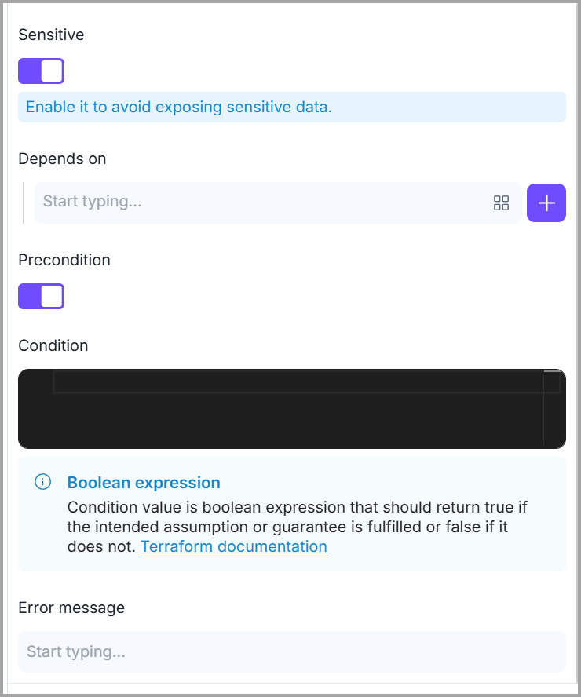

# Output

**Output values** make information about your cloud infrastructure available on the **command line** and will be displayed in the output of execution.


_The table of outputs is similar to the table of_ [_variables_](variables.md)_. Please refer to it to understand the different components of the user interface._


#### Creating an output

1. Click the <mark style="color:$primary;">**`Outputs`**</mark> icon available in the right panel.&#x20;
2. Then, click the <mark style="color:$primary;">**`+`**</mark> icon to add/import variables. It opens the **Create output** modal.
3. Specify the _<mark style="color:$primary;">Name</mark>, <mark style="color:$primary;">Description</mark>_ and _<mark style="color:$primary;">Value</mark>_ of the output.

<figure><figcaption></figcaption></figure>

4. You can also specify if the output is **sensitive**, has a **dependency**, or has a **precondition.**&#x20;

<figure><figcaption></figcaption></figure>


For every output defined, <mark style="color:$primary;">**Brainboard**</mark> creates an output block in the file <mark style="color:$primary;">**`outputs.tf`**</mark>.

