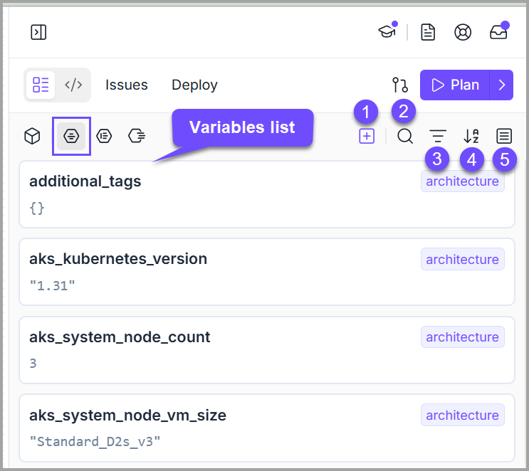
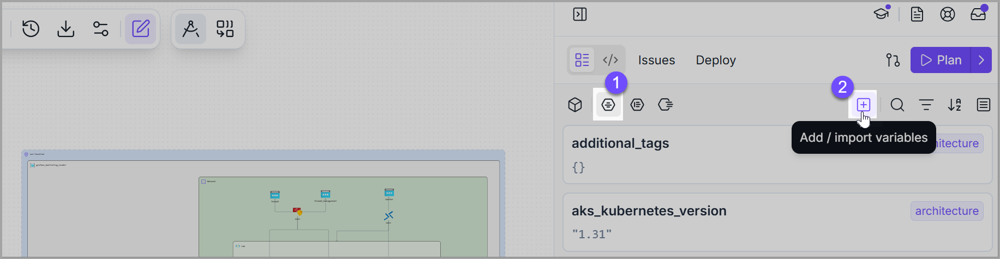
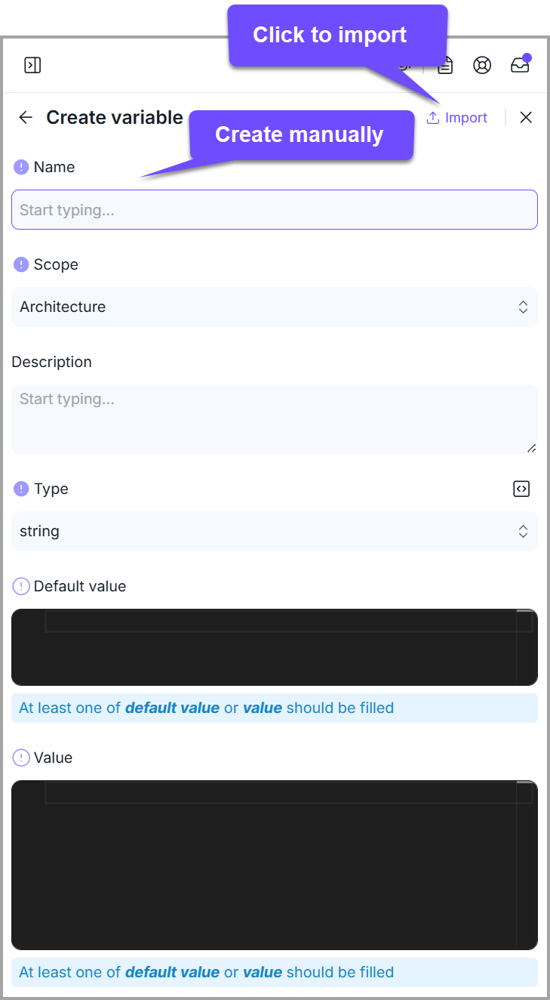
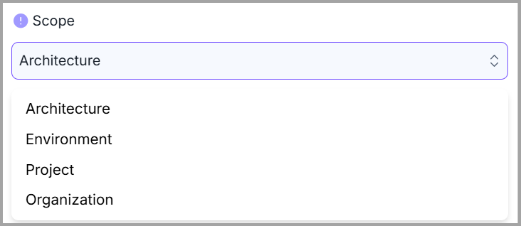
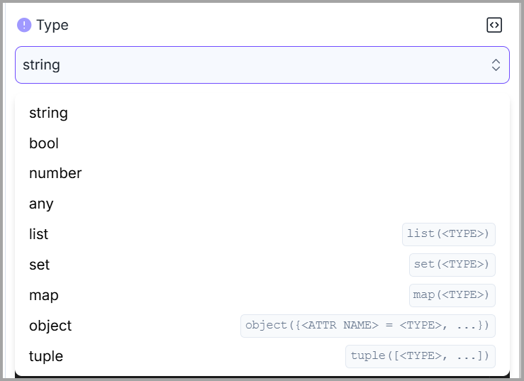
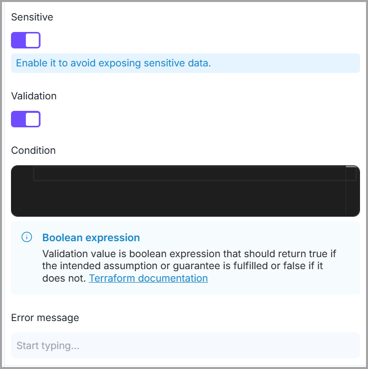

# Variables

### Variables

In **Terraform**, a variable is a way to store and reuse values throughout your **Terraform** code, and it is defined using the <mark style="color:$primary;">**`variable`**</mark> block.


Brainboard allows you to create a variable **manually,** or you can also import it from an existing file. File types allowed are: <mark style="color:$primary;">**`tfvars`**</mark> , <mark style="color:$primary;">**`tf`**</mark>.&#x20;



<mark style="color:$primary;">**Brainboard**</mark> follows **Terraform** best practices, so by default, when you create a new architecture, Brainboard automatically adds a variable called <mark style="color:$primary;">**`tags`**</mark> which is added in the generated **Terraform** code of every resource that supports tagging.


#### Action items on the Variables window

Shared below is the screenshot of the **Variables** window, numbered with action items/features available on this screen, followed by their brief description.&#x20;


By default, the variables list is displayed when you click on the **variables icon** in the right panel.&#x20;


<figure><figcaption></figcaption></figure>

<table><thead><tr><th width="57">#</th><th width="138">Feature</th><th width="563.6666259765625">Purpose / Description</th></tr></thead><tbody><tr><td>1</td><td><strong>Add Variable</strong><strong> </strong><mark style="color:$primary;"><strong>(+)</strong></mark></td><td>To create a new variable. <em>(Explained in detail below).</em></td></tr><tr><td>2</td><td><strong>Search option</strong></td><td>To search for a specific variable on the Variables window. Keyword search is supported.</td></tr><tr><td>3</td><td><strong>Filter</strong></td><td>

Using this option, you can filter the list of variables by scope or by the user who updated the variable. So, you have the following three options:  - <strong>All</strong> (no filter). - <strong>Scope:</strong> architecture, environment, project, organization. <strong>- Updated by:</strong> select the user name whose updated variables you want to view. 
</td></tr><tr><td>4</td><td><strong>Sorting variables list</strong></td><td>You can sort the list of variables according to ascending or descending order of their names, as well as in ascending/descending order of the date when they were last updated. </td></tr><tr><td>5</td><td><strong>Filter</strong></td><td>The scope selector allows you to view variables that are defined in every scope or display all variables of all scopes.</td></tr><tr><td>6</td><td><strong>Expand all / Collapse all</strong></td><td>Clicking this will exapnd the variables section for you to view details of each variable in the list. Clicking it again will collapse the expanded view. </td></tr></tbody></table>

#### Creating a new variable

To create a new variable, expand the right panel, and follow these steps:&#x20;

1. Click the <mark style="color:$primary;">**`Variable`**</mark> icon available in the right panel.&#x20;
2. Then, click the <mark style="color:$primary;">**`+`**</mark> icon to add/import variables. It opens the **Create** **Variable** modal.

<figure><figcaption></figcaption></figure>

3. After that, you can either create a variable **manually** or you can click on the <mark style="color:$primary;">**`Import`**</mark> option to **import** already defined variables from an external file (<mark style="color:$primary;">**`tfvars`**</mark> , <mark style="color:$primary;">**`tf`**</mark> ).

<figure><figcaption></figcaption></figure>

On the _**"Create variable"**_ form, you can specify the following information:

1. **Name of the variable:** This is the name that you'll use to reference the variable when you use it.&#x20;


It follows the naming conventions of **Terraform**; for example, it doesn't support spaces or starting with a number.

**Best practice:** use clear and explicit names and separate words with an underscore <mark style="color:$primary;">**`_`**</mark>.


2. **Scope:** You can set the level at which you want this variable to be available.

<figure><figcaption></figcaption></figure>


The four levels of scopes are listed in the order of **"least shared or restrictive to most shared/available/"**



There is an override mechanism if the same variable is defined in multiple scopes.&#x20;


<table><thead><tr><th width="175.66668701171875">Scope</th><th width="270.6666259765625">Explanation</th><th>Variable Overried</th></tr></thead><tbody><tr><td><strong>Architecture</strong></td><td>Variables that are defined with this scope are only available within this architecture only.</td><td>If the same variable is defined in another level as well, the default or values defined at the architecture level overrides any other level. </td></tr><tr><td><strong>Environment</strong></td><td>Variables defined at the environment level are available to all architectures within the same environment.</td><td>Variables defined in this level override those defined at project and organization level. </td></tr><tr><td><strong>Project</strong></td><td>Variables defined at the project level are available to all environments and architectures within the same project.</td><td>Variables defined in this level override those defined at the organization level. </td></tr><tr><td><strong>Organization</strong></td><td>Variables defined at the organization level are available to all architectures, environments and project within the organization.</td><td></td></tr></tbody></table>

3. **Description:** It should concisely explain the purpose of the variable and what kind of value is expected. This description string might be included in documentation about the module, and so it should be written from the perspective of the user of the module rather than its maintainer.
4. **Variable type:** This allows you to restrict the type of value that will be accepted.&#x20;


If no type constraint is set, then a value of any type is accepted.


While type constraints are optional, we recommend specifying them; they can serve as helpful reminders for users of the module, and they allow **Terraform** to return a helpful error message if the wrong type is used.


The supported type keywords are: <mark style="color:$primary;">**`any`**</mark> <mark style="color:$primary;">**`bool`**</mark> <mark style="color:$primary;">**`list`**</mark> <mark style="color:$primary;">**`map`**</mark> <mark style="color:$primary;">**`number`**</mark> <mark style="color:$primary;">**`object`**</mark> <mark style="color:$primary;">**`set`**</mark> <mark style="color:$primary;">**`string`**</mark> <mark style="color:$primary;">**`tuple`**</mark>


<figure><figcaption></figcaption></figure>

5. **Default value:** If present, the variable is considered to be _<mark style="color:$primary;">optional</mark>_ and the default value will be used if no value is set.
6. **Value:** The value that will be used during **Terraform** execution and if defined, it overrides the default value.
   1. This value will be put in the file <mark style="color:$primary;">**`terraform.tfvars`**</mark> .
   2. If you convert the architecture into a template or clone the architecture, this value will be removed.
7. **Sensitive:** Setting this flag prevents **Terraform** from showing its value in the <mark style="color:$primary;">**`plan`**</mark> or <mark style="color:$primary;">**`apply`**</mark> output and <mark style="color:$primary;">**Brainboard**</mark> will store the variable in a separate vault.


Even if the variable is flagged sensitive, its value will still be stored in clear text in the **Terraform** state.


8. **Validation:** You can specify custom validation rules for the variable.

<figure><figcaption></figcaption></figure>


For every variable defined, Brainboard creates a variable block in the file <mark style="color:$primary;">**`variables.tf`**</mark><mark style="color:$primary;">**&#x20;**</mark><mark style="color:$primary;">**.**</mark>



Refer to the [RBAC (Role Based Access Control) documentation page](../../../settings/rbac/) to understand how you can manage permissions to restrict/allow members and teams to add, update or delete variables.

