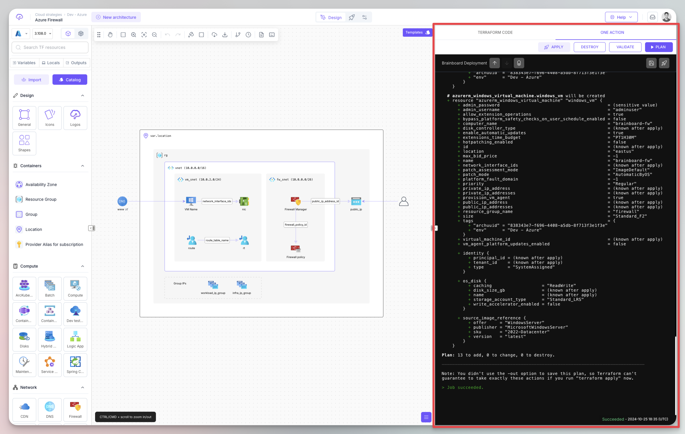

# One action

### Description

One action is a quick way to execute a Terraform action, like terraform plan or apply without triggering the pipeline.

This is useful when you are building the infrastructure to quickly launch a plan or validate to make sure the code is valid and see what changes will be introduced, and that's why it is located next to your design.

<figure><figcaption></figcaption></figure>

### How it works

When you trigger an action in `one-action` tab, Brainboard creates an ephemeral execution environment, executes the action and streamline the output in real time.

You also have the timestamp in the bottom on the right in UTC timezone, to know when the action has been performed.

This execution will also be logged in the pipeline history, so you can visualize it at any time. It is named “One Action pipeline” in the workflow column.

<figure><figcaption></figcaption></figure>

### Actions

Here are the actions available in one-action tab:

1. Validate: this will execute `terraform validate` on the generated code and gives you the output.
2.  Plan: it will do `terraform plan` on the generated code and gives you the output.

    1. This action can also be triggered from the Terraform code pane.

    <figure><figcaption></figcaption></figure>
3. Apply: it will do `terraform apply -auto-approve` on the generated code and gives you the output.
4. Destroy: it will do `terraform destroy -auto-approve` on the generated code and gives you the output.


Before doing any action, Brainboard does `terraform init -input=false -upgrade=true` to make sure everything is setup correctly before launching the execution of the action.


#### Stop the execution

When there is an ongoing execution, you can stop it by clicking on the `Stop` button located in the top-right corner of the output.

<figure><figcaption></figcaption></figure>

You can also stop the execution from the pipeline view

<figure><figcaption></figcaption></figure>


When you stop an ongoing `apply` or `destroy`, Brainboard attempts to gracefully shutdown the execution process, but in some rare cases the Terraform state maybe get corrupted. If you encounter this situation, reach out to our support.


### Targeting

Brainboard provides you with the possibility to execute an action on a specific resource. For example, you want to destroy a specific resource(s) on an already deployed architecture without impacting the whole infrastructure.

To achieve this, type the address of the resource in the menu or select it from the dropdown menu, then click on any action.


Refer to [this documentation page](https://developer.hashicorp.com/terraform/cli/commands/plan#resource-targeting) to understand how resource targeting works in Terraform.


### Output

Brainboard provides with real-time output of the current execution.

When you first open the one-action tab, Brainboard displays the output of the last execution.

This output is shared for all users that have access to the architecture, as it is important to know what happened during the last execution when you are about to make new changes.

### Best practices

* When you are building a cloud architecture, it's advised to do `plan` frequently to catch errors at early stage and fix them.
