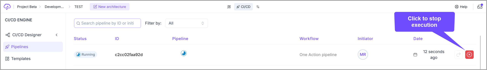
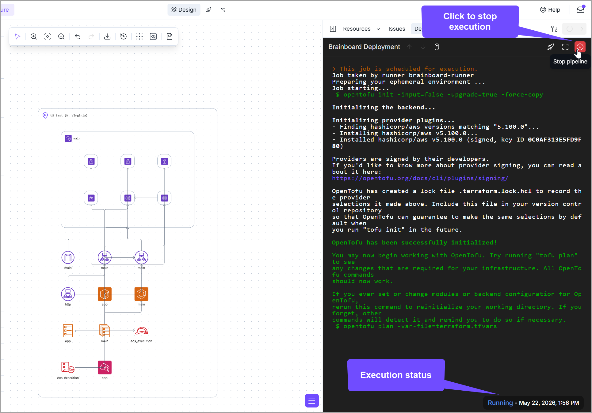

# One action

### Description

At the top of the right panel, the expandable tab containing the Terraform action buttons is termed the <mark style="color:$primary;">**One-action**</mark> tab.&#x20;

<mark style="color:$primary;">**One action**</mark> is a quick way to execute a Terraform action without triggering the pipeline.

### Terraform Actions

1. **Validate:** This executes <mark style="color:$primary;">**`terraform validate`**</mark> on the generated code and gives you the output.
2. **Plan:** It performs  <mark style="color:$primary;">**`terraform plan`**</mark> on the generated code and gives you the output.
3. **Apply:** It runs  <mark style="color:$primary;">**`terraform apply -auto-approve`**</mark> on the generated code and gives you the output.
4. **Destroy:** It performs <mark style="color:$primary;">**`terraform destroy -auto-approve`**</mark> on the generated code and gives you the output.


Before doing any action, Brainboard sets this up: <mark style="color:green;">**`terraform init -input=false -upgrade=true`**</mark>&#x20;

This is to make sure everything is set up correctly before launching the execution of the action.


<figure><figcaption></figcaption></figure>


This is useful when building infrastructure to quickly launch a plan or run validation checks to ensure the code is valid and preview the changes that will be introduced. That’s why it is located next to your design.


### How it works

When you trigger an action in <mark style="color:$primary;">**`one-action`**</mark> tab, Brainboard:&#x20;

* creates an ephemeral execution environment,
* executes the action, and&#x20;
* streamlines the output in real time.


**Time stamp:** You can also find the timestamp in the bottom-right corner. It is displayed in the UTC timezone to indicate when the action was performed.


This execution will also be logged in the pipeline history, so you can visualize it at any time. It is named <mark style="color:$primary;">**“One Action pipeline”**</mark> in the workflow column.

<figure><figcaption></figcaption></figure>

### Stop the execution

When there is an ongoing execution, you can stop it by clicking on the <mark style="color:red;">**`Stop`**</mark> button located in the top-right corner of the output.

<figure><figcaption></figcaption></figure>


You can also stop the execution from the pipeline view


<figure><figcaption></figcaption></figure>


When you stop an ongoing <mark style="color:$primary;">**`apply`**</mark> or <mark style="color:$primary;">**`destroy`**</mark>, Brainboard attempts to gracefully shutdown the execution process, but in some rare cases, the **Terraform state** may get **corrupted.** If you encounter this situation, reach out to our support by clicking the **Help** icon in the top right corner of your Brainboard dashboard.&#x20;


### Targeting

Brainboard allows you to execute an action on a specific resource. For example, you want to destroy a specific resource(s) on an already deployed architecture without impacting the whole infrastructure.

To achieve this, type the resource address in the menu or select it from the dropdown menu, then click any action.


Refer to [this documentation page](https://developer.hashicorp.com/terraform/cli/commands/plan#resource-targeting) to understand how resource targeting works in Terraform.


### Output

Brainboard provides real-time output of the current execution.

When you first open the <mark style="color:$primary;">**one-action**</mark> tab, Brainboard displays the output of the last execution.

This output is shared for all users who have access to the architecture, as it is important to know what happened during the last execution when you are about to make new changes.

### Best practices

When you are building a cloud architecture, it's advised to do <mark style="color:$primary;">**`plan`**</mark> frequently to catch errors at an early stage and fix them.

