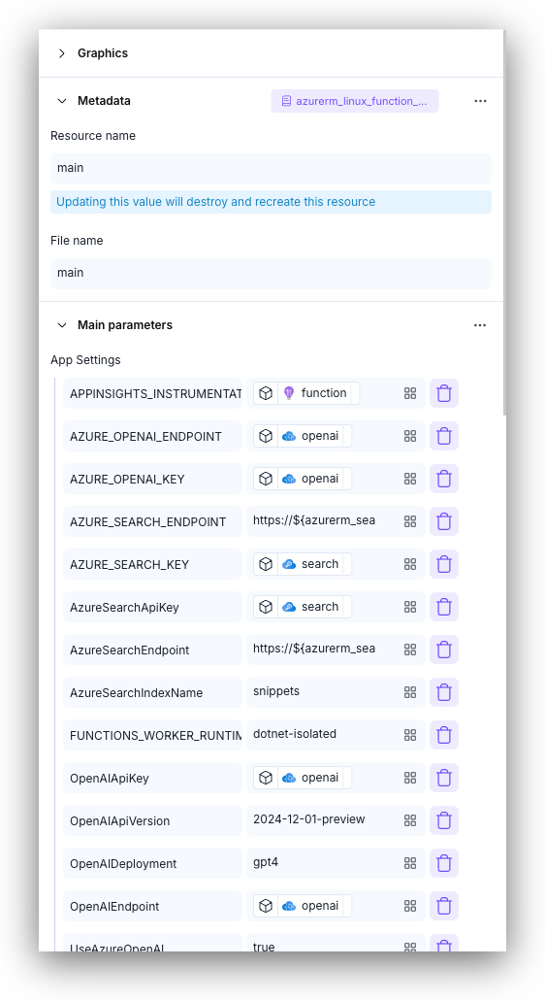

# Resource Configuration

The **Resource Configuration** panel is the primary interface for configuring individual cloud resources. It provides a comprehensive form-based editor, code view, and state inspection for deep resource configuration. This panel replaces and extends the functionality of the previous ID Card interface.

<figure><figcaption>
Resource Configuration form view
</figcaption></figure>

## Overview

The Resource Configuration panel opens when you double-click a resource card in the [Resources List](resources-list.md) or double-click a resource in the diagram. It provides three views for working with resources:

1. **Form** - Structured configuration form with sections and fields (primary editing interface)
2. **State** - Read-only view of Terraform state attributes
3. **Code** - Direct HCL code editor for the resource


Opening and using the Resource Configuration panel


## Opening the Resource Configuration Panel

To open the Resource Configuration panel:

1. **From Resources List**: Navigate to the **Resources** tab in the [Right Panel](right-panel.md) and **double-click** any resource card
2. **From Diagram**: **Double-click** any resource node in the design area
3. **From Node Options**: Click a resource and select "Cloud configuration" from the node's options bar


You can also open the Resource Configuration panel by selecting a resource in the diagram and pressing `Enter` or selecting "Configure" from the context menu.


## Form View

The Form view provides a structured interface for configuring resource parameters, organized into collapsible sections. This is the **primary and recommended way** to configure your cloud resources.


Dynamic form view with collapsible sections


### Form Components

#### Header

The header displays:

* **Back button** - Returns to the Resources List
* **Resource icon and name** - Visual identifier for the current resource
  * You can change the resource title, reset, or delete it if needed
  * You can customize the icon
* **Tab selector** - Switch between Form, State, and Code views
* **Close button** - Closes the Resource Configuration panel

#### Configuration Sections

The form is organized into sections:

1. **Graphics** - Resource appearance settings:
   * Icon customization
   * Resource label (displayed name in the diagram)

2. **Metadata** - Terraform-specific settings:
   * **Resource name** (Terraform identifier) - Used to uniquely identify the resource in the design and code
   * **File name** - Which `.tf` file contains this resource
   * **Provider alias** - If using multiple provider configurations
   * **Region/location settings** - For providers like AWS where location is not part of the Terraform resource

3. **Required Parameters** - Core mandatory attributes:
   * These parameters come from what Terraform considers as required
   * Missing required fields are highlighted in red

4. **Advanced Configuration** - Optional sections and nested configurations:
   * Contains all fields that are not mandatory
   * Can be added/removed using the Sections Builder

5. **Extra Attributes** - Terraform meta-arguments:
   * `count` - Create multiple instances with a single configuration
   * `depends_on` - Specify dependencies between resources
   * `for_each` - Create multiple instances based on a map or set
   * `lifecycle` - Define actions during create, update, or delete
   * `terraform code` - Write any valid Terraform code (like provisioners)

6. **Exported Attributes** - Read-only information:
   * Attributes available to be used by other resources
   * Used in output blocks
   * Automatically filled after deployment from the tfstate file


**Special Parameters:**

1. **Resource name:** The Terraform resource name. Changing this will destroy and recreate the resource. This field doesn't accept variables - use string text. Brainboard manages this field for you in most cases.
2. **Location:** For some providers like AWS, Brainboard uses this field to generate Terraform code accurately when location isn't part of the Terraform resource.


### Section Management

Each section can be:

* **Expanded/Collapsed** - Click the section header to toggle
* **Added/Removed** - Use the Sections Builder to customize visible sections
* **Configured** - Fill in parameters specific to your infrastructure needs

#### Sections Builder

The Sections Builder allows you to customize which configuration blocks appear in your form:


Using the Sections Builder to add/remove configuration blocks


To use the Sections Builder:

1. Click the **builder icon** (grid icon) in the configurator header
2. Browse available sections and blocks for your resource type
3. Check/uncheck sections to add or remove them from the form
4. The form updates immediately with your selections

### Field Types

The Resource Configuration panel supports various field types that map to Terraform attributes:

#### Text Attributes

Used when the expected value is a `string` such as name, IP address, or location:

* All Terraform supported types including [string & template strings](https://developer.hashicorp.com/terraform/language/expressions/strings) and [heredoc](https://en.wikipedia.org/wiki/Here_document)
* Press Enter to switch into multiline mode for proper formatting
* No need to quote values - Brainboard handles quoting based on Terraform requirements

#### Number Attributes

For specifying numerical values (integers and floating-point numbers):

* Supports decimal or scientific notation
* Common uses: resource counts, networking parameters, timeouts
* Terraform provides [built-in functions](https://developer.hashicorp.com/terraform/language/functions) for manipulating numbers

#### List Attributes

For collections of values (any data type including strings, numbers, booleans, nested lists/maps):

* **Lists of resources** - Related resources like virtual network subnets
* **Lists of strings** - IP addresses, names, etc.
* **Lists of maps** - Sets of key-value pairs
* Can switch to text field mode to use Terraform functions (e.g., `merge` function for tags)


Lists can be accessed and manipulated using [built-in functions](https://developer.hashicorp.com/terraform/language/functions) like indexing, length, concatenation, and filtering.


#### Boolean Attributes

Three options for boolean type attributes:

* **Default** - Value removed from generated code, uses Terraform default
* **False** - Explicitly set to false
* **True** - Explicitly set to true
* **Var mode** - Use expression evaluation for dynamic values

#### Block Attributes

Nested configuration blocks that can contain:

* All the field types mentioned above
* Other nested blocks
* Reset button to remove the entire block from generated code
* Add button to create multiple blocks (when supported by Terraform)


Using the Block Builder to configure nested blocks



Brainboard shows the option to create another block only when multiple blocks are supported in Terraform.


### Field Documentation

Each field includes inline documentation:

* **Hover over the field label** to see a tooltip with:
  * Parameter description
  * Data type
  * Default values
  * Validation rules
  * Required/optional status
* **Click the documentation icon** (?) to open the official Terraform provider documentation

### Auto-save Behavior

The form auto-saves changes:

* **On blur** - When you click outside a field
* **On mouse leave** - When your cursor leaves the form area
* **Debounced** - Changes are batched to avoid excessive saves


A subtle indicator shows when changes are being saved. You don't need to manually save the form.


### Top Bar Options

Options in the top bar allow you to:

* Move the panel wherever you want in the design area
* See automatic save indicator
* Reset the changes you made
* Open the Terraform documentation of the resource
* Show/hide the documentation of every field within Brainboard
* Close the panel

### Warnings and Validation

The form displays warnings for:

* **Destructive changes** - Operations that will destroy and recreate the resource
* **Required parameters** - Missing required fields highlighted in red
* **Invalid values** - Validation errors with helpful messages
* **Type mismatches** - Incorrect data types for fields

### Extra Attributes Details

#### Count

Allows you to create multiple instances of the same resource with a single configuration:

* Use a number, variable, Terraform functions, or any valid Terraform syntax
* When a resource has count, its icon changes visually in the diagram

#### Depends_On

Specify dependencies between resources:

* Ensures one resource is created before another
* Brainboard automatically creates a visual link between both resources

#### For_Each

Create multiple instances based on a map or set of values:

* Can write your map directly or use a variable (best practice)
* When a resource has for_each, its icon changes visually in the diagram

#### Lifecycle

Define actions during resource lifecycle:

* **create_before_destroy** - Create new resource before destroying existing one
* **prevent_destroy** - Prevent Terraform from destroying a resource (useful for databases)
* **ignore_changes** - Specify attributes that shouldn't trigger an update

#### Terraform Code

For advanced users, write any valid Terraform code:

* Useful for provisioners
* Custom logic not available in standard fields

## Search Feature

The Resource Configuration panel includes a powerful search feature for finding and adding parameters:

1. Click the **search icon** in the configurator toolbar
2. Type to search for:
   * Attribute names
   * Block names
   * Documentation keywords
3. Search results show:
   * **Configured attributes** - Already in your form (navigate to them)
   * **Available attributes** - Not yet added (click to add to form)


Use search when you know the name of a parameter but can't find it in the sections. The search will add it to your form automatically.


## State View

The State view displays read-only Terraform state information for the resource.

### State Information

State view shows:

* **Exported Attributes** - Values generated after resource creation
* **Computed Values** - Calculated by Terraform
* **Resource IDs** - Cloud provider identifiers
* **Output Values** - Data exported for use by other resources

### When to Use State View

State view is useful for:

* **Checking resource IDs** after deployment
* **Finding computed values** to reference in other resources
* **Debugging** resource relationships
* **Understanding** what Terraform has created


State information is only available after the resource has been deployed. Newly created resources will show an empty state.



1. An exported attribute is a value created by one Terraform module and made available for another module to use.
2. Once the infrastructure is deployed, Brainboard fills these fields automatically based on information from the generated tfstate file.


## Code View

The Code view provides direct access to the Terraform HCL code for the individual resource.

<figure><figcaption>
Resource Configuration code editor
</figcaption></figure>


Viewing and editing resource code


### Code Editor Features

* **Syntax Highlighting** - Full HCL syntax support
* **Line Numbers** - Easy reference
* **Code Validation** - Real-time syntax checking
* **Keyboard Shortcuts**:
  * `CMD/CTRL+S` - Save changes
  * `CMD/CTRL+F` - Search in code
  * `CMD/CTRL+H` - Find and replace

### Bi-directional Sync

Changes in code view sync with the form view and vice versa:

* **Form → Code** - Form changes immediately update the code
* **Code → Form** - After saving code, the form updates to reflect changes


The code editor operates on a single resource, making it safer than editing the full file in the main Code tab.


## Terraform Actions

The Resource Configuration panel header provides quick access to Terraform actions:

* **Validate** - Run `terraform validate` for this resource
* **Plan** - Generate an execution plan
* **Apply** - Deploy changes
* **Pull Request** - Create a PR with changes

## Special Resource Types

### Custom Resources

The Resource Configuration panel for custom resources includes additional fields:

1. You can define the Terraform resource type
2. You can indicate the source of the provider if it's in a different namespace (e.g., `cloudflare/cloudflare`)


When you specify the cloud provider source, Brainboard automatically adds this entry in the provider block.


### Modules

The Resource Configuration panel for a module is built based on the variables and outputs defined in the module's source code:

1. **Refresh button** - Fetch the latest version from Git or registry and rebuild the form
2. **Source** - The module source location (change in modules' catalog)
3. **Version** - Specific version, branch, or tag
4. **Documentation** - Comes from the description of the module's variables

## Navigation and Keyboard Shortcuts

### Navigation

* **Back button** - Returns to Resources List (retains scroll position)
* **Close button** (X) - Closes configurator and returns to Resources tab
* `ESC` key - Closes the configurator

### Keyboard Shortcuts

* `CMD/CTRL+F` - Open search (when Form tab is active)
* `Enter` - (When field is focused) Move to next field
* `Tab` - Navigate between fields
* Arrow keys - Navigate section headers

## Resizer

The panel includes a resizer that allows you to:

* Adjust width by dragging the left edge
* Adjust height by dragging the bottom edge
* Resize to make it bigger or smaller based on your preference

## Best Practices

### Form Configuration

* **Start with Required Parameters** - Configure mandatory fields first
* **Use the Sections Builder** - Customize your form to show only what you need
* **Leverage Search** - Quickly find and add obscure parameters
* **Check Documentation** - Hover over fields to understand their purpose
* **Use References** - Link to other resources instead of hardcoding values

### Resource Organization

* **One resource at a time** - The configurator is designed for focused editing
* **Use references** - Link to other resources, variables, or outputs
* **Group related resources** - Keep connected resources in the same file

### Performance

* **Minimize expanded sections** - Collapse sections you're not actively editing
* **Avoid excessive nesting** - Deeply nested blocks can impact form performance
* **Use code view for bulk changes** - When adding many attributes at once

## Common Workflows

### Adding a New Block

1. Click the **Sections Builder** icon
2. Find the block you want to add (e.g., "logging")
3. Check the checkbox to add it to your form
4. Configure the block parameters

### Referencing Another Resource

1. Click the field that needs a reference
2. Select **Reference** from the dropdown (if applicable)
3. Choose the resource, variable, or output to reference
4. The form automatically creates the correct Terraform reference syntax

### Creating Dependencies

1. In the **Extra Attributes** section, find `depends_on`
2. Select the resource(s) this resource depends on
3. Brainboard automatically creates a visual link in the diagram

### Using Count or For_Each

1. In the **Extra Attributes** section, find `count` or `for_each`
2. Enter your expression:
   * **Count**: A number, variable, or expression
   * **For_each**: A map or set (best practice: use a variable)
3. The resource icon changes visually to indicate multiple instances

### Viewing Computed Values

1. Deploy your architecture
2. Open the resource in the Resource Configuration panel
3. Switch to the **State** tab
4. Find the computed value you need
5. Copy it or reference it in other resources

## Troubleshooting

### Form Not Saving

If changes aren't saving:

* Check for validation errors (red highlights)
* Ensure required fields are filled
* Try clicking outside the field to trigger save
* Check the browser console for errors

### Missing Sections

If expected sections don't appear:

* Check the **Sections Builder** - they may be hidden
* Verify the resource type supports the block
* Check if using a module (module resources have limited configuration)

### Code and Form Mismatch

If code and form show different values:

* Save the code explicitly with `CMD/CTRL+S`
* Refresh the form by closing and reopening the configurator
* Check for syntax errors in the code

## See Also

* [Resources List](resources-list.md) - Resource list and overview
* [Right Panel](right-panel.md) - Overview of right panel features
* [Code Edition](code-edition.md) - Full file code editing
* [Design Area](design-area/) - Visual diagram interface
* [Terraform Actions](autogenerated-code/terraform-opentofu-actions.md) - Running Terraform commands
* [Node](design-area/node.md) - Working with resource nodes in the diagram
