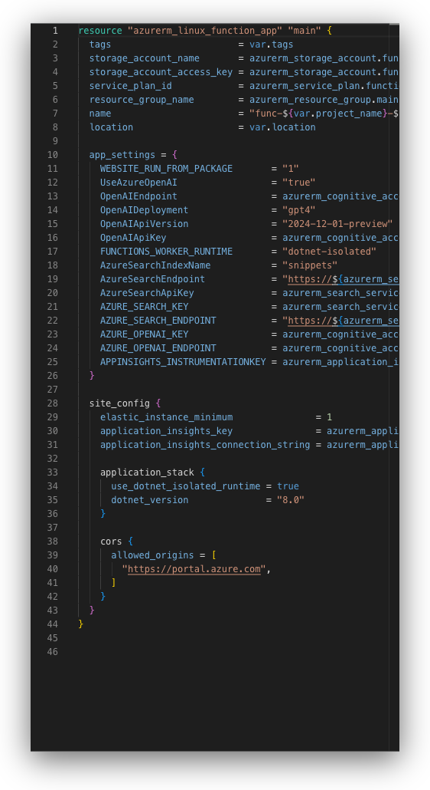

# Resource Configurator

The **Resource Configurator** is an advanced configuration interface for editing individual cloud resources. It provides a comprehensive form-based editor, code view, and state inspection for deep resource configuration.

<figure><figcaption>
Resource Configurator form view
</figcaption></figure>

## Overview

The Resource Configurator opens when you double-click a resource card in the [Architecture Configurator](architecture-configurator.md). It provides three views for working with resources:

1. **Form** - Structured configuration form with sections and fields
2. **State** - Read-only view of Terraform state attributes
3. **Code** - Direct HCL code editor for the resource

## Opening the Resource Configurator

To open the Resource Configurator:

1. Navigate to the **Resources** tab in the [Right Panel](right-panel.md)
2. **Double-click** any resource card
3. The Resource Configurator slides in from the right


You can also open the Resource Configurator by clicking a resource in the diagram and pressing `Enter` or selecting "Configure" from the context menu.



Opening and using the Resource Configurator


## Form View

The Form view provides a structured interface for configuring resource parameters, organized into collapsible sections.

### Form Components

#### Header

The header displays:

* **Back button** - Returns to the Architecture Configurator
* **Resource icon and name** - Visual identifier for the current resource
* **Tab selector** - Switch between Form, State, and Code views
* **Close button** - Closes the Resource Configurator

#### Configuration Sections

The form is organized into sections:

1. **Graphics** - Resource appearance settings:
   * Icon customization
   * Resource label (displayed name)

2. **Metadata** - Terraform-specific settings:
   * Resource name (Terraform identifier)
   * File name (which `.tf` file contains this resource)
   * Provider alias (if using multiple provider configurations)
   * Region/location settings

3. **Main Parameters** - Core required and commonly used attributes
4. **Optional Sections** - Additional blocks and nested configurations
5. **Custom Attributes** - User-defined parameters

### Section Management

Each section can be:

* **Expanded/Collapsed** - Click the section header to toggle
* **Added/Removed** - Use the section builder to customize visible sections
* **Reordered** - (Coming soon)

#### Sections Builder

The Sections Builder allows you to customize which configuration blocks appear in your form:


Using the sections builder to add/remove configuration blocks


To use the Sections Builder:

1. Click the **builder icon** (grid icon) in the configurator header
2. Browse available sections and blocks for your resource type
3. Check/uncheck sections to add or remove them from the form
4. The form updates immediately with your selections

### Field Types

The Resource Configurator supports various field types:

* **Text Input** - Simple string values
* **Number Input** - Numeric values with validation
* **Select/Dropdown** - Predefined options
* **Multi-select** - Multiple value selection
* **Reference Picker** - Links to other resources, variables, or outputs
* **Toggle/Checkbox** - Boolean values
* **List Builder** - Arrays of values
* **Map Builder** - Key-value pairs
* **Block Builder** - Nested configuration blocks

#### Block Builder

For complex nested blocks, use the Block Builder:


Using the block builder to configure nested blocks


### Field Documentation

Each field includes inline documentation:

* **Hover over the field label** to see a tooltip with:
  * Parameter description
  * Data type
  * Default values
  * Validation rules
  * Required/optional status
* **Click the documentation icon** (?) to open the official Terraform provider documentation

### Auto-save Behavior

The form auto-saves changes:

* **On blur** - When you click outside a field
* **On mouse leave** - When your cursor leaves the form area
* **Debounced** - Changes are batched to avoid excessive saves


A subtle indicator shows when changes are being saved. You don't need to manually save the form.


### Warnings and Validation

The form displays warnings for:

* **Destructive changes** - Operations that will destroy and recreate the resource
* **Required parameters** - Missing required fields highlighted in red
* **Invalid values** - Validation errors with helpful messages
* **Type mismatches** - Incorrect data types for fields

## Search Feature

The Resource Configurator includes a powerful search feature for finding and adding parameters:

1. Click the **search icon** in the configurator toolbar
2. Type to search for:
   * Attribute names
   * Block names
   * Documentation keywords
3. Search results show:
   * **Configured attributes** - Already in your form (navigate to them)
   * **Available attributes** - Not yet added (click to add to form)


Use search when you know the name of a parameter but can't find it in the sections. The search will add it to your form automatically.


## State View

The State view displays read-only Terraform state information for the resource.

### State Information

State view shows:

* **Exported Attributes** - Values generated after resource creation
* **Computed Values** - Calculated by Terraform
* **Resource IDs** - Cloud provider identifiers
* **Output Values** - Data exported for use by other resources

### When to Use State View

State view is useful for:

* **Checking resource IDs** after deployment
* **Finding computed values** to reference in other resources
* **Debugging** resource relationships
* **Understanding** what Terraform has created


State information is only available after the resource has been deployed. Newly created resources will show an empty state.


## Code View

The Code view provides direct access to the Terraform HCL code for the individual resource.

<figure><figcaption>
Resource Configurator code editor
</figcaption></figure>

### Code Editor Features

* **Syntax Highlighting** - Full HCL syntax support
* **Line Numbers** - Easy reference
* **Code Validation** - Real-time syntax checking
* **Keyboard Shortcuts**:
  * `CMD/CTRL+S` - Save changes
  * `CMD/CTRL+F` - Search in code
  * `CMD/CTRL+H` - Find and replace


Viewing and editing resource code


### Bi-directional Sync

Changes in code view sync with the form view and vice versa:

* **Form → Code** - Form changes immediately update the code
* **Code → Form** - After saving code, the form updates to reflect changes


The code editor operates on a single resource, making it safer than editing the full file in the main Code tab.


## Terraform Actions

The Resource Configurator header provides quick access to Terraform actions:

* **Validate** - Run `terraform validate` for this resource
* **Plan** - Generate an execution plan
* **Apply** - Deploy changes
* **Pull Request** - Create a PR with changes

## Navigation and Keyboard Shortcuts

### Navigation

* **Back button** - Returns to Architecture Configurator (retains scroll position)
* **Close button** (X) - Closes configurator and returns to Resources tab
* `ESC` key - Closes the configurator

### Keyboard Shortcuts

* `CMD/CTRL+F` - Open search (when Form tab is active)
* `Enter` - (When field is focused) Move to next field
* `Tab` - Navigate between fields
* Arrow keys - Navigate section headers

## Best Practices

### Form Configuration

* **Start with Main Parameters** - Configure required fields first
* **Use the Sections Builder** - Customize your form to show only what you need
* **Leverage Search** - Quickly find and add obscure parameters
* **Check Documentation** - Hover over fields to understand their purpose

### Resource Organization

* **One resource at a time** - The configurator is designed for focused editing
* **Use references** - Link to other resources instead of hardcoding values
* **Group related resources** - Keep connected resources in the same file

### Performance

* **Minimize expanded sections** - Collapse sections you're not actively editing
* **Avoid excessive nesting** - Deeply nested blocks can impact form performance
* **Use code view for bulk changes** - When adding many attributes at once

## Common Workflows

### Adding a New Block

1. Click the **Sections Builder** icon
2. Find the block you want to add (e.g., "logging")
3. Check the checkbox to add it to your form
4. Configure the block parameters

### Referencing Another Resource

1. Click the field that needs a reference
2. Select **Reference** from the dropdown (if applicable)
3. Choose the resource, variable, or output to reference
4. The form automatically creates the correct Terraform reference syntax

### Viewing Computed Values

1. Deploy your architecture
2. Open the resource in the Resource Configurator
3. Switch to the **State** tab
4. Find the computed value you need
5. Copy it or reference it in other resources

## Troubleshooting

### Form Not Saving

If changes aren't saving:

* Check for validation errors (red highlights)
* Ensure required fields are filled
* Try clicking outside the field to trigger save
* Check the browser console for errors

### Missing Sections

If expected sections don't appear:

* Check the **Sections Builder** - they may be hidden
* Verify the resource type supports the block
* Check if using a module (module resources have limited configuration)

### Code and Form Mismatch

If code and form show different values:

* Save the code explicitly with `CMD/CTRL+S`
* Refresh the form by closing and reopening the configurator
* Check for syntax errors in the code

## See Also

* [Architecture Configurator](architecture-configurator.md) - Resource list and overview
* [Right Panel](right-panel.md) - Overview of right panel features
* [Code Edition](code-edition.md) - Full file code editing
* [ID Card](design-area/id-card.md) - Quick resource configuration from diagram
* [Terraform Actions](autogenerated-code/terraform-opentofu-actions.md) - Running Terraform commands
