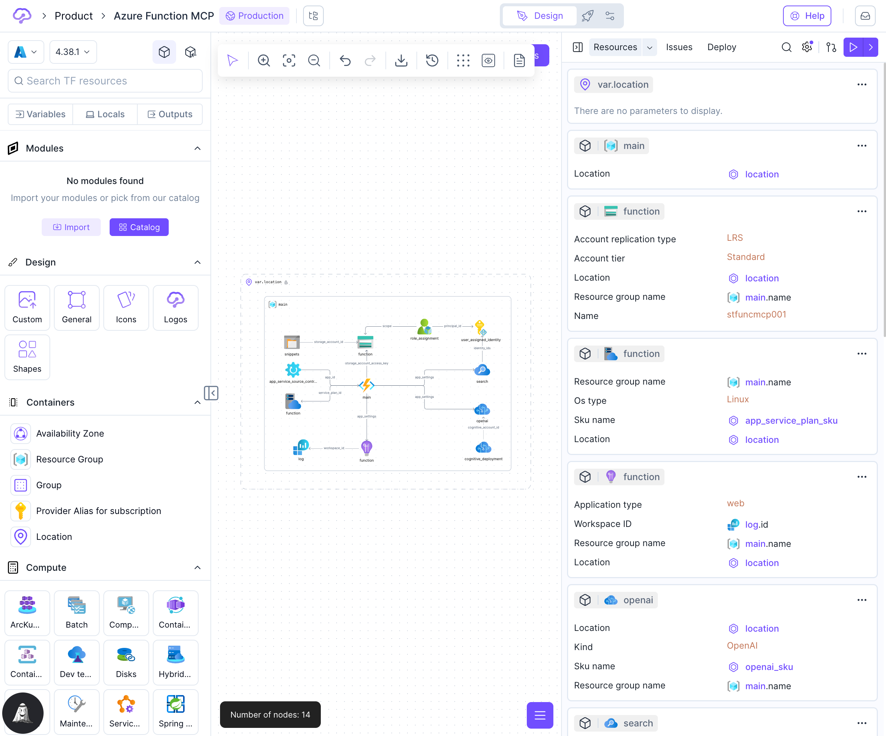

# Resources List

The **Resources List** provides a comprehensive overview of all cloud resources in your architecture, displayed as interactive cards. This interface enables quick navigation, parameter inspection, and resource management directly from the right panel.

<figure><figcaption>
Resources list showing all architecture resources
</figcaption></figure>

## Overview

The Resources List is accessible from the **Resources** tab in the [Right Panel](right-panel.md). It displays all resources in your current architecture design in an easy-to-scan card layout, helping you quickly find resources, understand relationships, and navigate your infrastructure.

## Key User Goals

The Resources List is designed to help you:

1. **Find resources quickly** - Search and filter through all resources in your architecture
2. **See resource overview** - View key parameters and configuration at a glance
3. **Navigate to diagram** - Jump directly to any resource's location in the visual diagram
4. **Understand relationships** - See how resources connect and reference each other

## Resource Cards

### Card Components

Each resource card displays:

1. **Resource Icon** - Visual indicator of the resource type (e.g., storage account, virtual machine, function app)
2. **Resource Name** - The Terraform resource name you've assigned
3. **Resource Type** - The Terraform resource type (e.g., `azurerm_storage_account`, `aws_s3_bucket`)
4. **Key Parameters** - Most important configuration values:
   * Required parameters
   * Connection references to other resources
   * Location/region information
   * Names and identifiers
5. **File Assignment** - Shows which Terraform file contains this resource

### Parameter Display

Parameters are displayed in different formats based on their type:

* **Simple Values** - Strings and numbers shown directly (e.g., `"Standard"`, `"LRS"`)
* **References** - Links to other resources shown with an icon and resource name (e.g., `→ resource_group.name`)
* **Variables** - Variable references shown with variable icon (e.g., `var.location`)
* **Complex Objects** - Nested configuration indicated with a message: "View full configuration in the Resource Configurator"


Parameter references are clickable - click any reference to navigate to the referenced resource, variable, or output.


### Card Actions

Each resource card provides quick actions:

* **Double-Click** - Opens the [Resource Configuration](resource-configuration.md) panel for detailed editing
* **Minimize/Expand** - Toggle between collapsed and expanded parameter view
* **Actions Menu** (⋯) - Access additional options:
  * Configure resource
  * Navigate to resource in diagram
  * Delete resource
  * View full configuration

## Search and Filter

### Resource Search

Use the search bar at the top of the Resources List to filter resources by:

* **Resource Name** - Search by the Terraform resource name
* **Resource Type** - Filter by type (e.g., "storage", "network", "compute")
* **Parameters** - Find resources with specific parameter values

### Search Behavior

* Search is **real-time** - results update as you type
* Search is **case-insensitive**
* Partial matches are supported
* Clear the search to see all resources again

## View Modes

The Resources List supports two organizational modes:

### Unified View

Displays all resources in a single continuous list, sorted by creation order or file assignment. This view is ideal for:

* Smaller architectures (under 50 resources)
* Quick scanning of all resources
* Finding resources by scrolling

### File-Grouped View

Organizes resources by their Terraform file assignment, with collapsible sections for each file. This view is ideal for:

* Larger architectures with many resources
* Viewing resources by logical file organization
* Understanding file structure


For architectures with many resources, File-Grouped View automatically activates to improve performance and navigation.


## Working with Resources

### Opening Resource Configuration

To open a resource for detailed editing:

1. **Double-click** the resource card, or
2. Click the resource card and select "Configure" from the actions menu

This opens the [Resource Configuration](resource-configuration.md) panel, where you can access the full configuration form, state information, and code editor.

### Navigating to Resources in the Diagram

Click the "Show in diagram" action to:

* Pan and zoom the canvas to the resource location
* Highlight the resource in the visual diagram
* Useful for large diagrams where resources may be off-screen

### Viewing Parameter Details

Hover over any parameter value to see:

* Parameter documentation
* Data type information
* Default values
* Validation requirements

## Resource Organization

### File Assignment

Resources are assigned to Terraform files based on:

* **Default Assignment** - New resources go to `main.tf` by default
* **Manual Assignment** - You can assign resources to different files
* **Automatic Separation** - Variables go to `variables.tf`, outputs to `outputs.tf`, etc.

To change a resource's file assignment:

1. Right-click the resource in the diagram
2. Select "Edit TF filename"
3. Choose an existing file or create a new one

Learn more in [Split Code into Files](autogenerated-code/split-code-into-files.md).

### Resource Relationship Indicators

Resource cards show relationship indicators:

* **Incoming References** - Icon shows when other resources reference this one
* **Outgoing References** - Displayed as clickable parameter values
* **Module Connections** - Special indicator for module-sourced resources

## Empty States

The Resources List displays different messages when:

* **No Resources** - "Drop a resource on the canvas to get started"
* **No Visible Resources** - When all resources are outside the visible canvas area, you'll see a "Fit to view" button
* **No Search Results** - "No resources match your search" with option to clear search

## Best Practices

### Navigation

* **Use search** for architectures with more than 10 resources
* **Use File-Grouped View** when working with organized, multi-file architectures
* **Click references** to quickly navigate between related resources

### Resource Management

* **Review parameters regularly** to ensure configurations are correct
* **Check for unset required parameters** (indicated with warning icons)
* **Use the minimize feature** to focus on specific resources while keeping others visible

### Performance

* For very large architectures (100+ resources), the interface automatically optimizes by:
  * Switching to File-Grouped View
  * Virtualizing the card list (only rendering visible cards)
  * Limiting expanded parameter displays

## Keyboard Shortcuts

* `SHIFT+CMD+R` / `SHIFT+CTRL+R` - Toggle Resources tab
* `CMD+F` / `CTRL+F` - Focus search input (when Resources tab is active)
* `Escape` - Clear search
* `Enter` - When hovering a card, open Resource Configuration

## See Also

* [Resource Configuration](resource-configuration.md) - Detailed resource configuration interface
* [Right Panel](right-panel.md) - Overview of all right panel tabs
* [Design Area](design-area/) - Visual diagram interface
* [Split Code into Files](autogenerated-code/split-code-into-files.md) - Organizing Terraform files
