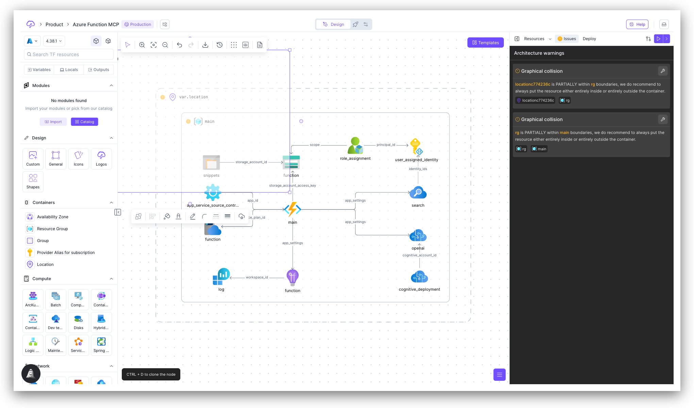
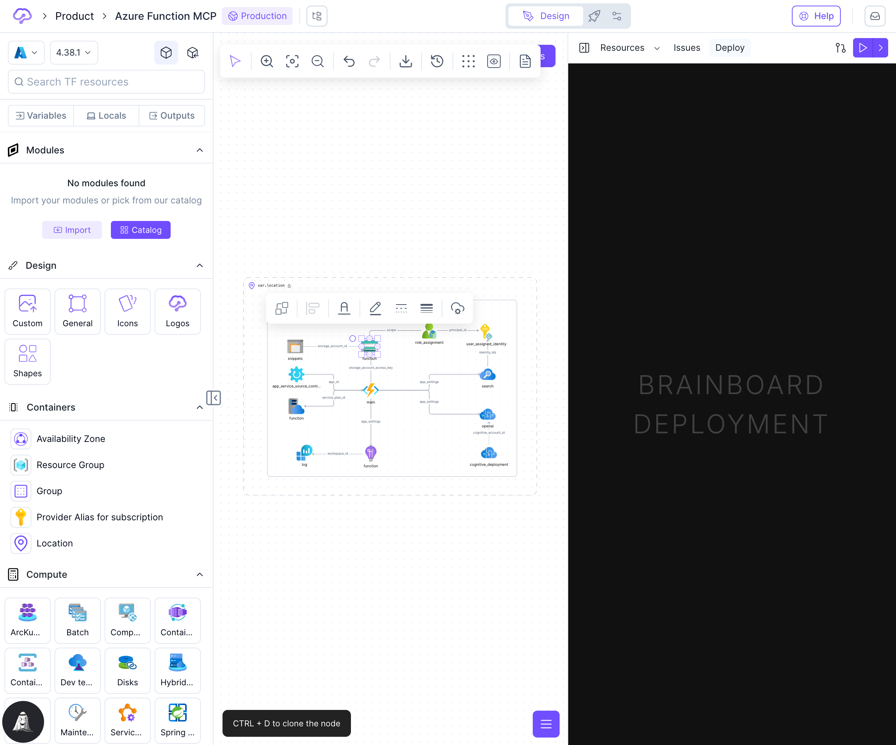

# Right Panel

The **Right Panel** in Brainboard provides quick access to your architecture's resources, generated code, validation issues, and deployment configuration. It serves as a central hub for reviewing, configuring, and managing your cloud infrastructure.

## Overview

The Right Panel features four main tabs, each serving a specific purpose:

1. **Resources** - View and manage all resources in your architecture
2. **Code** - View and edit generated Terraform code
3. **Issues** - Review architecture warnings and validation errors
4. **Deploy** - Configure and monitor CI/CD deployment pipelines

## Resources Tab

The Resources tab displays all cloud resources in your current architecture, providing a card-based interface for quick navigation and configuration.

<figure><figcaption>
Resources tab showing architecture resources
</figcaption></figure>

### Key Features

* **Resource Cards** - Each resource is displayed as a card showing:
  * Resource icon and name
  * Resource type and provider
  * Key configuration parameters
  * Reference relationships to other resources
* **Search** - Filter resources by name, type, or properties
* **Quick Actions** - Access common actions directly from resource cards:
  * Double-click to open the [Resource Configuration](resource-configuration.md) panel for detailed editing
  * View parameter values and references
  * Navigate to connected resources


Resources displayed in the panel reflect the current state of your visual diagram. Changes made visually are immediately reflected here.


### View Modes

The Resources tab supports two view modes:

* **Unified View** - All resources displayed in a single scrollable list
* **File-Grouped View** - Resources organized by their Terraform file assignment

Learn more about managing resources in [Resources List](resources-list.md).

## Code Tab

The Code tab provides direct access to view and edit your auto-generated Terraform code. This feature is ideal for users who prefer code-centric workflows or need to make quick adjustments.

### Key Features

* **File Selector** - Switch between different Terraform files (main.tf, variables.tf, outputs.tf, etc.)
* **Syntax Highlighting** - Full Terraform HCL syntax support
* **Code Validation** - Real-time validation with error reporting
* **Keyboard Shortcuts**:
  * `CMD/CTRL+S` - Save changes
  * `CMD/CTRL+F` - Search
  * `CMD/CTRL+H` - Find and replace
  * `CMD/CTRL+SHIFT+R` - Discard changes


Changes made in the code editor are bidirectional - they update both the code and the visual diagram. However, some limitations apply to preserve Brainboard's structured approach.


Learn more about code editing in [Code Edition](code-edition.md).

## Issues Tab

The Issues tab displays architecture warnings and validation errors, helping you maintain best practices and catch configuration problems early.

<figure><figcaption>
Issues tab showing architecture validation status
</figcaption></figure>

### Key Features

* **Architecture Warnings** - Identifies potential configuration issues:
  * Missing required parameters
  * Unconnected resources
  * Security best practice violations
  * Resource relationship inconsistencies
* **Validation Errors** - Shows Terraform validation errors before deployment
* **Quick Navigation** - Click any issue to navigate to the affected resource


Regular review of the Issues tab helps maintain infrastructure quality and prevents deployment failures.


## Deploy Tab

The Deploy tab provides access to Brainboard's deployment pipeline configuration and monitoring capabilities.

<figure><figcaption>
Deploy tab for pipeline configuration
</figcaption></figure>

### Key Features

* **Pipeline Configuration** - Set up and manage deployment workflows
* **Environment Settings** - Configure deployment targets
* **Execution History** - View past deployment runs and their status
* **Quick Actions** - Trigger deployments directly from the panel

Learn more about deployment in [CI/CD Designer](../automation/ci-cd-designer.md) and [Pipelines](../automation/pipelines.md).

## Panel Controls

### Collapsing the Panel

Click the close button (X) at the top of the panel to collapse it, providing more space for the design canvas. Click the panel icon in the toolbar to reopen it.

### Keyboard Shortcuts

* `SHIFT+CMD+D` / `SHIFT+CTRL+D` - Toggle Code tab
* `SHIFT+CMD+R` / `SHIFT+CTRL+R` - Toggle Resources tab

### Resizing

Drag the left edge of the panel to resize its width according to your preference.

## Best Practices

* **Use Resources tab** for quick parameter checks and navigation between resources
* **Use Code tab** when you need to make bulk changes or prefer code-first workflows
* **Check Issues tab** regularly, especially before running Terraform plan or apply
* **Configure Deploy tab** once and use it to maintain consistent deployment workflows

## See Also

* [Resources List](resources-list.md) - Detailed resource management
* [Resource Configuration](resource-configuration.md) - Advanced resource configuration
* [Code Edition](code-edition.md) - Code editing capabilities
* [Design Area](design-area/) - Visual diagram interface