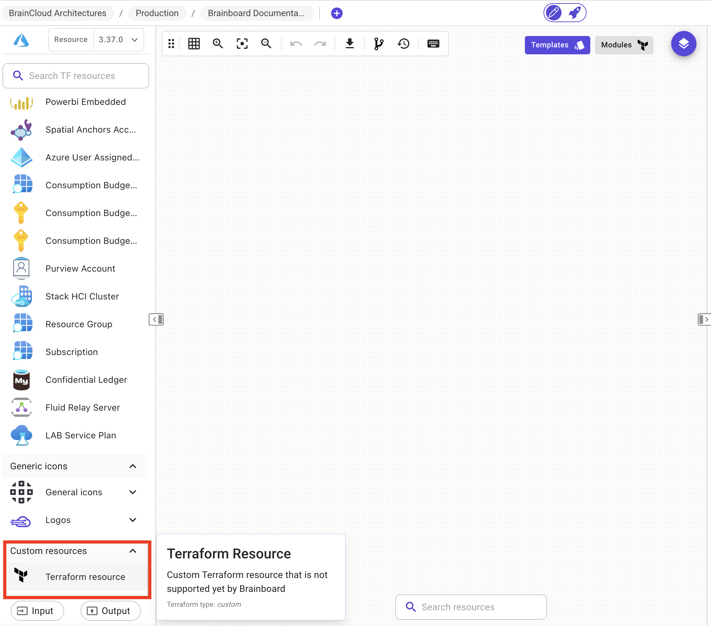
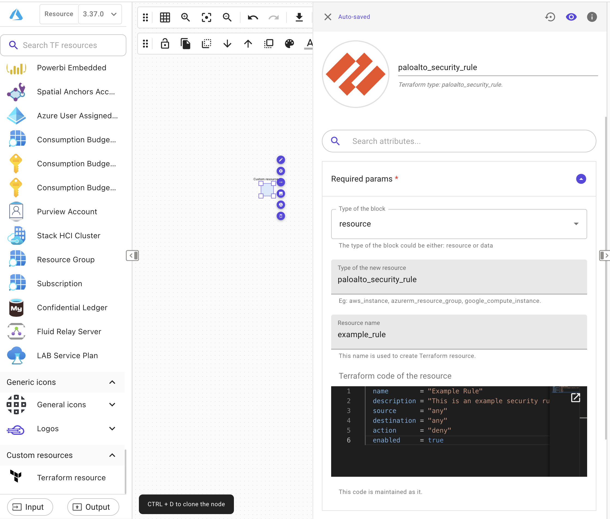

# Unsupported cloud providers ✨

### Description

Terraform supports a wide range of providers, including popular cloud providers, infrastructure providers, and SaaS providers.

They can be categorized as :

* **Official** Official providers are owned and maintained by HashiCorp hashicorp
* **Partner** Partner providers are written, maintained, validated and published by third-party companies against their own APIs.
* **Community** Community providers are published to the Terraform Registry by individual maintainers, groups of maintainers, or other members of the Terraform community.

Besides the providers that are supported by Brainboard (Azure, AWS, GCP, OCI, Scaleway), you can use all the other providers by following these steps:

1. Add the configuration for the cloud providers on the cloud provider configuration.
2. Add a new resource for that provider by using custom resources.

To illustrate it let's consider **Paloalto** as a cloud provider that is not supported by Brainboard and see how we can use it.

### Palo Alto Terraform Provider

The Palo Alto Networks Terraform provider is a plugin for Terraform that allows you to manage Palo Alto Networks resources, such as firewalls, in Terraform. The provider provides a set of Terraform resources that map to corresponding Palo Alto Networks resources, allowing you to manage your network infrastructure as code.

### Cloud Provider Configuration

To configure the Palo Alto Networks provider you'll need to follow these steps:

#### Configure the provider

Open the providers configuration by clicking on the button next to the current cloud provider that you are using.


In the provider's block, you'll need to configure the Palo Alto Networks provider by specifying the required parameters. This may include the API key or other credentials needed to connect to the Palo Alto Networks platform. A sample provider configuration block could look like this:

```hcl
provider "paloalto" {
  api_key = "<your-api-key>"
}
```

#### Add a resource

Once the provider is configured, you can add a resource in Brainboard. For example, you could create a firewall rule in Palo Alto Networks like this:

*   In the bottom of the left menu , you can find the custom resources. This is a block that you can add terraform resources that are not supported yet by Brainboard.

    
*   Drag and drop the resource in the architecture schema that you need and add the needed information in the card id.

    

    * **Type of the block** Add either resource if you want to provision a new resource or data if you want to use an existing one.
    * **Type of the new resource** Add the type of the new resource from the cloud provider. In this example is `paloalto_security_rule`.
    * **Resource name** Add a name for your new resource.
    * **Terraform code of the resource** Add the resource code and configuration into this field.
    * **Icon** Add a custom icon by clicking on the icon at the beginning of the card id.
* After finishing this steps you can use the resource as other supported resources in Brainbard and test it by running the terraform plan/apply command to create or update the resources in the Palo Alto Networks platform.
