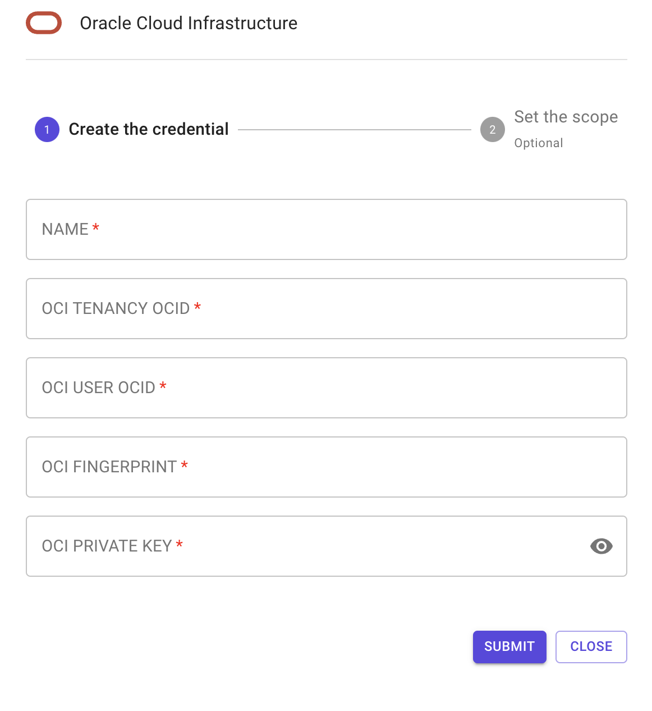
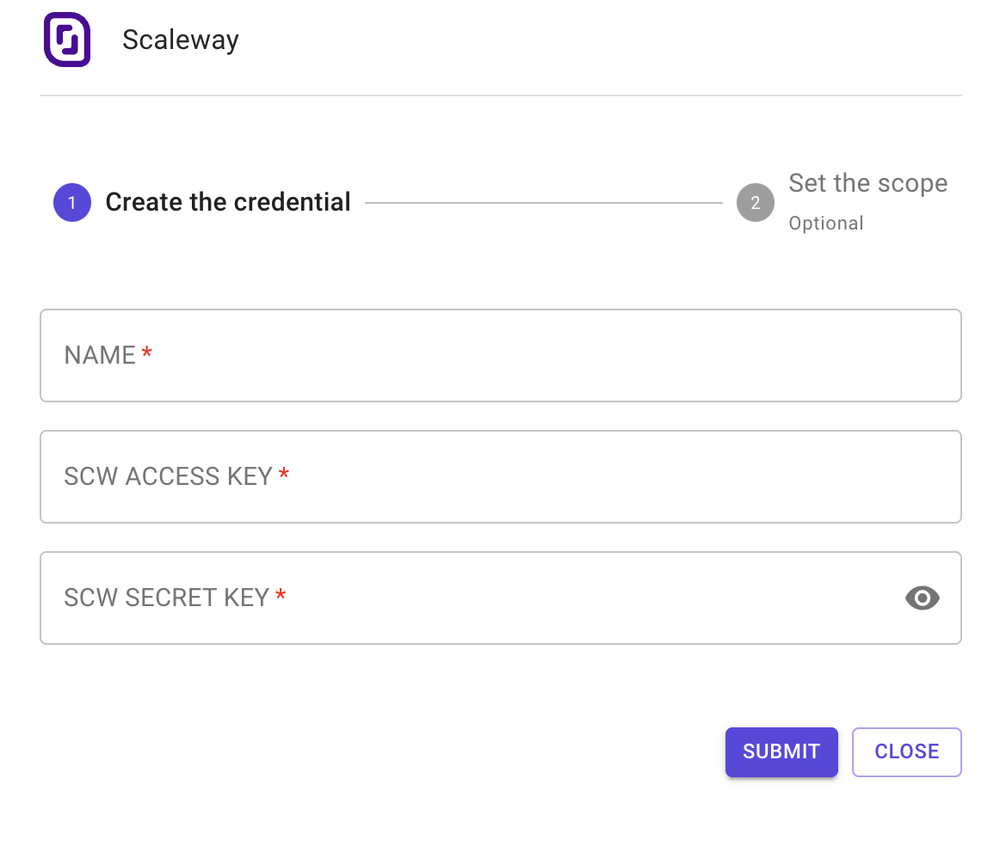

# Configure access

To configure the Oracle Cloud Infrastructure (OCI) provider in Terraform, you will need to specify the information in the OCI configuration as below and set the appropriate variables.

* The tenancy\_ocid variable specifies the OCID of the tenancy that you want to use. You can find your tenancy OCID in the Oracle Cloud Infrastructure Console under the "Tenancy Information" section.
* The user\_ocid variable specifies the OCID of the user to use. You can find your user OCID in the Oracle Cloud Infrastructure Console under the "User Settings" section.
* The fingerprint variable specifies the fingerprint of the public key that you have added to your user. You can find your public key fingerprint in the Oracle Cloud Infrastructure Console under the "User Settings" section.
* The private\_key\_path variable specifies the path to the private key file that corresponds to the public key that you have added to your user. This private key will be used to sign the requests to the OCI API.

Generate OCI credentials for Terraform

To generate Oracle Cloud Infrastructure (OCI) credentials for use with Terraform, you can use the OCI Console or the OCI CLI.

1. Using OCI Console:
2. Log in to the OCI Console
3. Go to the Identity service
4. Select Users from the navigation menu
5. Click on the "Create User" button
6. Enter a username, select "Programmatic" for the access type and then click on "Create"
7. Click on the username of the user you just created
8. Click on the "Create API Key" button

Click on the "Download" button to download the private key in PEM format

### Scaleway

To configure the Scaleway provider in Terraform, you will need to specify the provider block in your Terraform configuration file and set the appropriate variables.

* Name
* Scaleway Access Key
* Scaleway Secret Key

To generate access and secret keys in Scaleway, you will need to create an API token in the Scaleway console.

Generate Scaleway credentials for Terraform

Here are the steps to generate access key and secret key in Scaleway:

1. Go to the Scaleway console (https://console.scaleway.com) and sign in.
2. In the navigation menu, click on "Account" and then "API Tokens"
3. Click on the "Create a token" button.
4. In the "Create an API Token" form, give a name to the token and provide a brief description.
5. Under "Rights" select the rights that you want to assign to the token. These rights will determine the actions that can be performed by the token.
6. Click on "Create" to create the token.
7. Once the token is created, you will see the option to "Show the token". This is the only time the token will be displayed.
8. Once you have the token, you can use it as an access key.
9. You can also assign or revoke rights to the token by clicking on the pencil icon next to the token.

Scaleway does not provide a secret key. Instead, it uses the token generated as the access key and no separate secret key is required.

