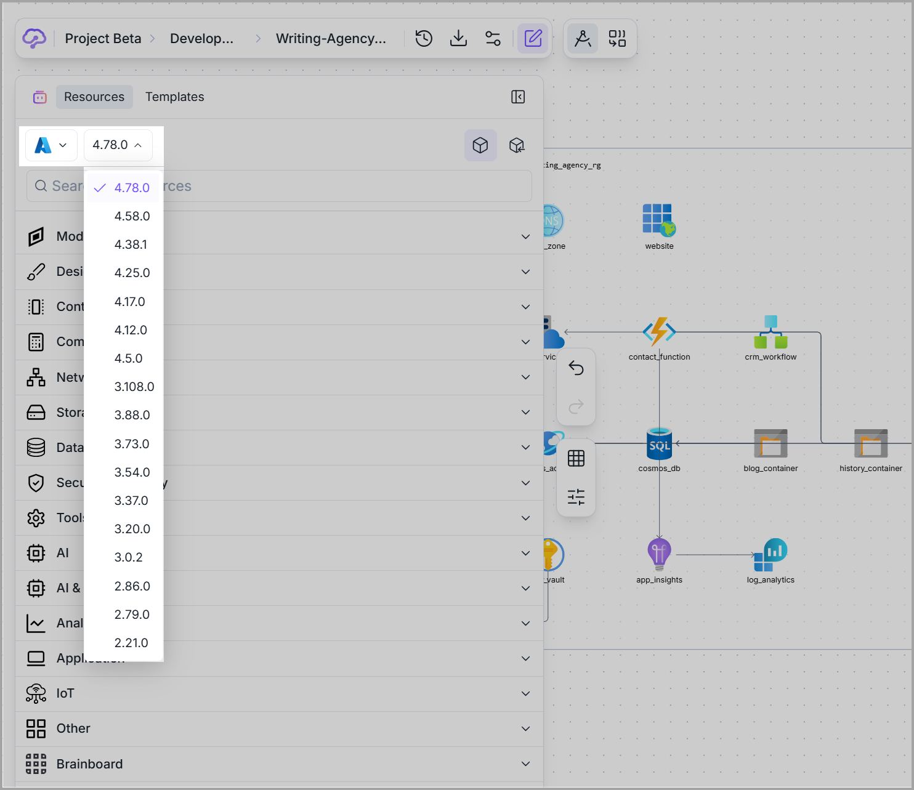

# Supported cloud providers

### Cloud provider definition

A **Terraform cloud provider** is a plugin that allows **Terraform** to interact with a specific cloud provider's API to create, manage, and delete resources. Each cloud provider has its own set of resources and data sources that can be used to define and manage infrastructure with **Terraform.**

You can use the provider block to specify which cloud provider you are using and configure its settings.


This block is typically placed at the top of a **Terraform** configuration file, and you can specify multiple providers to manage resources across multiple cloud providers


<mark style="color:$primary;">**Brainboard**</mark> supports the following cloud providers:

### Azure (Azure Resource Manager)

<mark style="color:$primary;">**`AzureRM`**</mark> is the **Terraform** provider for **Azure Resource Manager (ARM)**, which is the service that allows you to **manage** Azure resources.


It provides **Terraform** with the necessary API calls to interact with Azure's API and create, manage, and delete resources within your Azure account.



When you use the **AzureRM** provider in **Terraform**, you can _<mark style="color:$primary;">define resources</mark>_ such as _<mark style="color:blue;">virtual machines, storage accounts, and virtual networks</mark>_, and use **Terraform** to _<mark style="color:$primary;">create, update,</mark> and <mark style="color:$primary;">delete</mark>_ those resources in **Azure.**



Refer to the [credential page](../../settings/integrations/cloud-providers/azure.md) to understand how to connect <mark style="color:$primary;">**Brainboard**</mark> with your Azure environments.


### AWS (Amazon Web Services)

The <mark style="color:$primary;">**`AWS`**</mark> provider for **Terraform** is a plugin that allows **Terraform** to interact with the **AWS API** to create, manage, and delete resources within an **AWS** account.


It provides **Terraform** with the necessary API calls to _<mark style="color:$primary;">create, update,</mark> and <mark style="color:$primary;">delete</mark>_ **AWS** resources such as _<mark style="color:blue;">EC2 instances, S3 buckets,</mark>_ _and_ _<mark style="color:blue;">RDS databases.</mark>_



Refer to the [credential page](../../settings/integrations/cloud-providers/aws.md) to understand how to connect <mark style="color:$primary;">**Brainboard**</mark> with your AWS environments.


### OCI (Oracle Cloud Infrastructure)

<mark style="color:$primary;">**`Oracle Cloud Infrastructure`**</mark> provider is a plugin that allows **Terraform** to interact with the **Oracle Cloud Infrastructure (OCI) API** to create, manage, and delete resources within an **OCI** account.


It provides **Terraform** with the necessary **API calls** to _<mark style="color:$primary;">create, update,</mark> and <mark style="color:$primary;">delete</mark>_ OCI resources such as _<mark style="color:blue;">Compute instances, Virtual Cloud Networks,</mark> and <mark style="color:blue;">Block Volumes.</mark>_&#x20;

It also allows managing other resources that are not directly related to **OCI**, such as _<mark style="color:blue;">DNS records</mark>_ and others.



Refer to the [credential page](../../settings/integrations/cloud-providers/oci.md) to understand how to connect <mark style="color:$primary;">**Brainboard**</mark> with your OCI environments.


### GCP (Google Cloud Platform)

<mark style="color:$primary;">**`Google Cloud Platform`**</mark> provider for **Terraform** is a plugin that allows **Terraform** to interact with the **Google Cloud API** to  _<mark style="color:$primary;">create, manage,</mark> and <mark style="color:$primary;">delete</mark>_ resources within a **GCP** project.


It provides **Terraform** with the necessary **API calls** to _<mark style="color:$primary;">create, update,</mark> and <mark style="color:$primary;">delete</mark>_ **GCP** resources such as **Compute Engine** **instances**, **Cloud Storage buckets**, and **Cloud SQL databases.**



Refer to the [credential page](../../settings/integrations/cloud-providers/gcp.md) to understand how to connect <mark style="color:$primary;">**Brainboard**</mark> with your **GCP** environments.


### Scaleway

<mark style="color:$primary;">**`Scaleway`**</mark> provider for **Terraform** is a plugin that allows **Terraform** to interact with the **Scaleway API** to _<mark style="color:$primary;">create, manage,</mark> and <mark style="color:$primary;">delete</mark>_ resources within a **Scaleway** account.


It provides **Terraform** with the necessary **API calls** to _<mark style="color:$primary;">create, update,</mark> and <mark style="color:$primary;">delete</mark>_ **Scaleway** resources such as _<mark style="color:blue;">Compute instances, Volumes,</mark> and <mark style="color:blue;">Networks.</mark>_


### Providers versions

Every **Terraform** cloud provider has different versions for both its resources and data sources.

You can select any version from the list of versions:

<figure><figcaption></figcaption></figure>

When you select a specific version, <mark style="color:$primary;">**Brainboard**</mark> loads all the resources of this version and the <mark style="color:$primary;">**Resource Configuration**</mark> panel of every resource will contain the parameters available in the selected version.


When selecting a different version, always do a <mark style="color:$primary;">**`plan`**</mark> to make sure that the code is valid, as most often parameters are updated between versions and some resources may be added or deleted

