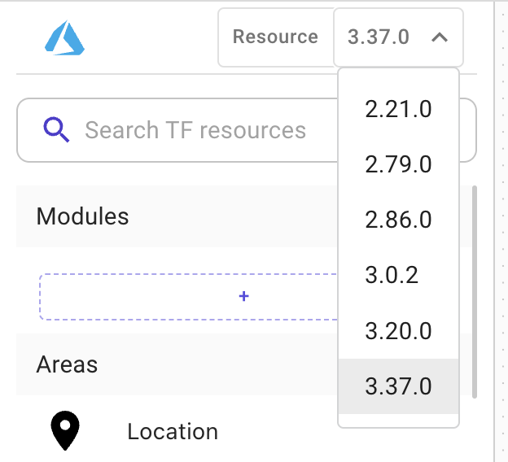

# Supported cloud providers

### Cloud provider definition

A **Terraform cloud provider** is a plugin that allows Terraform to interact with a specific cloud provider's API to create, manage, and delete resources. Each cloud provider has its own set of resources and data sources that can be used to define and manage infrastructure with Terraform.

You can use the provider block to specify which cloud provider you are using and configure its settings.


This block is typically placed at the top of a Terraform configuration file, and you can specify multiple providers to manage resources across multiple cloud providers


Brainboard supports the following cloud providers:

### Azure (Azure Resource Manager)

`AzureRM` is the Terraform provider for Azure Resource Manager (ARM), which is the service that allows you to manage Azure resources.

* It provides Terraform with the necessary API calls to interact with Azure's API and create, manage, and delete resources within your Azure account.
* When you use the AzureRM provider in Terraform, you can define resources such as virtual machines, storage accounts, and virtual networks, and use Terraform to create, update, and delete those resources in Azure.


Refer to the [credential page](../../settings/integrations/cloud-providers/azure.md) to understand how to connect Brainboard with your Azure environments.


### AWS (Amazon Web Services)

The `AWS` provider for Terraform is a plugin that allows Terraform to interact with the AWS API to create, manage, and delete resources within an AWS account.

* It provides Terraform with the necessary API calls to create, update, and delete AWS resources such as EC2 instances, S3 buckets, and RDS databases.


Refer to the [credential page](../../settings/integrations/cloud-providers/aws.md) to understand how to connect Brainboard with your AWS environments.


### OCI (Oracle Cloud Infrastructure)

`Oracle Cloud Infrastructure` provider is a plugin that allows Terraform to interact with the Oracle Cloud Infrastructure (OCI) API to create, manage, and delete resources within an OCI account.

* It provides Terraform with the necessary API calls to create, update, and delete OCI resources such as Compute instances, Virtual Cloud Networks, and Block Volumes. It also allows managing other resources that are not directly related to OCI, such as DNS records, and others.


Refer to the [credential page](../../settings/integrations/cloud-providers/oci.md) to understand how to connect Brainboard with your OCI environments.


### GCP (Google Cloud Platform)

`Google Cloud Platform` provider for Terraform is a plugin that allows Terraform to interact with the Google Cloud API to create, manage, and delete resources within a GCP project.

* It provides Terraform with the necessary API calls to create, update, and delete GCP resources such as Compute Engine instances, Cloud Storage buckets, and Cloud SQL databases.


Refer to the [credential page](../../settings/integrations/cloud-providers/gcp.md) to understand how to connect Brainboard with your GCP environments.


### Scaleway

`Scaleway` provider for Terraform is a plugin that allows Terraform to interact with the Scaleway API to create, manage, and delete resources within a Scaleway account.

* It provides Terraform with the necessary API calls to create, update, and delete Scaleway resources such as Compute instances, Volumes, and Networks.

### Providers versions

Every Terraform cloud provider has different versions for both its resources and data sources.

You can select any version from the list of versions:

When you select a specific version, Brainboard loads all the resources of this version and the id-card of every resource will contain the parameters available in the selected version.


When selecting a different version, always do a `plan` to make sure that the code is valid, as most often parameters are updated between versions and some resources may be added or deleted

