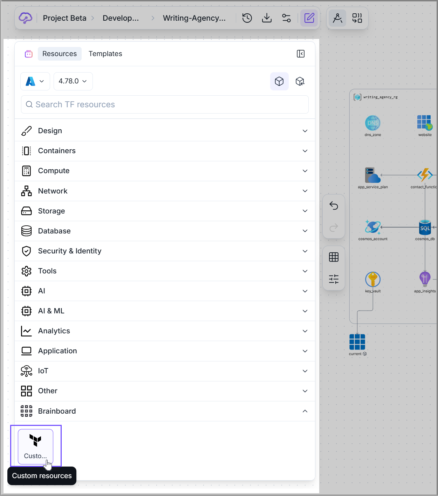

# Unsupported cloud providers

### Description

**Terraform** supports a wide range of providers, including popular cloud providers, infrastructure providers, and SaaS providers.

They can be categorized as:&#x20;


**Official** providers are owned and maintained by <mark style="color:blue;">**HashiCorp**</mark>**.**



**Partner** providers are written, maintained, validated and published by third-party companies against their own APIs.



**Community** providers are published to the Terraform Registry by individual maintainers, groups of maintainers, or other members of the Terraform community.


Besides the providers that are supported by <mark style="color:$primary;">**Brainboard**</mark> _<mark style="color:green;">(Azure, AWS, GCP, OCI, Scaleway)</mark>_, you can use all the other providers by following these steps:

1. **Add the configuration** for the cloud providers in the cloud provider configuration.
2. **Add a new resource** for that provider by using custom resources.

To illustrate, let's consider <mark style="color:blue;">**Palo Alto**</mark>, a Terraform provider not supported by <mark style="color:$primary;">**Brainboard**</mark>, and see how we can use it.

### Palo Alto Terraform provider

The <mark style="color:blue;">**Palo Alto Networks Terraform**</mark> provider is a plugin for **Terraform** that allows you to manage <mark style="color:blue;">**Palo Alto Networks**</mark> resources, such as _<mark style="color:blue;">firewalls</mark>_, in Terraform. The provider provides a set of **Terraform** resources that map to corresponding <mark style="color:blue;">**Palo Alto Networks**</mark> resources, allowing you to manage your network infrastructure as code.

### Cloud Provider Configuration

To configure the <mark style="color:blue;">**Palo Alto Networks**</mark> provider, you need to follow these steps:

#### 1. Configure the provider

In the _**left bar**_**,** click on the drop-down menu next to the cloud provider icon, and click the <mark style="color:$primary;">**`Custom configuration`**</mark> button. Enable the toggle on the <mark style="color:$primary;">**Customer Terraform provider definition**</mark> modal.&#x20;

<figure><figcaption></figcaption></figure>

In the custom provider block, you'll need to configure the <mark style="color:blue;">**Palo Alto Networks**</mark> provider by specifying the required parameters. This may include the **API** key or other credentials to connect to the <mark style="color:blue;">**Palo Alto Networks**</mark> platform. A sample provider configuration block could look like this:

```hcl
provider "paloalto" {
  api_key = "<your-api-key>"
}
```

#### 2. Add a resource

Once the provider is configured, you can add a resource in <mark style="color:purple;">**Brainboard**</mark>. For example, you could create a _<mark style="color:cyan;">firewall</mark>_ rule in <mark style="color:blue;">**Palo Alto Networks**</mark> like this:

1. At the bottom of the _<mark style="color:$primary;">**Leftbar**</mark>_, you can find the custom resources. This is a block where you can add **Terraform** resources that <mark style="color:$primary;">**Brainboard**</mark> does not yet support.

<figure><figcaption></figcaption></figure>

2. Drag and drop the custom resource, open its configuration and complete the information:&#x20;

* **Icon:** Add a custom icon by clicking on the icon at the top of the configuration panel.
* **Block Type:** Add either resource if you want to provision a new resource, or data.
* **Resource Type:** Add the type of the new resource from the cloud provider. In this example, it is <mark style="color:blue;">**`paloalto_security_rule`**</mark>.
* **Resource name:** Add a name for your new resource.
* **Terraform code of the resource:** Add the resource code and configuration into this field.

<figure><figcaption></figcaption></figure>

After finishing these steps, you can use the resource as other supported resources in <mark style="color:$primary;">**Brainboard**</mark> and test it by running the **Terraform plan/apply** command to create or update the resources in the <mark style="color:blue;">**Palo Alto Networks**</mark> platform.

