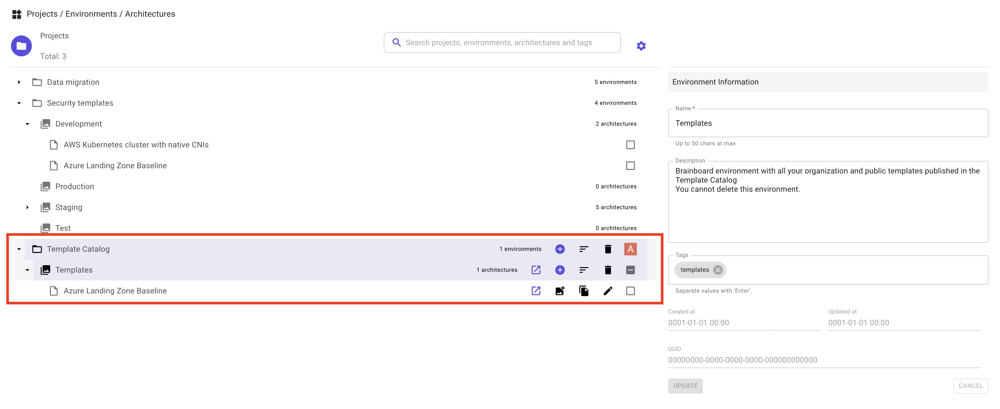

# Cloud architecture


### Description

Cloud architecture represents a real infrastructure that is either deployed or to be deployed.

* It is the container and the graphical face of your cloud resources.
* Architectures are located within an environment inside a project.
* In terms of Terraform, it has its own Terraform state file.
* It supports modules and private git repository natively.
* It has its own CI/CD pipelines to allow you to check its security posture, pricing, policies...before introducing any change.

### Components

Think of the architecture as a git repository containing all cloud resources of your infrastructure.

#### 1. Architecture information

All high-level information related to the architecture is accessible from the list of projects, environments and architectures.


Here is the explanation of all fields:

* Name of the architecture.
* Status of the architecture:
  * `WIP`
  * `Reviewing`
  * `Approved`
  * `Rejected`
  * `Deployed`
  * `Destroyed`
  * `Decommissioned`
  * `Locked`
* Description of the architecture.
* Tags: list of tags.
* Created at: read-only field. The creation timestamp in UTC.
* Updated at: read-only field. The last time this architecture has been updated in UTC format.
* UUID: architecture unique identifier. This number is useful when you reach out to the support.

#### 2. Nodes

The node is a fundamental component of the architecture, it represents (in most cases) a cloud resource of a given cloud provider.

* Every node has an identity card that contains its cloud configuration.
* This identity card represents the Terraform configuration parameters of the node. e.g.
  * `azurerm_lb`
  * `aws_instace`
  * `google_app_engine_application`
* You have the possibility to connect nodes by using the connectors from any selected node.

There are **5** types of nodes:

1. Cloud resource: this resource will be created when you provision the infrastructure.
2. Data source: it refers to an existing cloud resource.
3. Module: Terraform module.
4. Container: it can contain other resource and give them its properties. E.g. AWS VPC, or Azure virtual network.
5. Icon only: this resource is just graphic and has no Terraform representation.

#### 4. Variables

These are `Terraform variables` and `locals` that you can define and use both in the design and during deployment.

Refer to the [variables](../../../input-output/variables.md) page for a detailed explanation.

#### 5. Output

This is `Terraform output` that you can define and use both in the design and during deployment.

Refer to the [output](../../../input-output/output.md) page for a detailed explanation.

#### 6. README file

You can document for your infrastructure using Markdown.

Refer to the [Readme file](readme-file.md) page for a detailed explanation.

#### 7. Versions

You can track every change you do to the infrastructure by creating as many versions as you want.

Refer to the [versioning](../../../cloud-design/design-area/versioning.md) page for detailed explanation.

### Operations

#### Create architecture


You have different ways to create an architecture:

1.  **Create blank architecture**:&#x20;

    <figure><figcaption></figcaption></figure>
2.  **Clone a template from the templates' catalog**:&#x20;

    <figure><figcaption></figcaption></figure>

    Refer to the [templates page](../template.md) for more details.&#x20;

3\. **Import existing architecture**:&#x20;

<figure><figcaption></figcaption></figure>

Choose the source of the import, then import your infrastructure:


If you select Git as a source then you'll have the list of the supported Git providers:



Default tags By default, when you create a new architecture, Brainboard adds a variable called `tags` that contains the UUID of the architecture and the environment name.\


This variables will be added in all resources that support tagging using Terraform best practice using the function `merge`. It will look like this line of code:

```hcl
tags = merge(var.tags, {})
```


#### Multi-user edition

Multiple users can connect to the same architecture and collaboratively build it.

All you have to do is to invite your colleagues and give them rights to edit the architecture.

#### Clone architecture

You can clone an architecture either within the same environment or into another one.

To clone an architecture:

1.  Open the architecture selector by clicking in the name of the architecture in the top bar:&#x20;

    <figure><figcaption></figcaption></figure>
2.  Hover the line of the architecture, and click on `Clone this architecture` button:&#x20;

    <figure><figcaption></figcaption></figure>
3. In clone menu, specify:
   * Target environment.
   * Name of the new architecture and add a description.
   * Leave the sync option disabled.
   * Click `Next` to finalize the operation.
4. If the clone is successful, you'll be switched into the new architecture.
   * If the clone fails, you'll receive an error detailing the reason of the failure.




* Cloning an architecture also clones its history (versions), its variables, outputs and README file.
* When cloning an architecture, the variables are cloned but not their values.


#### Promote architecture into another environment

Promoting an architecture into another environment is the same operation as cloning, you just have to specify a different target environment.

#### Create a template from an architecture

You have the possibility to create a template from any architecture, as follows:

1.  Open the architecture selector by clicking in the name of the architecture in the top bar:&#x20;

    <figure><figcaption></figcaption></figure>
2.  Hover the line of the architecture, and click on `Create template from this architecture` button:&#x20;

    <figure><figcaption></figcaption></figure>
3. In clone menu, specify:
   * You are reminded to remove any sensitive information since the template will be used by others.
   * Specify the visibility of the template:
     * Organization: this means that the template will be visible only to users that are within your organization.
     * Public: the template will be visible to any Brainboard user.
   * Specify a new name and description
   * Click `Next` to publish the template into the templates' catalog.
4.  If the action is successful, a new project will be created named `Template catalog` with a new environment `Templates` and the new template will be visible inside.&#x20;

    <figure><figcaption></figcaption></figure>

This allows you to access, maintain or delete the template. - If the action fails, you'll receive an error detailing the reason of the failure.




* You cannot delete the project `Template catalog` nor the environment `Templates`. They will be removed automatically when you remove all your templates.
* The newly created template will be available in the templates' catalog.


#### Delete architecture

To delete an architecture:

1.  Open the architecture selector by clicking in the name of the architecture in the top bar:&#x20;

    <figure><figcaption></figcaption></figure>
2. Select the architecture(s) you want to delete.
3.  Click on `Delete the selected architectures` button:&#x20;

    <figure><figcaption></figcaption></figure>
4. Confirm the action to delete the architecture(s).
5. If you are authorized to delete the selected architecture(s) and the operation succeed, the architecture(s) will be removed from the listing.
   * If you are not allowed to delete the architecture(s) or the operation fails, you'll receive an error detailing the reason of the failure.


Deleting an architecture, environment or project cannot be undone


### Deploy architecture

To deploy your architecture, you have 2 options:

1. Either, use `one-action` to trigger Terraform `apply`. Refer to the[ one-action](../../../deployment-and-settings/ci-cd-engine/one-action.md) documentation for more details.
2. Or, build pipelines with Brainboard CI/CD engine and trigger it. Refer to the[ CI/CD engine](../../../deployment-and-settings/ci-cd-engine/) documentation for detailed steps.

### Best practices

* Always build default pipeline that contains at least security checks, and trigger it before pushing the code into your repository or deploying the architecture.
* Create versions frequently. It saves you many troubles as you can rollback easily to any specific point-in-time copy.
* Always update the status of your architecture.
