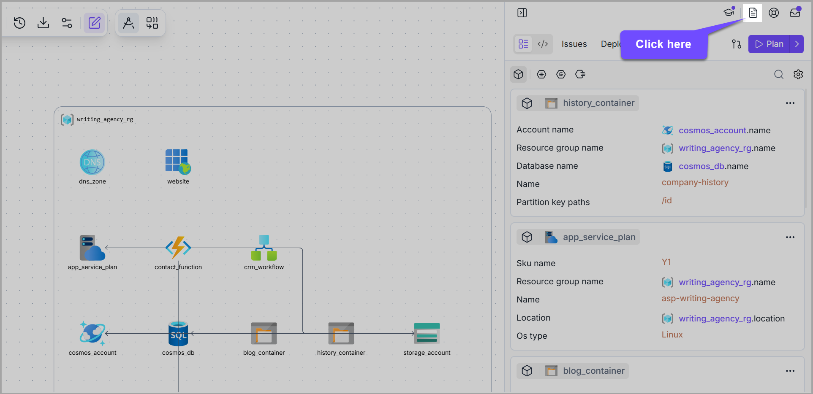
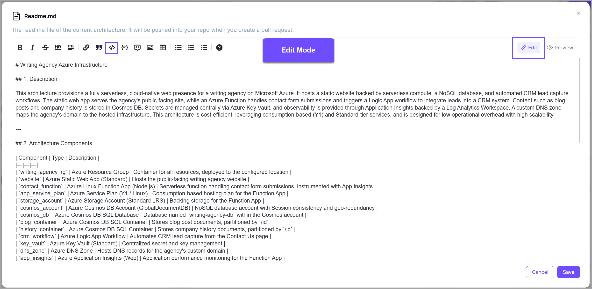
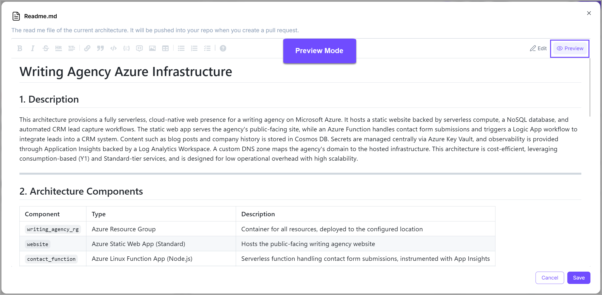

# Readme file

### Description

The <mark style="color:$primary;">**`readme`**</mark> file refers to a text file that provides information about the architecture, its features, requirements, installation instructions, and usage instructions.


It's an important component as it serves as the first point of reference for users.


When you [create a new architecture,](../../../getting-started/fast-track.md) a blank **README** file is created with it by default. You can edit it as you like.&#x20;

To access the **README** file of your architecture, click on the **file** icon (📄) available next to the **help icon** in the right panel.&#x20;

<figure><figcaption></figcaption></figure>

### Edit README file

To add information and edit the **README** file, just open the editor and add the details.

Brainboard lets you write a **Markdown** document and generates its **HTML** representation, making it super easy for you and your team to read.

To preview the **HTML** version of your file, switch to the <mark style="color:$primary;">**`Preview`**</mark> tab on the <mark style="color:$primary;">**`Readme.md`**</mark> window.&#x20;

<figure><figcaption></figcaption></figure>

<figure><figcaption></figcaption></figure>

### Visibility of the README file

* The **README** file will be displayed on the templates catalogue.
* The **README** file will be pushed to git when doing a pull request.
* The **README** file will be cloned along with the design of your architecture.

### Best practices

A good **README** file typically includes the following information:


**Project description:** A brief overview of the architecture, its purpose, and its key features.



**Usage instructions:** A step-by-step guide on how to use the architecture, including any variables and configuration settings.



**Support and contact information:** Details on how to get support or contact the development team, such as through email, forums, or social media.



**Release notes:** A list of changes, bug fixes, and new features for each release of the architecture.

