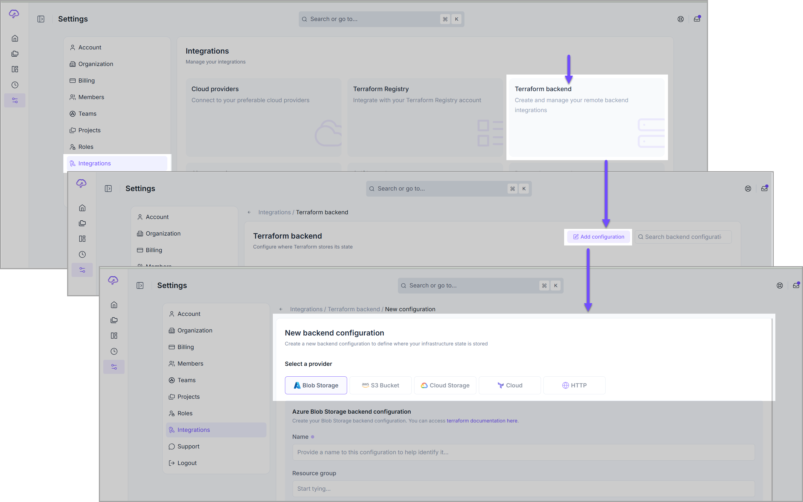
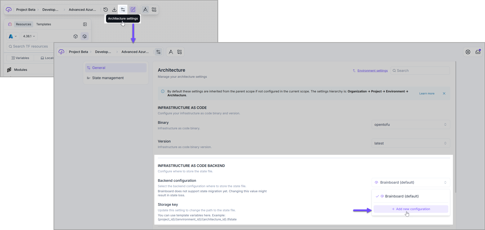
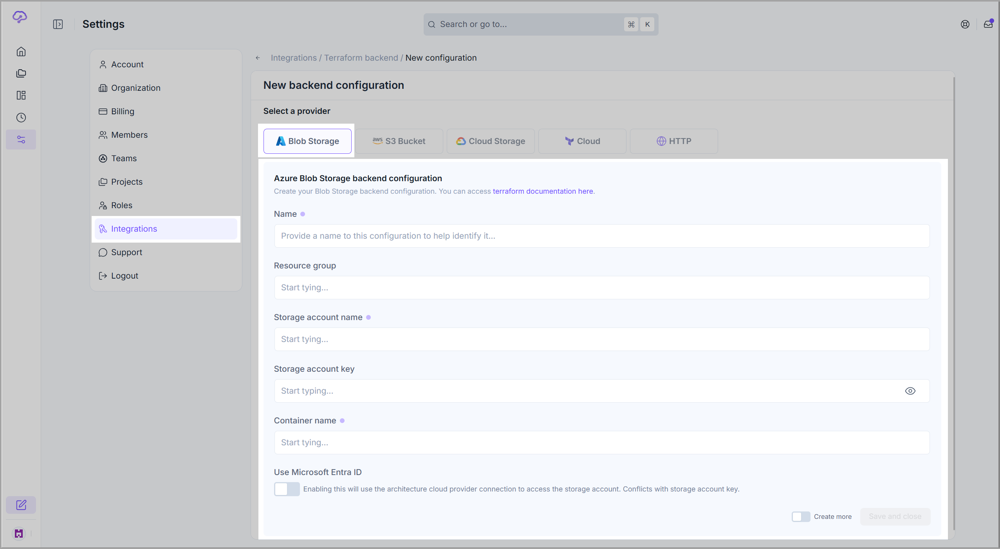
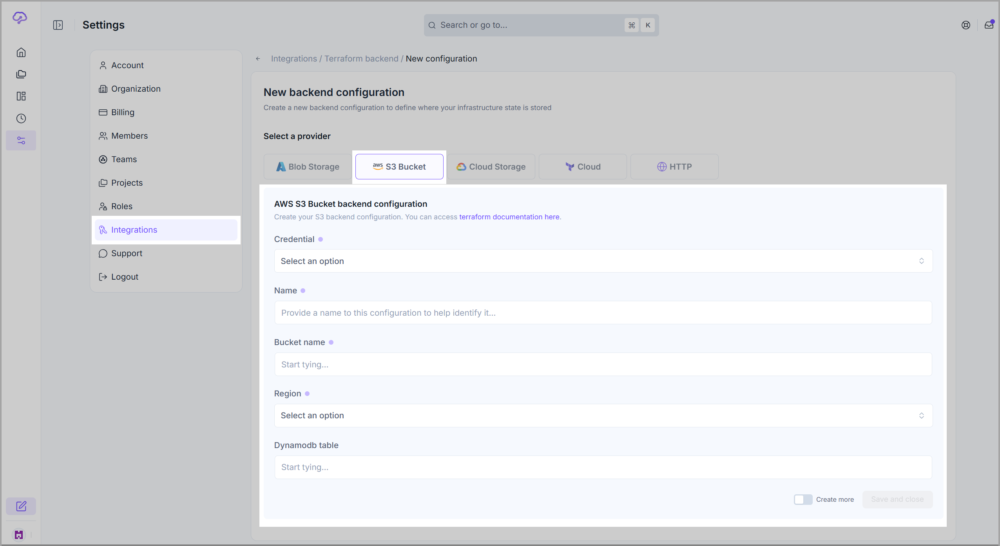
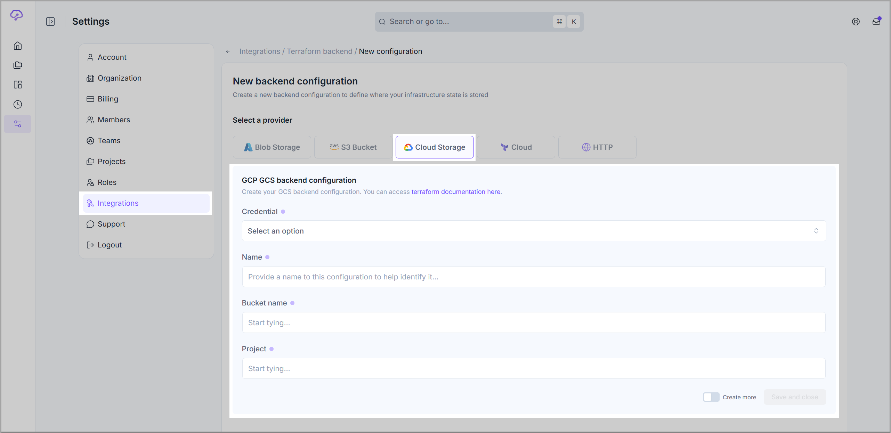
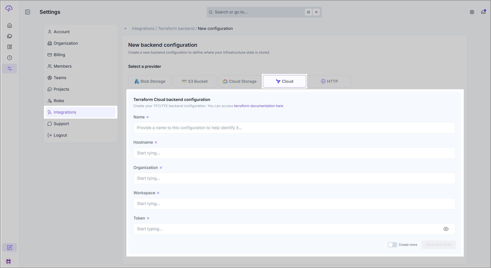
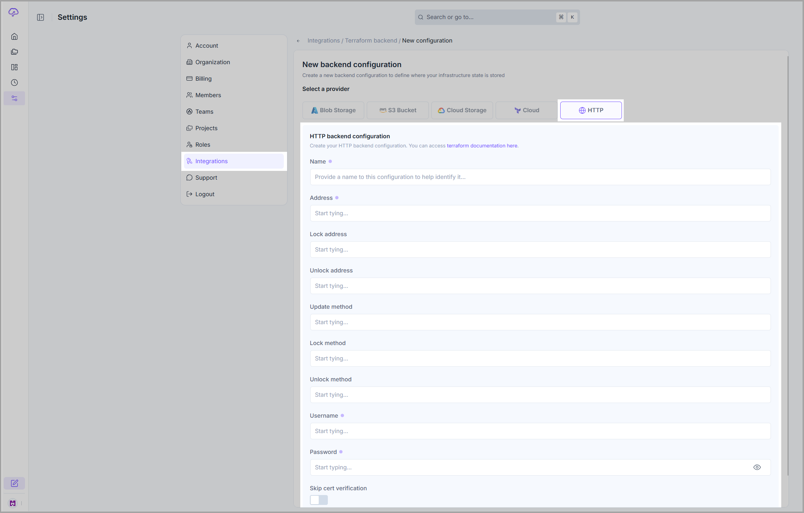

# Remote backend

### Definition

The <mark style="color:$primary;">**remote backend**</mark> is a storage that hosts the **Terraform** state of your cloud infrastructure after it is provisioned.

<mark style="color:$primary;">**Brainboard**</mark> uses **Terraform** as the provisioning engine, and so the concept of the <mark style="color:$primary;">**remote backend**</mark> comes from the configuration of **Terraform** that allows you to specify which storage system you want to use and how to access it.


The remote backend configuration can be set up at two levels:

1. Global
2. Architecture level


## Global

There are two paths under your [account settings](https://app.brainboard.co/settings/account) in <mark style="color:$primary;">**Brainboard**</mark> that you can follow to configure the remote backend at the global level.

1. Through the [Organization](https://app.brainboard.co/settings/organization) page.
2. Through the [Integrations](https://app.brainboard.co/settings/integrations) page.

### Organization page

Navigate to the **Infrastructure as Code Backend** section on this [page](https://app.brainboard.co/settings/organization). Here, you can select or add the desired remote backend by using the **Backend configuration** field.


<mark style="color:$primary;">**Brainboard**</mark> is the **default** backend when you don't specify one.



<mark style="color:$primary;">**Brainboard**</mark> stores the **Terraform** state in its cloud storage, which helps you stay protected as we isolate by default the state of every architecture.


If you want to add a new configuration, simply click the <mark style="color:$primary;">**`Add new configuration`**</mark> option that appears in the dropdown menu of the **Backend configuration** field. It will navigate you to the <mark style="color:$primary;">**New backend configuration**</mark> page, which is exactly the same as the one that opens when you add a new **Terraform configuration** through the[ Integrations page](https://app.brainboard.co/settings/integrations).

<figure><figcaption></figcaption></figure>


If you use your own **S3** or **blob storag**e remote backend, it means that by default, all the states will be stored in your own infrastructure.


### Integrations page

1. On the [Integrations page](https://app.brainboard.co/settings/integrations), click on the <mark style="color:$primary;">**Terraform backend**</mark> section.
2. Then, click <mark style="color:$primary;">**`Add configuration`**</mark> on the [Terraform backend](https://app.brainboard.co/settings/integrations/terraform-backend) page.
3. On the[ New backend configuration page](https://app.brainboard.co/settings/integrations/terraform-backend/create), you will have the option to select from the available supported backend options:
   1. Azure blob storage
   2. AWS S3 bucket
   3. Google Cloud Storage
   4. Terraform cloud
   5. HTTP

<figure><figcaption></figcaption></figure>


If you use a different backend from the supported ones, please reach out to our support team.


## Architecture level

You can specify a different remote backend at the architecture level, giving you more control over where you want to store the state files for any given architecture.

To specify a remote backend for the architecture:

1. Open your architecture canvas.
2. Click the **settings icon** in the top navigation bar.
3. On the Architecture settings page, you can configure the backend using the <mark style="color:$primary;">**Infrastructure as Code Backend**</mark> section. Follow the same steps as mentioned before for [AWS S3](remote-backend.md#id-2.-aws-s3-bucket), [Azure blob storage](remote-backend.md#id-2.-azure-blob-storage) or [Brainboard backend](remote-backend.md#id-1.-brainboard).

<figure><figcaption></figcaption></figure>

## Supported backends


Either you specify a **remote backend** (other than <mark style="color:$primary;">**Brianboard**</mark>) at the **global** or **architecture level**, the same [New backend configuration](https://app.brainboard.co/settings/integrations/terraform-backend/create?) page is used.

**Path:** <mark style="color:$primary;">Settings</mark> > <mark style="color:$primary;">Integrations</mark> > <mark style="color:$primary;">Terraform backend</mark> > <mark style="color:$primary;">Add new configuration</mark>



You can override the remote backend of a **specific architecture** in its settings page, as explained under[#architecture-level](remote-backend.md#architecture-level "mention").



Once the configuration is done, click on <mark style="color:$primary;">**`Save and close`**</mark> button given at the bottom right corner of the **New backend configuration** page to save the changes.


### 1. Brainboard

Brainboard is the default backend, which can be set up as a global backend using the [#organization-page](remote-backend.md#organization-page "mention")or at the [#architecture-level](remote-backend.md#architecture-level "mention").

### 2. Azure blob storage

Configuring the **Azure blob storage** as the backend in <mark style="color:$primary;">**Brainboard**</mark> means that the **Terraform** state of all your architectures will be stored in the specified **blob storage**.

When you specify the **Azure blob storage**, <mark style="color:$primary;">**Brainboard**</mark> stores the **Terraform** state of every architecture in a separate file that has the **UUID** of the architecture as a name.

On the [**New backend configuration** page](https://app.brainboard.co/settings/integrations/terraform-backend/create), navigate to the **Azure Blob Storage** tab and enter the following information:

* **Name** of the configuration
* **Resource group**
* **Storage account name**
* **Storage account key:** You can create a new access key following this [Azure documentation](https://learn.microsoft.com/en-us/azure/storage/common/storage-account-keys-manage?tabs=azure-portal)
* **Container name**


When you specify the storage **container name**, if the container doesn't exist, <mark style="color:$primary;">**Brainboard**</mark> will create a new one with the name you enter. To do so, it uses the default **AzureRM** credentials, so make sure these credentials have the rights to create a new storage container in the selected storage account.


* **Use Microsoft Entra ID:** Enabling this will use the architecture cloud provider connection to access the storage account. Conflicts with the storage account key.
* **Create more**

<figure><figcaption></figcaption></figure>

### 2. AWS S3 bucket

Specifying the **AWS S3** bucket as a backend in <mark style="color:$primary;">**Brainboard**</mark> means the **Terraform** state of all your architectures will be stored in the bucket you specify.

When you specify the **S3** bucket, <mark style="color:$primary;">**Brainboard**</mark> stores the **Terraform** state of every architecture in a separate file that has the **UUID** of the architecture as a name.

On the [**New backend configuration** page](https://app.brainboard.co/settings/integrations/terraform-backend/create), navigate to the **AWS S3 Bucket** tab and enter the following information:

* **Credential**
* **Name** of the configuration
* **Bucket name**


When you specify the **bucket name**, if the bucket doesn't exist, <mark style="color:$primary;">**Brainboard**</mark> will create a new one with the name you enter. To do so, it uses the default **AWS credentials**, so make sure these credentials have the rights to create a new bucket.


* **Region**
* **Dynamodb table**

<figure><figcaption></figcaption></figure>

### 3. Google Cloud Storage

<mark style="color:$primary;">**Brainboard**</mark> enables you to use **Google Cloud Storage** as a remote backend to host your **Terraform** states of all your architectures.

On the [**New backend configuration** page](https://app.brainboard.co/settings/integrations/terraform-backend/create), navigate to the **Google Cloud Storage** tab and enter the following information:

* **Credential**
* **Name** of the configuration
* **Bucket name**
* **Project**

<figure><figcaption></figcaption></figure>

### 4. Terraform Cloud backend

<mark style="color:$primary;">**Brainboard**</mark> enables you to use **Terraform Cloud** as a remote backend to host your **Terraform** states of all your architectures.

On the [**New backend configuration** page](https://app.brainboard.co/settings/integrations/terraform-backend/create), navigate to the **Terraform Cloud** tab and enter the following information:

* **Name** of the configuration
* **Hostname**
* **Organization** name
* **Workspace** name
* The **token** to authenticate

<figure><figcaption></figcaption></figure>

### 5. HTTP

<mark style="color:$primary;">**Brainboard**</mark> enables you to use **HTTP** as a remote backend to host your **Terraform** states of all your architectures.

On the [**New backend configuration** page](https://app.brainboard.co/settings/integrations/terraform-backend/create), navigate to the **Terraform Cloud** tab and enter the following information:

* **Name** of the configuration
* **Address**
* **Lock address**
* **Unlock address**
* **Update method**
* **Lock method**
* **Unlock method**
* **Username**
* **Password**
* **Skip certificate verification** on/off toggle

<figure><figcaption></figcaption></figure>

## Access

To access the remote backend, <mark style="color:$primary;">**Brainboard**</mark> uses the default cloud provider credentials that you provide in the [credentials page](https://app.brainboard.co/settings/integrations/cloud-providers), so make sure that these credentials have the right to access the storage.

Refer to the [data management](../../../security/data.md) page if you want to understand what information is manipulated and/or stored by Brainboard.

## State migration

To migrate your **Terraform** state into <mark style="color:$primary;">**Brainboard**</mark>, you have two options:

1. **Use&#x20;**<mark style="color:$primary;">**Brainboard**</mark>**&#x20;backend:** In this case, you need to upload your state files when you import your **Terraform** files. <mark style="color:$primary;">**Brainboard**</mark> will automatically detect the state file and put it in our storage.
2. **Use your remote backend (AWS S3 or Azure blob storage):**
   * Configure the remote backend in <mark style="color:$primary;">**Brainboard.**</mark> Follow the steps for [AWS S3](remote-backend.md#id-2.-aws-s3-bucket) or [Azure Blob Storage](remote-backend.md#id-2.-azure-blob-storage).
   * In the remote backend storage that you configured, create a folder that has a name as that of the architecture **UUID**.
   * Put your state in the folder you just created.
   * Test in <mark style="color:$primary;">**Brainboard**</mark> by launching a _**Terraform Plan**_ from the design area of your architecture.
