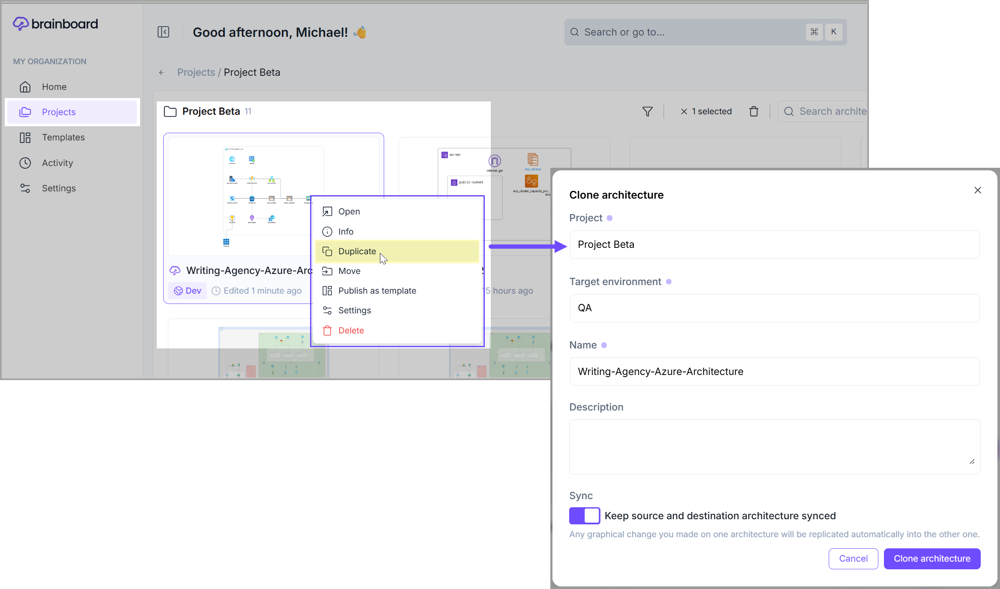
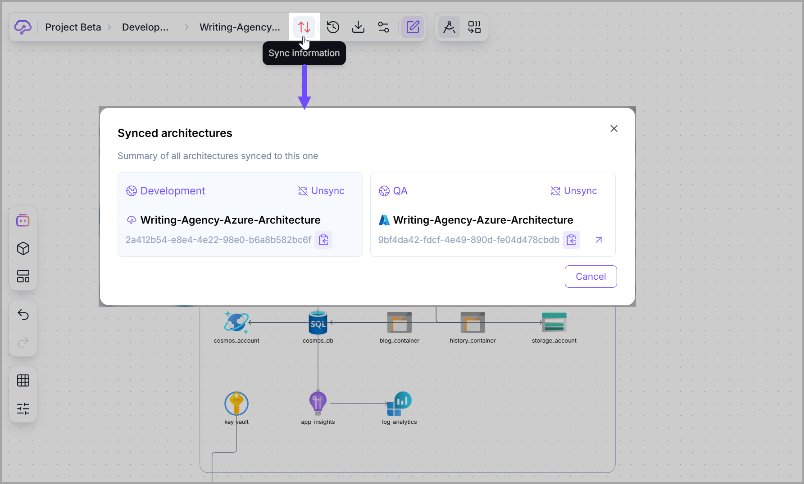
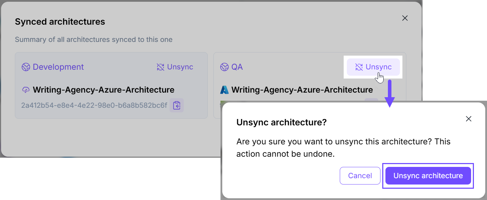

# Architecture Synchronization

### Definition

When managing cloud infrastructures at scale, you may want to keep your environments (e.g. QA, staging, production) close to each other.

You can achieve this by synchronizing an architecture across multiple environments, which means that any modification you do on one environment will be automatically replicated/synchronized with all synced environments, except the values of the variables that are supposed to be specific to each environment.

This allows you to maintain a consistent infrastructure across all your development, testing, and production environments.

### Create a synced environment

Here are the steps you can follow to implement environment sync in <mark style="color:$primary;">**Brainboard**</mark>:

1. Create the design and **Terraform** configuration for a specific architecture within a specific environment, for example: <mark style="color:$primary;">**`Development`**</mark>.
2. Go to [Projects](https://app.brainboard.co/projects) and open the project where your architecture is saved.&#x20;
3. Now, **right-click** on the architecture that you want to sync and click on the <mark style="color:$primary;">**`Duplicate`**</mark> button. It will open the Clone architecture modal for you to enter the following information:&#x20;
   1. **Project:** Select the desired project.
   2. **Target environment:** Add the **target** environment where you want to clone your architecture. For example, <mark style="color:$primary;">**`QA`**</mark>.
   3. **Name:** You can assign a different name to the cloned architecture.&#x20;
   4. **Description (optional)**
   5. **Sync:** Turn this toggle on to keep the source and destination architectures in sync.

<figure><figcaption></figcaption></figure>


The variables values are not synced, so you can use different values for different environments. Refer to the [Variables](../../../input-output/variables.md) to know more about the variables


### View synced environments

Once the architecture is synced, you see a new <mark style="color:$primary;">**`Sync Information`**</mark> clickable icon in the options bar. When you click on it, you can see all **synchronized environments** for this architecture.

<figure><figcaption></figcaption></figure>

### Un-sync environment

To **un-sync** a specific architecture or environment, click on the same **sync** icon available in the options bar. On the <mark style="color:$primary;">**Synced architectures**</mark> modal, click the <mark style="color:$primary;">**`Unsync`**</mark> button for the architecture to unlink it from the synchronized environments. On the confirmation popup, click the <mark style="color:$primary;">**`Unsync architecture`**</mark> button to confirm the unsyncing action.&#x20;

<figure><figcaption></figcaption></figure>

### Best practices


Use this process to apply changes to all environments consistently.&#x20;

For example, you might use the <mark style="color:$primary;">**Brainboard**</mark> **CI/CD** engine to apply different pipelines to different environments while keeping the design of the cloud architecture consistent through all environments.

Refer to the [CI/CD Engine](../../../automation/ci-cd-designer.md) to learn more about it.



Use **variables** and other **configuration options** to customize each environment as needed.&#x20;

For example, you might use different values for variables like the number of instances or the size of a database depending on the environment.



By using <mark style="color:$primary;">**Brainboard**</mark> to implement environment sync, organizations can ensure that their infrastructure is consistent across different environments, reducing the risk of <mark style="color:orange;">**drift**</mark>**,** <mark style="color:red;">**configuration errors**</mark> and <mark style="color:green;">**improving overall reliability.**</mark>

