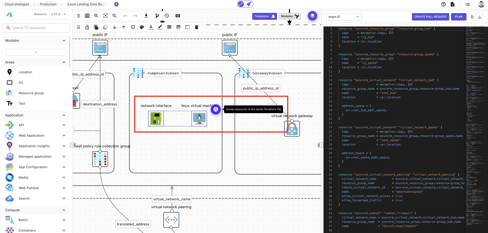
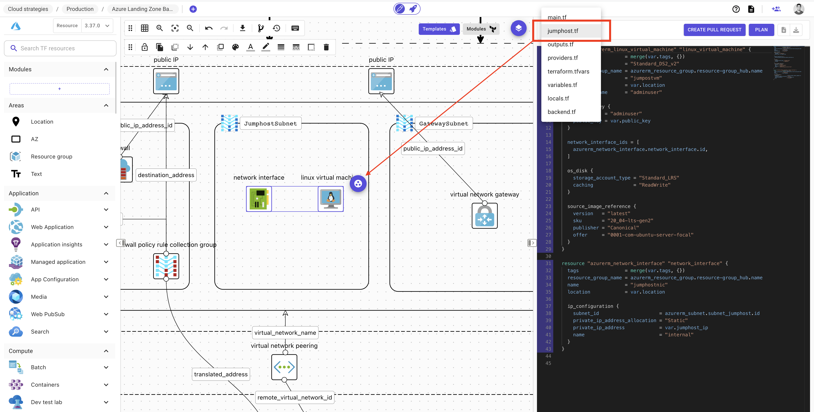
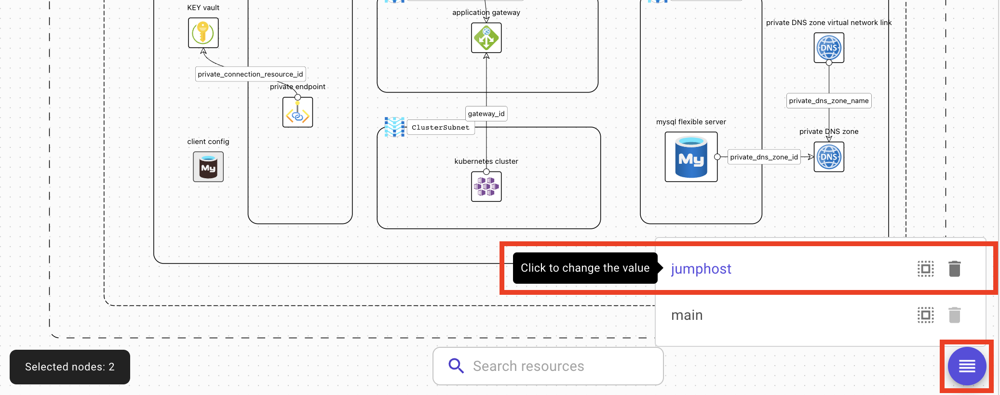
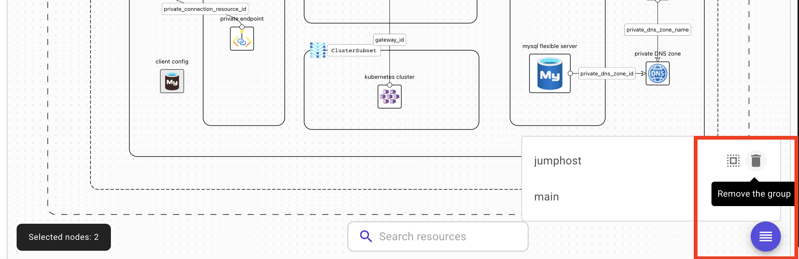
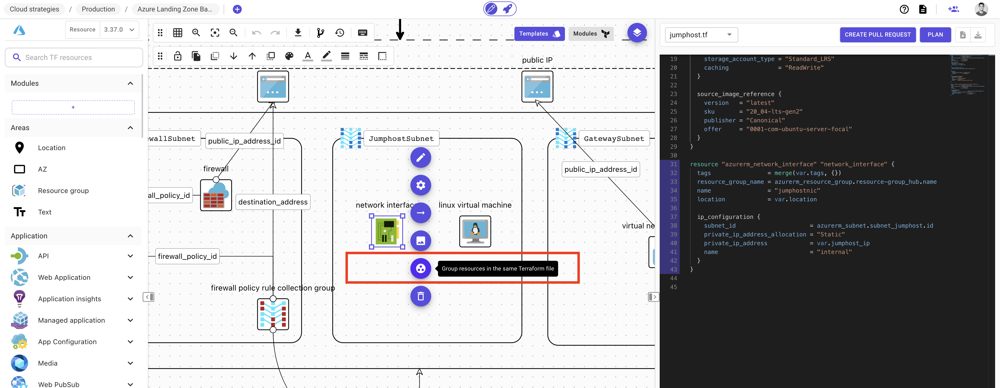

# Terraform files

### Description

When you create your architecture, Brainboard automatically and instantly generates a Terraform code for your infrastructure.

This code is stored in different files according to the best practices of Terraform.

### Files structure

By default, if you don't change rename or change the generated files, you have the following ones:

1. **main.tf**: contains all the definition of resources and their configuration. See how you can change or rename it below.
2. **output.tf**: contains the output variables.
3. **providers.tf**: contains the definition of `terraform` block and the providers.
4. **terraform.tfvars**: contains **only** the values of the variables if defined.
5. **variables.tf**: contains the definition of variables and their blocks.
6. **locals.tf**: contains the definition of Terraform `locals`.
7. **backend.tf**: contains the configuration of the remote backend.

### Create new Terraform file

To create a new Terraform file that contains some resources:

1. Select the resource you want to put in the same file.
2.  Click on `Group resource in the same Terraform file` button:&#x20;

    <figure><figcaption></figcaption></figure>
3. Give a new name of the file.
4. Click on `Save` to create the new file and put resources inside it.

Once the file is created, it will be visible in the list of Terraform files:&#x20;

<figure><figcaption></figcaption></figure>

### Rename existing Terraform file

To rename an existing file:

1. Click on the button to display the list of groups:
2.  Click on the name of the group:&#x20;

    <figure><figcaption></figcaption></figure>
3. Rename it and save.

### Delete a Terraform file

To delete an existing file:

1. Click on the button to display the list of groups:
2.  Click on the `Delete group` button:&#x20;

    <figure><figcaption></figcaption></figure>
3. Confirm to permanently delete it.


When you delete a group, the resources inside it **will not be deleted**. They will be put back in `main.tf`. To delete them, you need to select and delete them


### Add resource into an existing file

To add a resource into an existing or new Terraform file (group):

1. Select the resource.
2.  Click on the `Group resource in the same Terraform file` button:&#x20;

    <figure><figcaption></figcaption></figure>
3. Either select group from the available list or create a new one.
4. Click on `Save` to persist the change.

### Remove resource from a file

To remove a resource from an existing Terraform file (group):

1. Select the resource.
2.  Click on the `Group resource in the same Terraform file` button:&#x20;

    <figure><figcaption></figcaption></figure>
3. Select `main`.
4. Click on `Save` to persist the change.

### Best practices

* Always group resources that are supposed to work together or have the same logic in a separate group / Terraform file.
* Use explicit names for your Terraform files. Usually, there are 2 conventions of naming:
  * Infrastructure base naming: `vpc.tf`, `db.tf`...
  * Application base naming: `microservice1.tf`, `backend.tf`...
