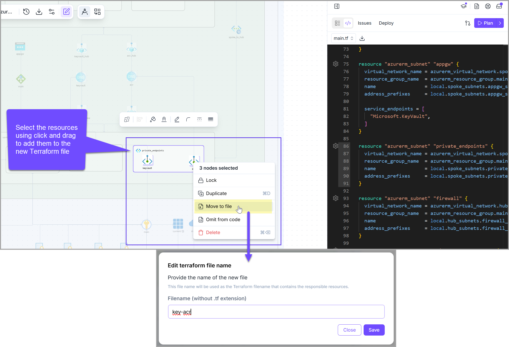
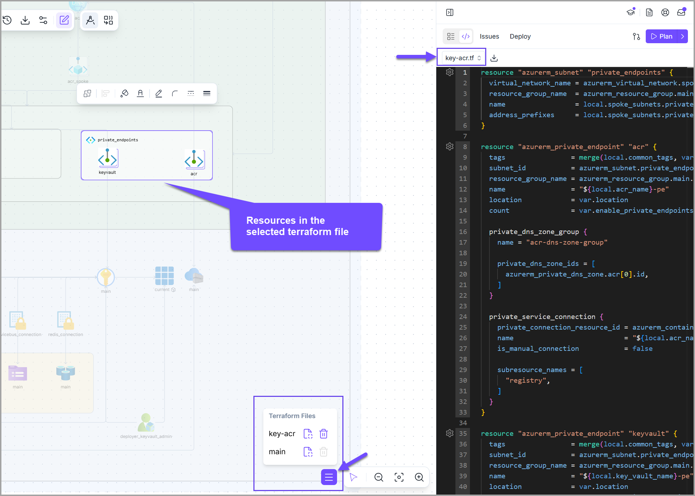
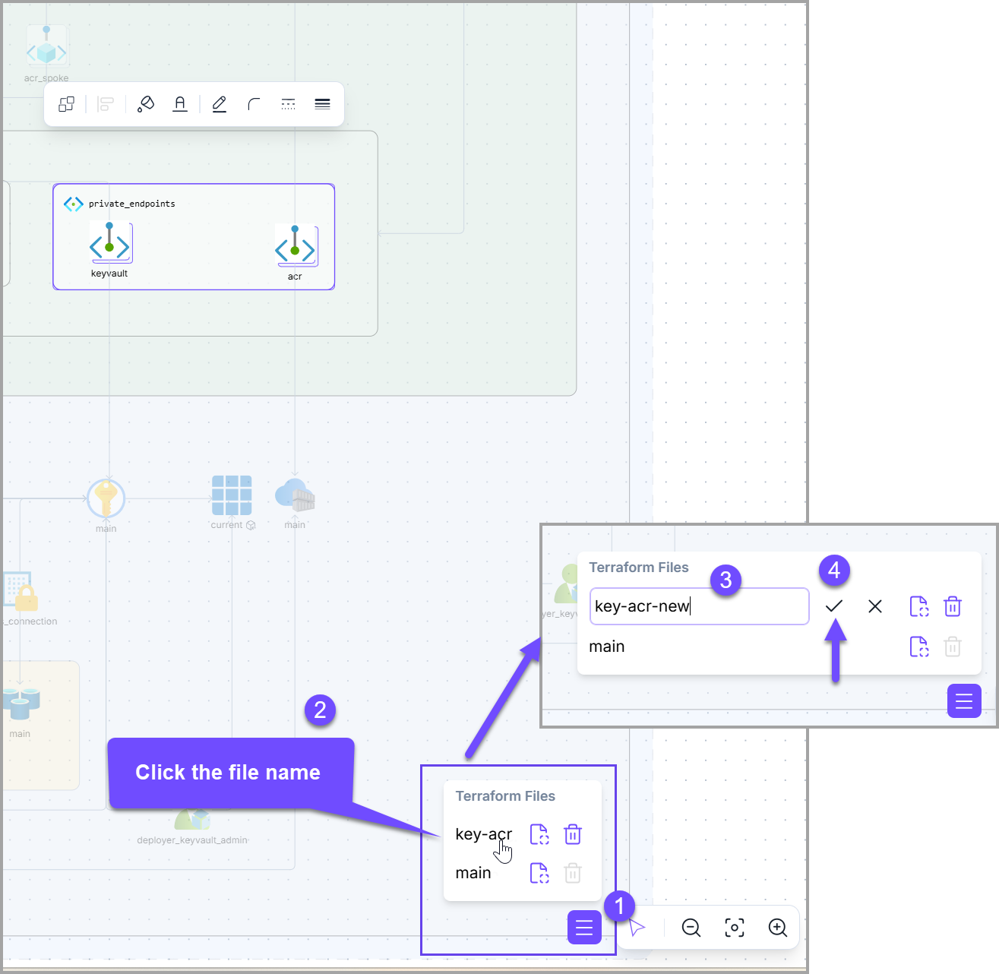
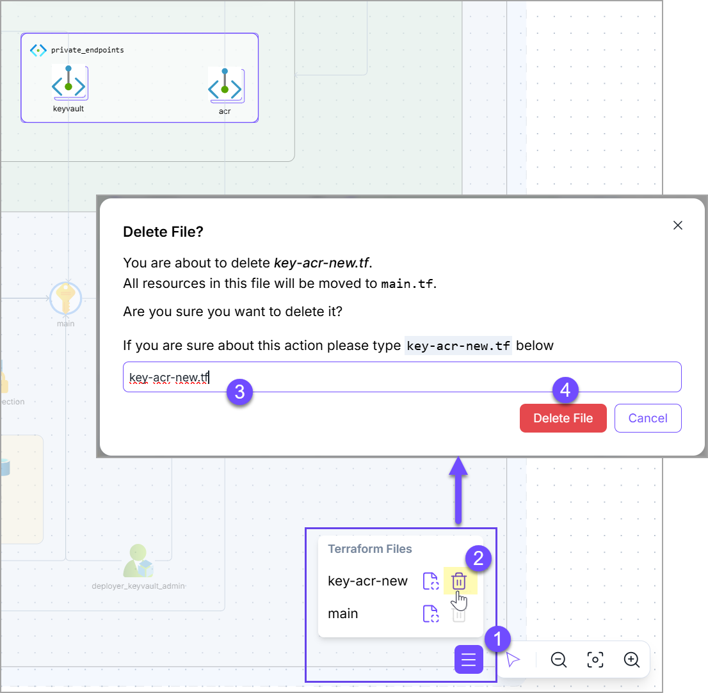
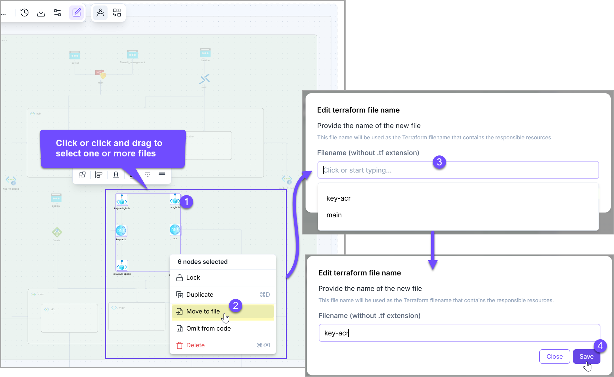
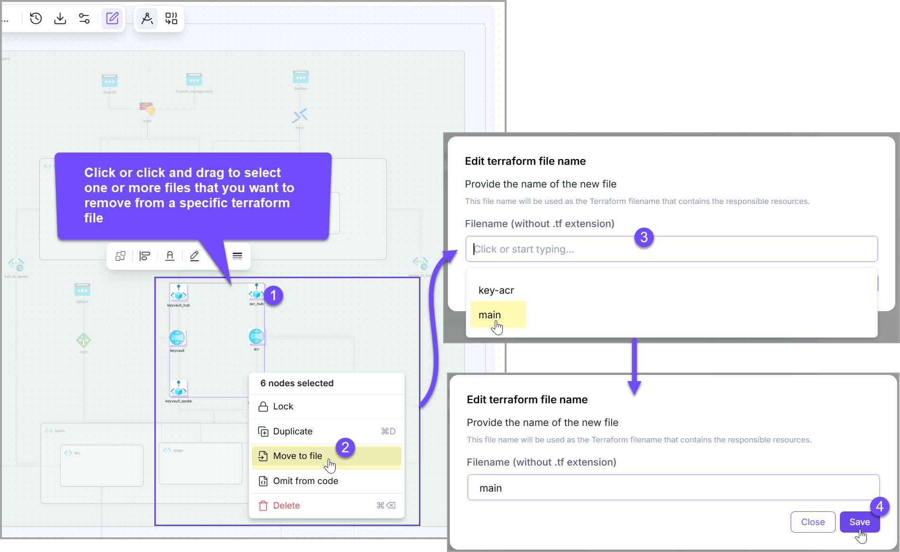

# Terraform files

### Overview

When you create your architecture, <mark style="color:$primary;">**Brainboard**</mark> automatically and instantly generates a **Terraform** code for your infrastructure.


This code is stored in different files according to the best practices of **Terraform.**


### Files structure

By default, if you don't rename or change the generated files, you have the following ones:

1. **main.tf**: contains all the definitions of resources and their configuration. See how you can change or rename it below.
2. **outputs.tf**: contains the output variables.
3. **providers.tf**: contains the definition of <mark style="color:$primary;">**`terraform`**</mark> block and the providers.
4. **terraform.tfvars**: contains **only** the values of the variables if defined.
5. **variables.tf**: contains the definition of variables and their blocks.
6. **locals.tf**: contains the definition of **Terraform** <mark style="color:$primary;">**`locals`**</mark>.
7. **backend.tf**: contains the configuration of the remote backend.
8. **undefined.tf**:&#x20;

### Create a new Terraform file

To create a new **Terraform** file that contains some resources:

1. Using click and drag, select the resource you want to put in the same file and right-click to open the menu. Select  <mark style="color:$primary;">**`Move to file`**</mark>.
2. On the <mark style="color:$primary;">**Edit terraform file name**</mark> modal, assign a name <mark style="color:red;">**(without .tf extension**</mark>) to the new file you are about to create. Click <mark style="color:$primary;">**`Save`**</mark>.&#x20;

<figure><figcaption></figcaption></figure>

Once the file is created, it will be visible in the list of **Terraform** files in the right menu. Or, you can also access the newly created **Terraform** file using the **hamburger icon** given at the bottom next to the right pane.&#x20;

<figure><figcaption></figcaption></figure>

### Rename existing Terraform file

To rename an existing file:

1. Click the <mark style="color:$primary;">**hamburger icon**</mark> at the bottom right to view the list of available **Terraform** files.&#x20;
2. Click on the file that you want to rename.&#x20;
3. Edit the file name as per your requirement.&#x20;
4. Click the <mark style="color:$primary;">**tick mark icon**</mark> given next to the editable field. The Terraform file name will be updated accordingly.&#x20;

<figure><figcaption></figcaption></figure>

1. Rename it and save.

### Delete a Terraform file

To delete an existing file:

1. Click on the <mark style="color:$primary;">**hamburger icon**</mark> to display the list of existing **Terraform** files in your architecture.&#x20;
2. Click on the <mark style="color:$primary;">**bin icon**</mark> next to the unwanted file.&#x20;
3. On the <mark style="color:$primary;">**Delete File**</mark> confirmation popup, enter the complete file name <mark style="color:red;">**(including the .tf extension)**</mark> as instructed.&#x20;
4. Click <mark style="color:$primary;">**`Delete File`**</mark>.

<figure><figcaption></figcaption></figure>


When you delete a group, the resources inside it **will not be deleted**. They will be put back in `main.tf`. To delete them, you need to select and delete them


### Add resource into an existing file

To add one or more resources into an existing **Terraform** file, follow these steps:

1. Using click and drag, select the resource/resources you want to put in the same file and right-click to open the menu.&#x20;
2. Select <mark style="color:$primary;">**`Move to file`**</mark>.
3. On the <mark style="color:$primary;">**Edit terraform file name**</mark> modal, select the file from the dropdown list.
4. Click <mark style="color:$primary;">**`Save`**</mark>.&#x20;

<figure><figcaption></figcaption></figure>

### Remove resource from a file

To remove a resource from an existing **Terraform** file:

1. Select the resource, and **right-click** to open the **shortcut menu.**&#x20;
2. Select <mark style="color:$primary;">**`Move to file`**</mark>.
3. On the <mark style="color:$primary;">**Edit terraform file name**</mark> modal, select <mark style="color:$primary;">**`main`**</mark> from the dropdown list.
4. Click <mark style="color:$primary;">**`Save`**</mark>.


The selected file/files will be removed from the **Terraform** file (other than <mark style="color:$primary;">**`main.tf`**</mark>) that contained it/them.


<figure><figcaption></figcaption></figure>

### Best practices


Always group resources that are supposed to work together or have the same logic in a separate group / Terraform file.



Use explicit names for your **Terraform** files. Usually, there are **two** conventions of naming:

* **Infrastructure base naming:** <mark style="color:$primary;">**`vpc.tf`**</mark>, <mark style="color:$primary;">**`db.tf`**</mark>
* **Application base naming:** <mark style="color:$primary;">**`microservice1.tf`**</mark>, <mark style="color:$primary;">**`backend.tf`**</mark>

