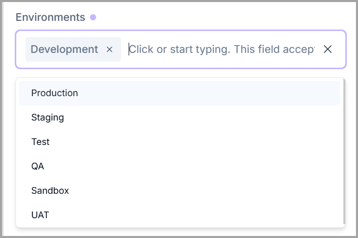
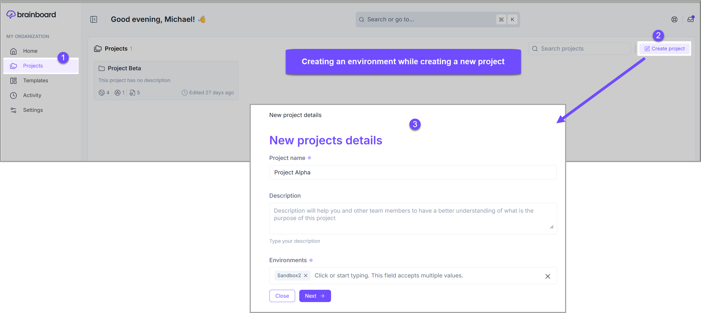
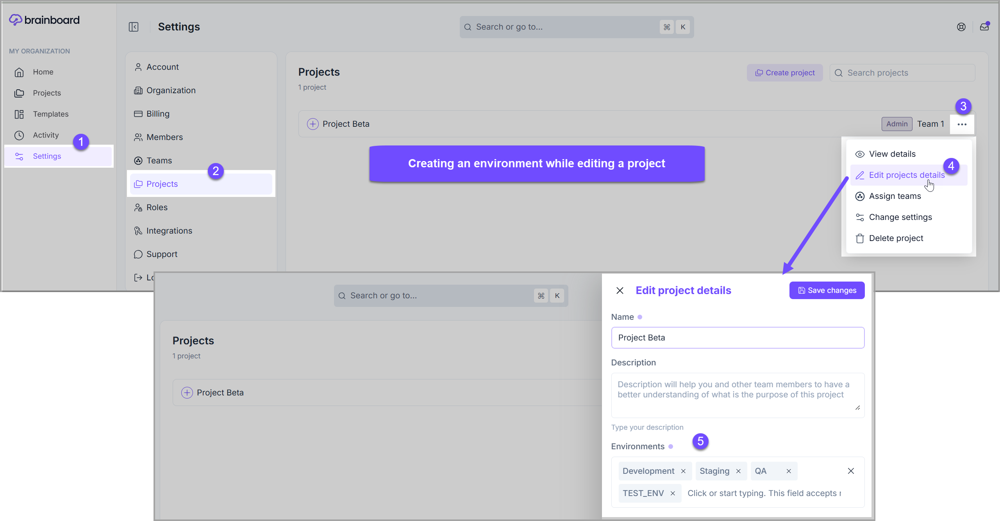
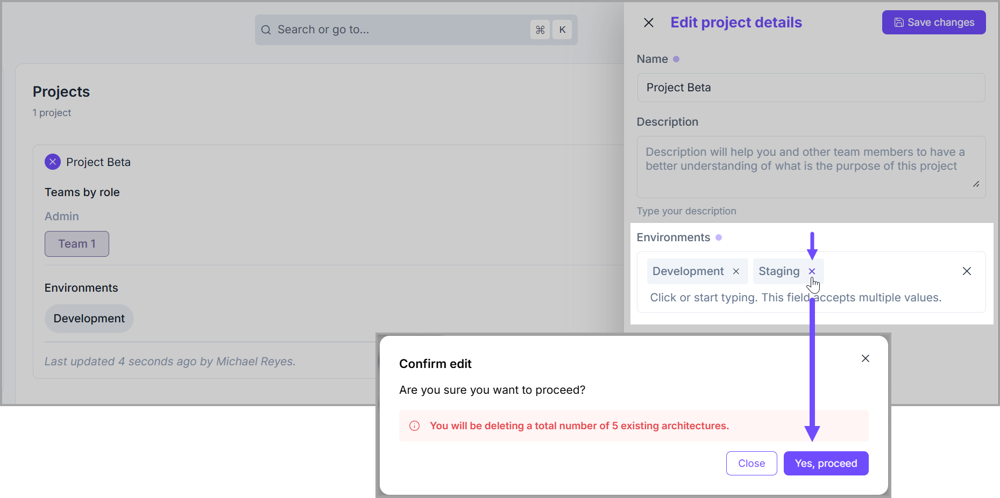

# Environment

### Description

An <mark style="color:$primary;">**`environment`**</mark> is a logical grouping of cloud architectures that are supposed to have the same criticality or serve the same purpose. Like dev, staging, QA, prod…

Environments can be used to separate and <mark style="color:$primary;">**`isolate`**</mark> development, staging, and production resources, or to create dedicated environments for different teams or applications.


Brainboard environments provide a flexible and powerful way to manage your cloud infrastructure. It is like a folder; you can put any logic that reflects your processes.


### Create a new environment

You can define or create a new environment in the following two ways:&#x20;

1. While creating a new project
2. While editing a new project


* Multiple new environments can be defined at a time.&#x20;


## Predefined Environments

The following environments are already predefined in <mark style="color:$primary;">**Brainboard**</mark> for you to select from when creating a new project or assigning an environment to a project in project edit mode.&#x20;

* Production
* Staging
* Test
* QA
* Sandbox
* UAT

<figure><figcaption></figcaption></figure>

### Creating a new environment in the New Project Details modal

1. To define a new environment at the time of new project creation, either go to <mark style="color:$primary;">**Settings > Projects**</mark> or simply click <mark style="color:$primary;">**Projects**</mark> in the left menu.&#x20;
2. Click the <mark style="color:$primary;">**`Create project`**</mark> button.&#x20;
3. Type in the new environment name that you want to create in the <mark style="color:$primary;">**`Environments`**</mark> field.&#x20;

<figure><figcaption></figcaption></figure>


Project environments are scoped to the individual project in which they are created. As a result, an environment defined for one project cannot be shared across multiple projects.


### Creating a new environment in the Edit Project Details modal

1. To define a new environment at the time of editing a project, click <mark style="color:$primary;">**Settings**</mark> in the left menu.
2. Then click <mark style="color:$primary;">**Projects**</mark>**.**&#x20;
3. Click the **ellipses icon (three dots)** next to the project you want to define a new environment for.&#x20;
4. Select <mark style="color:$primary;">**Edit project details**</mark> from the dropdown list.&#x20;
5. Type in the new environment name that you want to create in the <mark style="color:$primary;">**`Environments`**</mark> field.

<figure><figcaption></figcaption></figure>

### Delete environment

To delete an environment other than the predefined environments, simply open the project in edit mode and click the **cross icon&#x20;**<mark style="color:$primary;">**`(x)`**</mark> on the **environment name** that you want to delete.&#x20;


Pre-defined environments cannot be deleted.


<figure><figcaption></figcaption></figure>


Deleting an environment will delete all architectures inside it. This action cannot be undone.&#x20;

Therefore, you will be prompted with a confirmation message if there is an architecture associated with the environment you wish to delete.&#x20;


### Synchronize architectures across environments

Refer to the [Architecture Synchronization](cloud-architecture/synced-architectures.md) to know more about it.

By following these steps, you can effectively manage multiple environments in <mark style="color:$primary;">**Brainboard**</mark> and ensure that your infrastructure is consistent and reliable across all stages. This is the best way to eliminate the drift between different environments.

