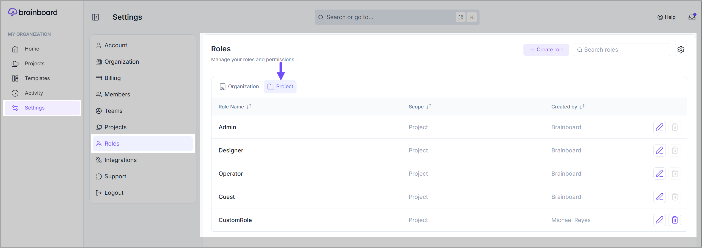
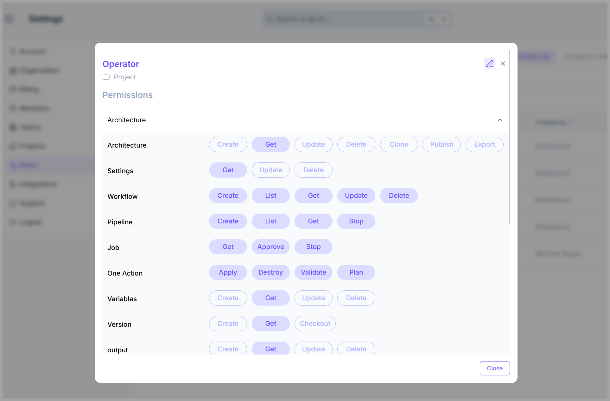
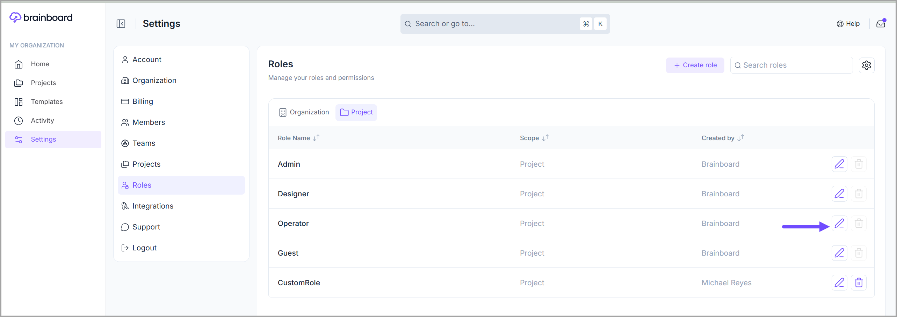
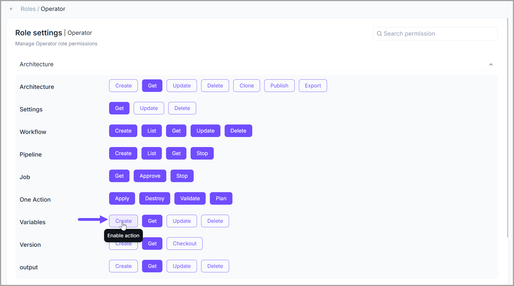

# Project Roles and Permissions

## Project roles

Granting access to a team or members gives them access to the environments and architectures hosted inside the project.

Different roles can be granted to teams for the project, and you can create custom roles with custom permissions, but **Brainboard** comes with 4 default roles out of the box:

#### 1. Admin

The members of a team having the <mark style="color:$primary;">**admin**</mark> role can perform any action on the project, its environments, architectures, versions, and deployments.

#### 2. Designer

The members of a team having the <mark style="color:$primary;">**designer**</mark> role can perform any action as the admin team, except for modifying the project information or deleting it.

#### 3. Operator

The members of a team having the <mark style="color:$primary;">**operator**</mark> role can manage the deployments only; they cannot change the design of the infrastructure.

#### 4. Guest

The members of a <mark style="color:$primary;">**guest**</mark> team can only view the project, its architectures, and deployments. They cannot change anything.

## Permissions

To check the permissions a specific team has on a project:

1. Go to the [Roles page](https://app.brainboard.co/settings/roles).
2. Switch to the <mark style="color:$primary;">**Project**</mark> tab.
3. Click on the role name.

<figure><figcaption></figcaption></figure>

This will display the permissions table:

<figure><figcaption></figcaption></figure>

### Assign/Unassign Permissions

To edit the permissions of a specific role, simply follow these steps:&#x20;

1. Click on the <mark style="color:$primary;">**pencil (edit)**</mark> icon given next to the role's name.&#x20;

<figure><figcaption></figcaption></figure>

2. On the <mark style="color:$primary;">**Role Settings**</mark> wizard, click on the **action/function name** for which you want to give permission to the role. For example, in the image shared below, we are assigning the <mark style="color:$primary;">**`Create`**</mark> **variables** permission to the <mark style="color:$primary;">**Operator**</mark> role.&#x20;


Once the permission is assigned, the **action/function** button will be highlighted in dark purple.&#x20;


<figure><figcaption></figcaption></figure>


To unassign a permission, click the highlighted **action/function** name for which you want to remove the permission from the role. The action/function button will no longer be highlighted in dark purple.&#x20;

