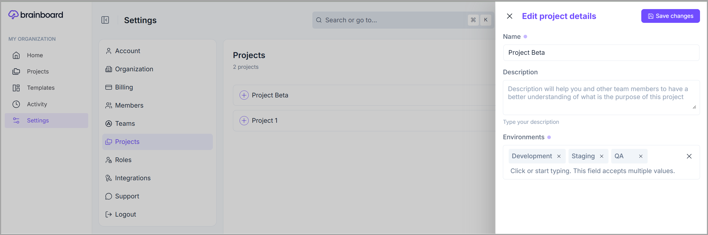
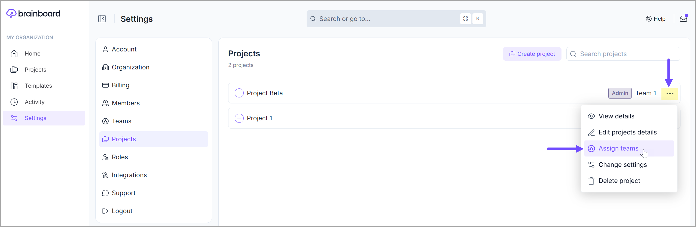
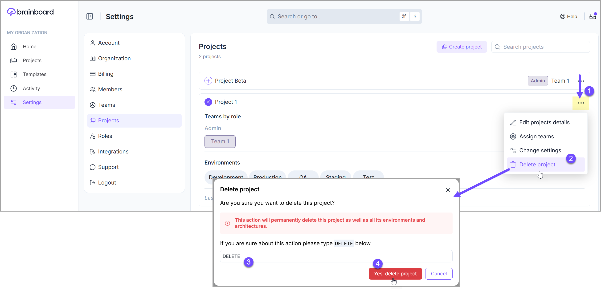

# Project

### Definition


A **project** is a container of environments and architectures to which teams have access with specific permissions.


💡Think of a project as an upper level folder.


&#x20;By default, members don't have direct permissions on projects unless the admin grants them access to.


***

### Create a new project

To create a new project:

1. Go to the [projects setting page](https://app.brainboard.co/settings/projects).
2. Click on the <mark style="color:$primary;">**`Create project`**</mark> button.&#x20;

<figure><figcaption></figcaption></figure>

3. You will then go through a **project creation wizard** comprising of three steps: &#x20;

* **First step:** Here, you will set up the **name, description and environments** of the new project.&#x20;


Brainboard creates 5 environments by default: **Production, Staging, Development, Test** and **QA.**&#x20;

You can also add any custom environment as well



The **project name** and at least one **environment** are required to create a new project.&#x20;


<figure><figcaption></figcaption></figure>

* **Second step:**  Here, you will need to assign **teams** to **roles**. You can do that by dragging and dropping each team into the corresponding role.&#x20;


You need to assign at least one team with the _admin_ role.


<figure><figcaption></figcaption></figure>

* **Third step:** Here, you can view the summary of the new project: _<mark style="color:$primary;">name, description, environment</mark>_ and the _<mark style="color:$primary;">teams</mark>_ assigned to this project with their _<mark style="color:$primary;">roles</mark>_.

4. Click the <mark style="color:$primary;">**`Create project`**</mark> button to save your project details. &#x20;

<figure><figcaption></figcaption></figure>

Upon clicking the <mark style="color:$primary;">**`Create project`**</mark> button, the new project's details will be saved, and you will be navigated to the[ project settings page](https://app.brainboard.co/settings/projects), where you can view the project details as well as edit it.&#x20;

### View the project's information

To view the information on a specific project:

1. Go to the [projects setting page](https://app.brainboard.co/settings/projects).
2. Click on the <mark style="color:$primary;">**`+`**</mark> icon next to the project name, and the project's details will be expanded, such as:&#x20;

* Name of the project.
* Teams that have access to this project with their respective roles.
* The environments of the project.&#x20;

<figure><figcaption></figcaption></figure>

Alternatively, you can click on the <mark style="color:$primary;">**`ellipsis icon`**</mark> next to the project name, and then select the <mark style="color:$primary;">**`View details`**</mark> option from the dropdown menu.&#x20;

<figure><figcaption></figcaption></figure>


Click the **cross&#x20;**<mark style="color:$primary;">**`x`**</mark> icon to collapse the project details view.&#x20;


### Edit project information

To edit the information on a project:

1. Go to the [projects setting page](https://app.brainboard.co/settings/projects).
2. Click on the <mark style="color:$primary;">**`ellipsis icon`**</mark> next to the project name, and then select the <mark style="color:$primary;">**`Edit project details`**</mark> option from the dropdown menu.&#x20;

<figure><figcaption></figcaption></figure>

3. You can alter the project _<mark style="color:$primary;">name, description</mark>,_ and _<mark style="color:$primary;">environments.</mark>_&#x20;
4. Click on the <mark style="color:$primary;">**`Save changes`**</mark> button in the top right corner of the <mark style="color:$primary;">**Edit project details**</mark> slide-out panel to save the new information.&#x20;

<figure><figcaption></figcaption></figure>

### Edit project roles


By default, the following four types of roles are available for a <mark style="color:$primary;">**Brainboard**</mark> project:&#x20;

* Admin
* Designer
* Operator
* Guest


To assign a role to a team: &#x20;

1. Go to the [projects setting page](https://app.brainboard.co/settings/projects).
2. Click on the <mark style="color:$primary;">**`ellipsis icon`**</mark> next to the project name, and then select the <mark style="color:$primary;">**`Assign teams`**</mark> option from the dropdown menu.&#x20;

<figure><figcaption></figcaption></figure>

3. You can assign a role to a team as you did when you created a new project - simple **drag and drop a team** to the specific **role** that you want to assign to it.&#x20;
4. Click on the <mark style="color:$primary;">**`Update`**</mark> button to save the new information about the project.

### Delete project

To delete a project:

1. Go to the [projects setting page](https://app.brainboard.co/settings/projects).
2. Click on the <mark style="color:$primary;">**`ellipsis icon`**</mark> next to the project name, and then select the <mark style="color:$primary;">**`Delete project`**</mark> option from the dropdown menu.&#x20;
3. You'll be asked to confirm the deletion. To do so, type the word "<mark style="color:$primary;">**DELETE**</mark>" in the input field, and click the <mark style="color:$primary;">**`Yes, delete project button`**</mark>. &#x20;


Once you confirm the deletion action, the project will be permanently deleted.



If there is only one project in your account, it cannot be deleted since your account needs at least one project.


<figure><figcaption></figcaption></figure>

