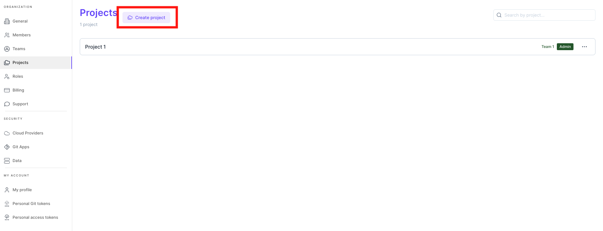
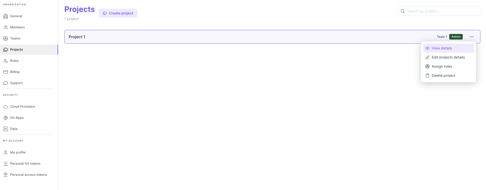
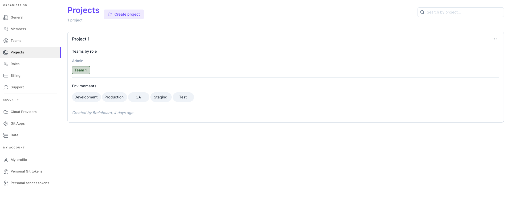
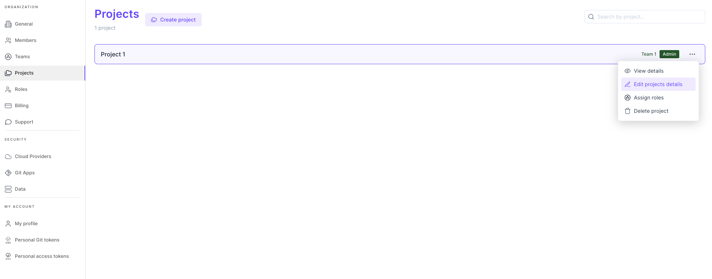
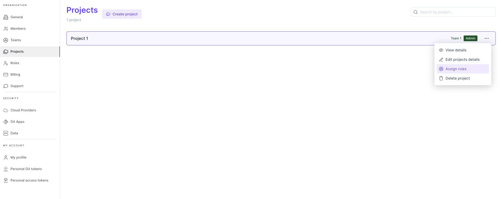
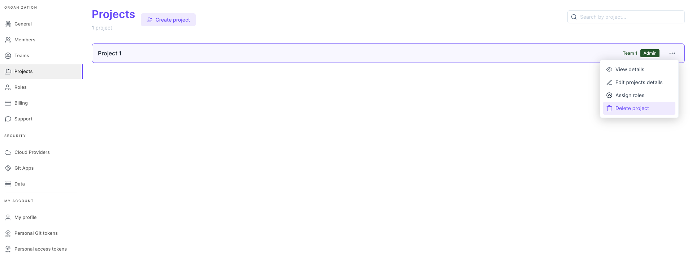

# Project

### Definition

A project is a container of environments and architectures to which teams have access with specific permissions.

Think of a project as the upper level folder.


&#x20;By default, members don't have direct permissions on projects until the admin grants them access to.


### Create a new project

To create a new project:

* Go to the [projects setting page](https://app.brainboard.co/settings/projects).
*   Click on the `Create project` button

    
* You will then go through a project creation wizard.
  * In the first step of the wizard you will setup the name, description and environments of the new project. Brainboard creates 5 environments by default: Production, Staging, Development, Test and QA, but you can add any custom environment as well. The project name and at least one environment are required.
  * In the second step of the wizard, you will need to assign teams to roles. You can do that by doing a drag & drop action for each team into the corresponding role. You need to assign at least one team with the _admin_ role.
  * The last step shows the summary of the new project: name, description, environment and the teams assigned to this project with their roles.

### View project's information

To view the information on a specific project:

* Go to the [projects setting page](https://app.brainboard.co/settings/projects).
*   Click on the `View details` option that appears when you click on the three horizontal dots button at the end of the row for a project.

    
* The information of the project is displayed:
  * Name of the project
  * Teams that have access to this project with their respective roles
  *   The environments of the project&#x20;

      <figure><figcaption></figcaption></figure>

### Edit project information

To edit the information on a project:

* Go to the [projects setting page](https://app.brainboard.co/settings/projects).
*   Click on the `Edit project details` option that appears when you click on the three dots button at the end of the row for a project.

    
* You can then change the information about the project:
  * Name.
  * Description.
  * The environments that will be created.
* Click on the disk icon from the top left of the drawer to save the new information about the project.

### Edit project roles

To edit the teams & roles of a project:

* Go to the [projects setting page](https://app.brainboard.co/settings/projects).
*   Click on the `Assign roles` option that appears when you click on the three dots button at the end of the row for a project.

    
* Here you can update the teams per role. You can do that by doing a drag & drop action for each team into the corresponding role. You need to assign at least one team to any role to advance.
* Click on `Update` button to save the new information about the project.

### Delete project

To delete a project:

* Go to the [projects setting page](https://app.brainboard.co/settings/projects).
*   Click on the `Delete project` button on the line of the project. You need to hover the line to see the options:

    
* You'll be asked to confirm the deletion, if you confirm the project will be permanently deleted. The last project cannot be deleted, as your account needs at least one project.

### Project roles

Granting access to a team or members, gives them access to the environments and architectures hosted inside the project.

Different roles can be granted to teams for the project, and you can create custom roles with custom permissions, but Brainboard comes with 4 default roles out of the box:

#### 1. Admin

The members of a team having the admin role can perform any action on the project, its environments, architectures, versions, and deployments.

#### 2. Designer

The members of a team having the designer role can perform any action as the admin team except modifying the project information or deleting it.

#### 3. Operator

The members of a team having the operator role can manage the deployments only, they cannot change the design of the infrastructure.

#### 4. Guest

The members of a guest team can only view the project, its architectures, and deployments. They cannot change anything.

### Check permissions

To check the permissions a specific team has on a project:

1. Go to [Roles page](https://app.brainboard.co/settings/roles)
2. Click on project view
3. Click on the role name.

<figure><figcaption></figcaption></figure>

This will display the permissions' table:

<figure><figcaption></figcaption></figure>
