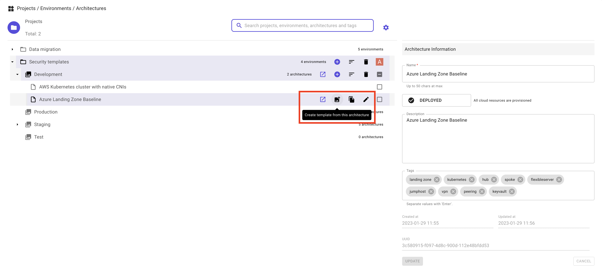
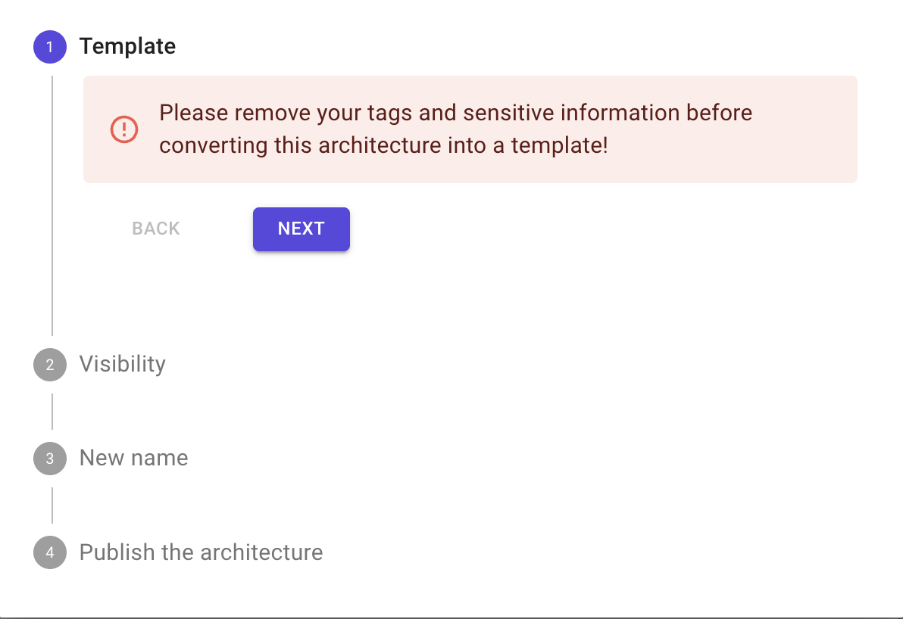
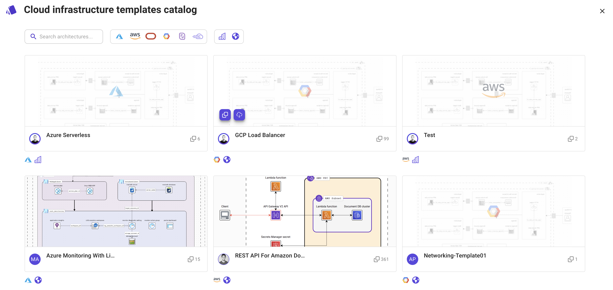
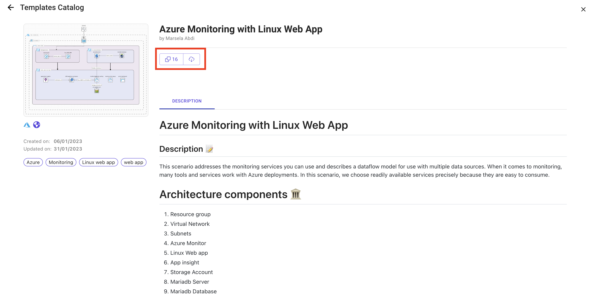
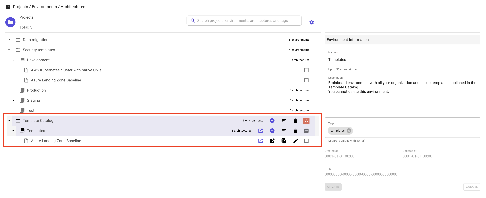

# Template

### Description

A cloud architecture template in Brainboard is a pre-designed and standardized architecture that can be used to create and deploy cloud infrastructure. It includes a set of guidelines and best practices for designing, building, and managing cloud infrastructure.

The templates typically provide the design and terraform code of the architecture and include details on the components that make up the infrastructure, such as virtual machines, storage, networks, and security.

These templates are designed to be reusable, making it easier and quicker to implement and manage cloud infrastructure. They can help organizations to achieve consistent deployment patterns, enforce governance policies, and reduce time and effort required to deploy cloud infrastructure.

Cloud architecture templates include AWS Well-Architected Framework, Google Cloud Architecture, Microsoft Azure Architecture, and the OpenStack Architecture. They are created to help organizations to build and manage secure, scalable, and cost-effective cloud infrastructure.

### Types of templates

In Brainboard you can find two types of templates:

* **Organization:** These are templates that are visible and can be used only within the organization in different projects. The organization templates can be used when teams want to share their templates and reuse them in other projects or architectures of the organization.
* **Public:** These are usually templates published by Brainboard team and are verified templates that are built by cloud architects that maintain and update them regularly.

### Create a template

To publish your architecture as a template, you can navigate to the architectures directory and follow the steps below:

1.  Select the architecture that you want to publish as a template and click on the `create template from architecture` button.

    
2.  Add the following information regarding the new template:

    


Make sure to remove all the sensitive information such as passwords from the architecture&#x20;


* Chose the visibility of the templates, it can be either `organization` or `public`.
* Choose a new name for the template.
* Publish the architecture.

### Use a template

Here are the steps to use a cloud architecture template:

1.  Open the Cloud infrastructure templates catalog.

    
2. Choose a template: Select a template that meets your requirements and aligns with your business goals. You can filter the search by using a keyword, the cloud provider, and the level either `public` or `organization`.
3. Review the template: Study the template description in detail and understand the components. Make sure that the components in the template align with your requirements.
4.  Clone the template into your project. You can either:

    * **Clone the template into a new architecture.** This option would create a new architecture and clone all the components of the template into the new architecture
    * **Copy the template into the current architecture.** This option would copy the design and terraform code and add it to your current architecture.

    
5. Customize the template: Modify the template to fit your specific needs. This may include changing the configurations, adding or removing components, changing variables etc.
6. Deploy the template: Once you have tested the template and made any necessary changes, you can deploy it to your environment.

### Modify a template

After you publish a template, you can find it in the templates' project.

1. If you need to modify the template, you can open and modify the template by selecting the template that you need and making the changes.
2. By clicking on the second and third buttons next to the template name, you can create a new template from the current template or clone the template.
3.  If you need to modify the template's details, you can click on the `pen` next to the architecture name and add the information :

    

    * **Name:** This is the name that will be displayed in the template catalog.
    *   **Status:** You can choose the status of the template from the values below. If you are working in a team and the template needs approval before being published, then you can choose the status `reviewing` or `approved`.&#x20;

        <figure><figcaption></figcaption></figure>
    * **Description:** Add a brief description of the template.
    * **Template visibility:** You can choose the visibility of the template.
    * **Tag:** Add the tags so that it is easier to search for it when needed by the team.
    * **Snapshot URL:** Add the image that you want to be displayed in the templates catalog.
4. If you need to delete the template, select the template and click on the `bin` icon next to the templates project.
