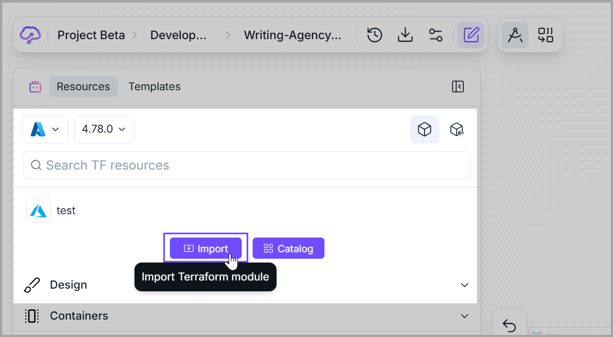
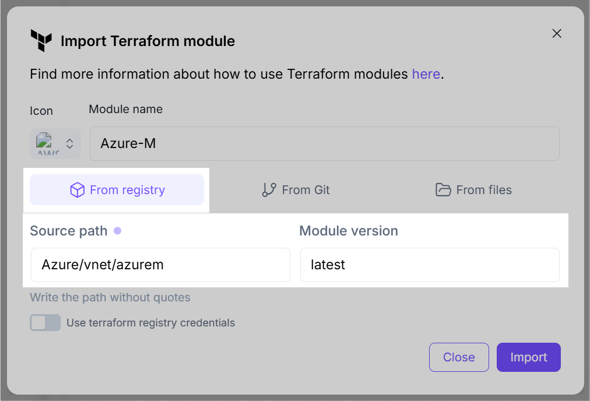
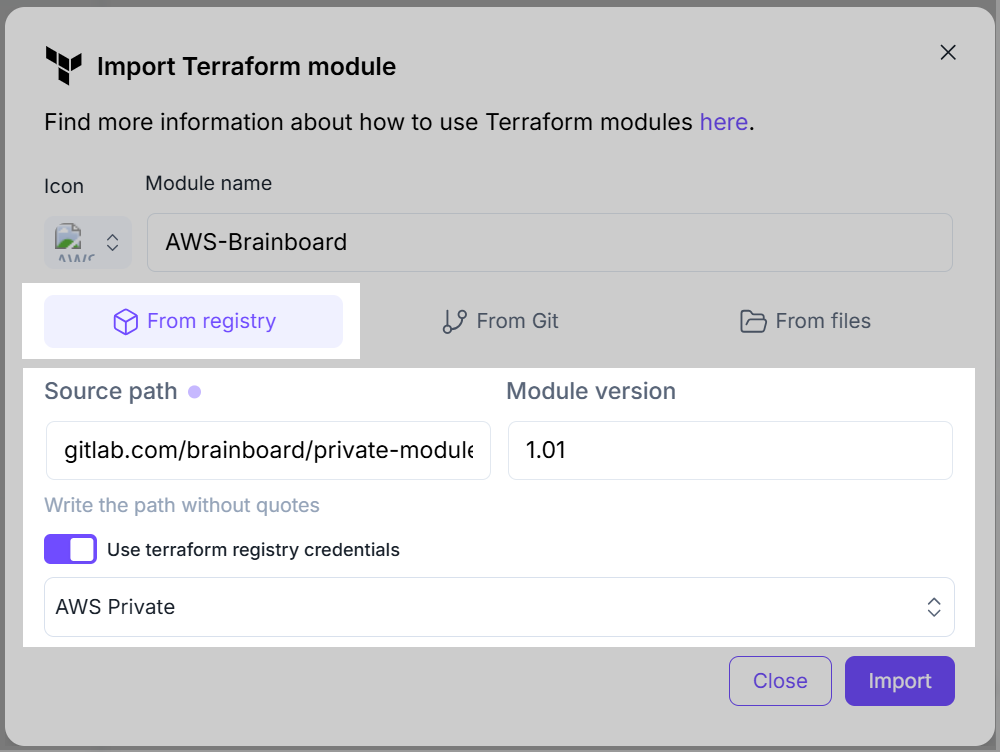
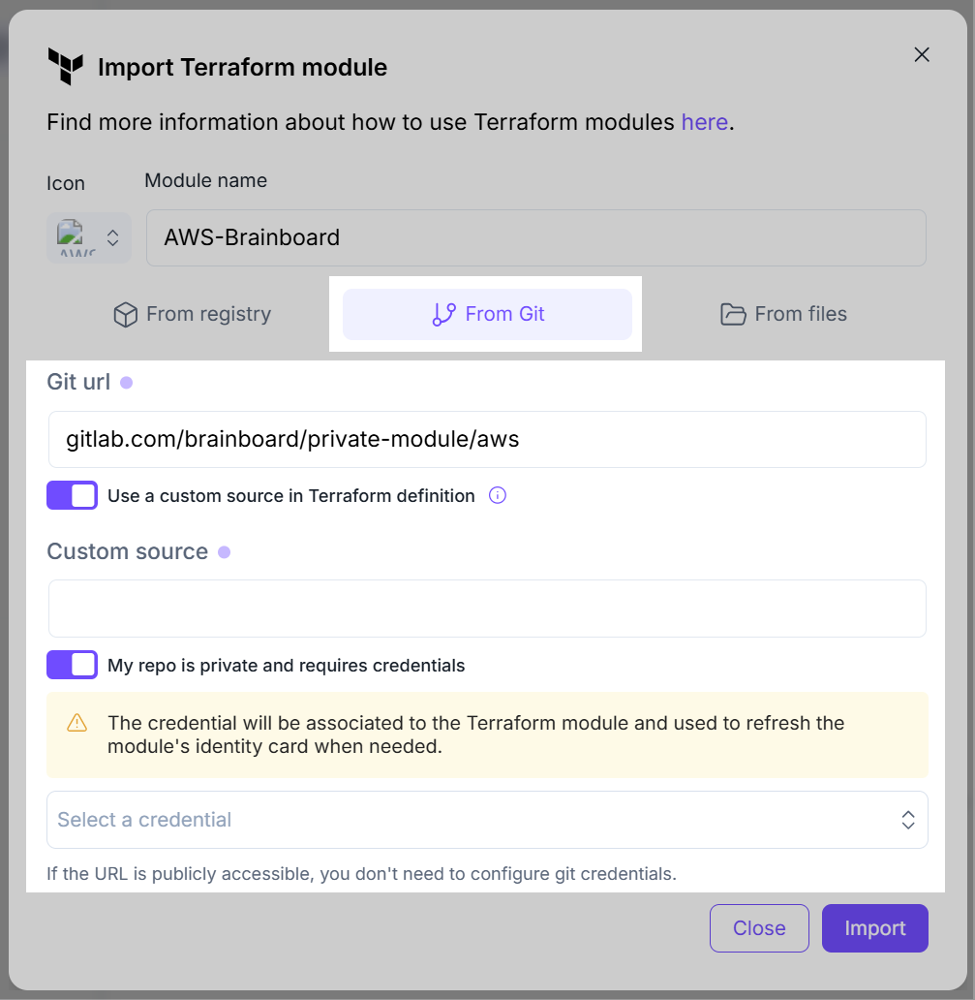
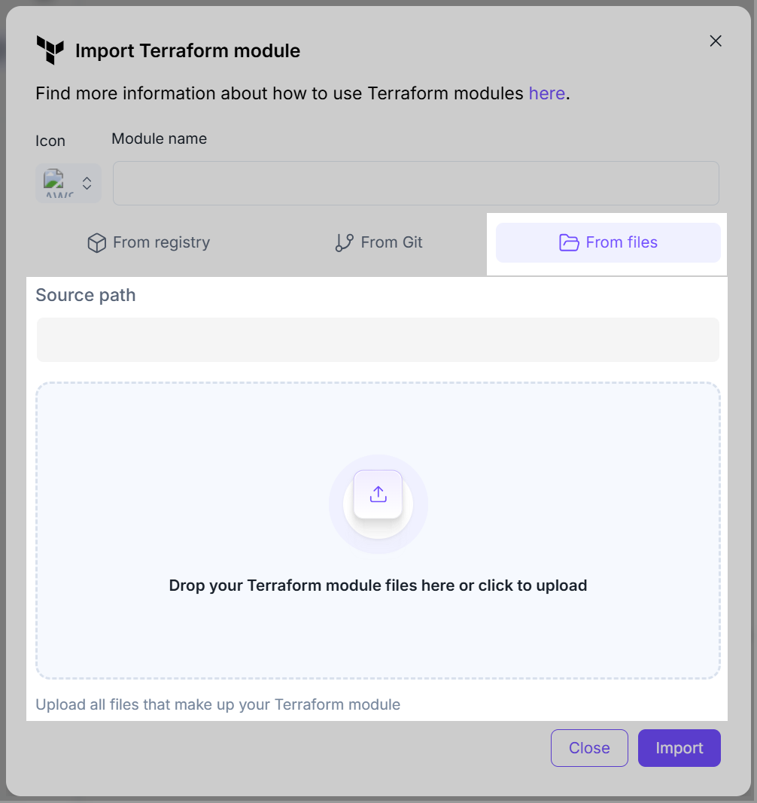
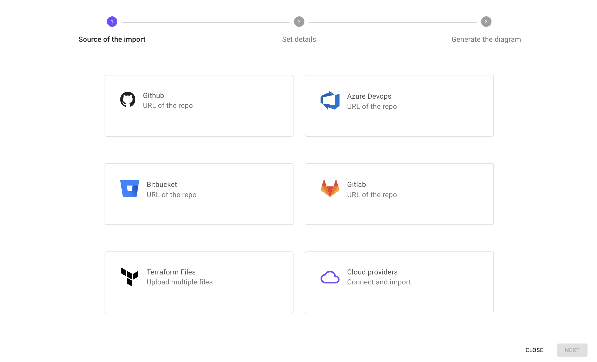

# Import modules

## Overview

<mark style="color:$primary;">**Brainboard**</mark> allows you to import your modules from any valid source supported by **Terraform**, organize them and keep yourself _DRY (don't repeat yourself)_.

There are many publicly available **Terraform** modules on platforms like the **Terraform** **Registry** or **GitHub** that you can use to quickly get started with your infrastructure.

Let's have a look at how we can import modules in <mark style="color:$primary;">**Brainboard**</mark>.

## Add modules as a block definition

1. You can add modules by clicking on the <mark style="color:$primary;">**`Import`**</mark> button.&#x20;

<figure><figcaption></figcaption></figure>

It will add a module as a black box, where Brainboard generates its block definition, but it doesn't show you the resources inside.

Add the information for the _<mark style="color:$primary;">name, source</mark>_ and _<mark style="color:$primary;">custom icon</mark>_.

<figure><figcaption></figcaption></figure>

### Specifying source of import

#### **1. From registry**

The **Terraform** Registry is a centralized repository for **Terraform** modules. It allows **Terraform** users to easily find and use Terraform modules for various cloud providers and other infrastructure resources.

<figure><figcaption></figcaption></figure>


When you import from the <mark style="color:$primary;">**registry**</mark>, you can add the information for the <mark style="color:$primary;">**`namespace/module_name/provider_name`**</mark>.



If your **Terraform** module is hosted in a private registry, toggle <mark style="color:$primary;">**`Use terraform registry credentials`**</mark> and select the credentials you want to use.


Refer to [Terraform Registry Credentials](terraform-registry-credentials.md) to learn how to manage your **Terraform** registry credentials.

<figure><figcaption></figcaption></figure>

#### **2. From Git**

Many **Terraform** modules are hosted on **GitHub**, either as standalone repositories or as part of a larger project.


If you have private modules, you can store them in a private repository, such as a private **GitHub** repository or an internal repository.&#x20;

When the repo that you want to import is private, you also need to specify the credentials by turning ont the toggle <mark style="color:$primary;">**`My repo is private and requires credentials`**</mark>.

You can specify a service _<mark style="color:$primary;">GitHub</mark>_<mark style="color:$primary;">,</mark> <mark style="color:$primary;"></mark>_<mark style="color:$primary;">Azure DevOps</mark>_<mark style="color:$primary;">,</mark> <mark style="color:$primary;"></mark>_<mark style="color:$primary;">Bitbucket</mark>_ or _<mark style="color:$primary;">GitLab</mark>_.


Refer to [Git Configurations](../../../settings/integrations/git-configuration/ado.md) to know more about **Git** configuration.

<figure><figcaption></figcaption></figure>

#### **3. From files**

You can also create your own modules using **Terraform** code and store them as local files and then import them in <mark style="color:$primary;">**Brainboard**</mark>.

<figure><figcaption></figcaption></figure>

### Add modules as an architecture

There are some cases when importing a module as an architecture is useful.

1. When a user wants to have **visibility** on the code and on the resources used by the module.
2. When a user wants to **modify** an existing module and use it later.

To import a module as an architecture, you can go to the top bar menu and click the `+` button to import an architecture.

