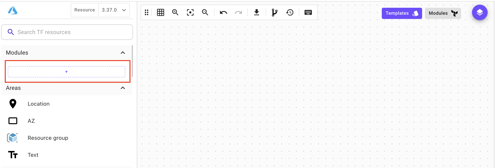
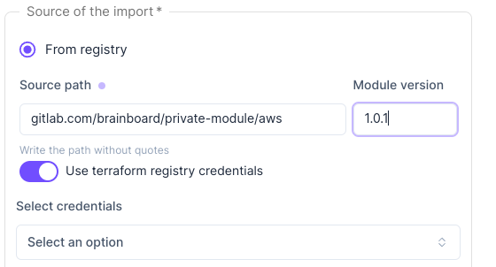

# Import modules

### Description

Brainboard allows you to import your modules from any valid source supported by Terraform, organize them and keep your self DRY (don't repeat yourself).

There are many publicly available Terraform modules on platforms like the Terraform Registry or GitHub that you can use to quickly get started with your infrastructure.

Below we will see how to import modules in Brainboard.

### Add modules as block definition

1.  You can add modules by clicking on the `+` button:

    

    It will a module as a black box, where Brainboard generates its block definition but it doesn't show you the resources inside.
2.  Add the information for the name, source and custom icon.

    
3.  Specify the source of the import for your module:

    * **From registry:** The Terraform Registry is a centralized repository for Terraform modules. It allows Terraform users to easily find and use Terraform modules for various cloud providers and other infrastructure resources.

    

    When you import from registry you can add the information for the `namespace/module_name/provider_name`.

    If your terraform module is hosted in a private registry, toggle `Use terraform registry credentials` and select the credentials you want to use.

    

    Refer to [Terraform Registry Credentials](terraform-registry-credentials.md) to learn how to manage your Terraform registry credentials.

    * **From git:** Many Terraform modules are hosted on GitHub, either as standalone repositories or as part of a larger project.

    

    If you have private modules, you can store them in a private repository, such as a private GitHub repository or an internal repository. When the repo that you want to import is private, then you need to specify also the credentials by opening the `open git settings`.

    You can specify as service _GitHub_, _Azure DevOps_, _Bitbucket_ or _GitLab_.

    Refer to [Git Configurations](../../../settings/integrations/git-configuration/ado.md) to know more about git configuration.

    * **From files:** You can also create your own modules using Terraform code and store them as local files and then import them in Brainboard.

    

### Add modules as an architecture

There are some cases when importing a module as an architecture is useful.

1. When a user wants to have visibility on the code and on the resources used by the module.
2. When a user wants to modify an existing module and use it later.

To import a module as an architecture, you can go to the top bar menu and click the `+` button to import an architecture.

