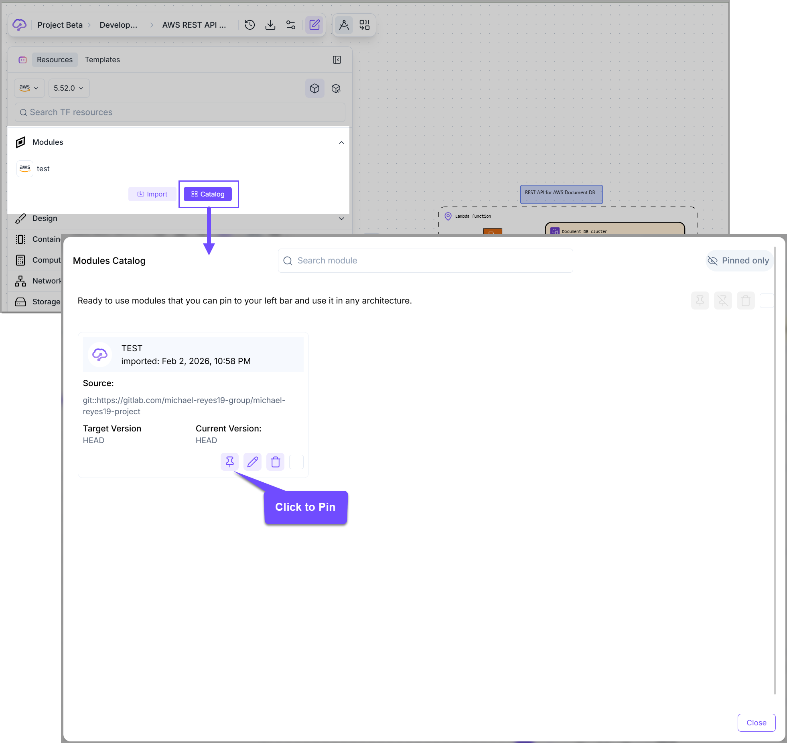

# Manage module

To manage modules within <mark style="color:$primary;">**Brainboard,**</mark> you can go to the <mark style="color:$primary;">**Modules Catalog**</mark> by clicking on the <mark style="color:$primary;">**`Catalog`**</mark> button under the **Modules** section in the **left bar.**

In this window, you can see and manage all your imported modules and choose which ones you want to have displayed in the modules list in your design area by <mark style="color:$primary;">**`pinning`**</mark> them.

If you want to change the configuration of a module, you can choose one of the modules in the list:

* In the module configuration, you can show the module in the design or remove it from the design by using the <mark style="color:$primary;">**`pin`**</mark> icon.
* You can **edit** the configuration by using the <mark style="color:$primary;">**`pen`**</mark> icon.
* You can delete the module by using the <mark style="color:red;">**`bin`**</mark> icon.

<figure><figcaption></figcaption></figure>


To have a more organized modules list in your design area, only <mark style="color:$primary;">**`pin`**</mark> the modules that are needed for a specific architecture. If you need more modules, you can revisit the modules catalog later and pin them.

