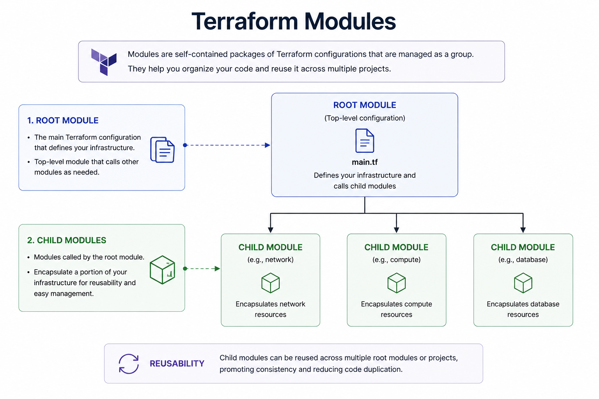
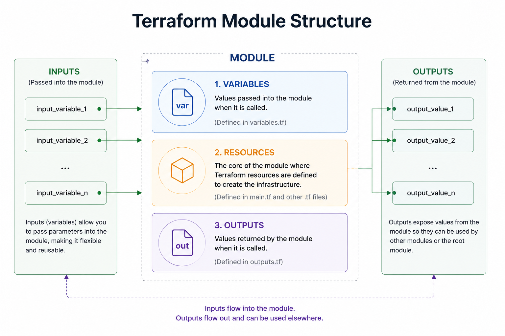

# Module

### Description

<mark style="color:$primary;">**Modules**</mark> are self-contained packages of **Terraform** configurations that are managed as a group. <mark style="color:$primary;">**Modules**</mark> allow you to organize your **Terraform** code and reuse it across multiple projects, making it easier to manage and maintain your infrastructure as code.

There are two types of **Terraform** modules:


**Root modules:** These are the main **Terraform** configurations that define your infrastructure. The root module is the top-level module in your **Terraform** configuration, and it calls other **Terraform** modules as needed.



**Child modules:** These are **Terraform** modules that are called by the root module. Child modules encapsulate a portion of your infrastructure, making it easier to manage and maintain.


When you create a **Terraform** module, you can use inputs and outputs to define the expected input and output values of the module:

* <mark style="color:$primary;">**`Inputs`**</mark> allow you to pass parameters into the module, making it more flexible and reusable.
* <mark style="color:$primary;">**`Outputs`**</mark> allow you to expose values from the module so that they can be used by other **Terraform** modules.

<figure><figcaption></figcaption></figure>

### Modules structure

The basic structure of a **Terraform** module includes:

* <mark style="color:$primary;">**`Variables`**</mark>: these are values that are passed into the module when it is called.
* <mark style="color:$primary;">**`Resources`**</mark>: The main part of a module is the collection of Terraform resources that are defined within it. These resources are used to create the infrastructure.
* <mark style="color:$primary;">**`Outputs`**</mark>: These are values that are returned by the module when it is called. These outputs can be used by other modules or in the root module of the Terraform configuration.

<figure><figcaption></figcaption></figure>

### Best practices

When using modules, these best practices make your life easier:


**Verify the source**: Before using a module from the Terraform Registry, verify the source to ensure that it's reputable and secure.



**Review the documentation**: Review the documentation of the module to ensure that it meets your requirements and to understand how it can be used in your configuration.



**Use version control**: Use version control to keep track of changes to the module, and make sure to use a specific version of the module in your configuration so that you are aware of any breaking changes.



**Test the module**: Test the module thoroughly before using it in production to ensure that it works as expected and to catch any bugs or errors.


