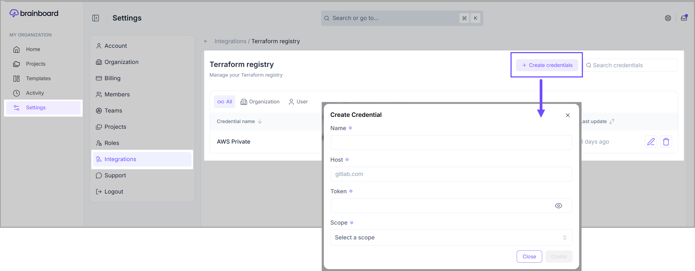

# Terraform registry credentials

To import **Terraform** modules from a [private registry](https://developer.hashicorp.com/terraform/registry/private), you need to provide the credentials to access the registry.

**Registry** credentials used by **Terraform** require two pieces of information:

* The <mark style="color:$primary;">**hostname**</mark> of your private registry
* The <mark style="color:$primary;">**token**</mark> used to authenticate with the registry

To add new registry credentials, follow these steps:

1. Go to the [Registry credentials page](https://app.brainboard.co/settings/terraform-registry).
2. Click on the <mark style="color:$primary;">**`Create credentials`**</mark> button and fill in the following information on the <mark style="color:$primary;">**Create credentials**</mark> modal.&#x20;
   * **Name:** Name of the credential.
   * **Host:** Terraform registry hostname.
   * **Token:** Terraform registry token.
   * **Scope:**
     * **Organization:** Credentials will be available to all users in the organization.
     * **User (myself):** Credentials will be available only to you.


**Credentials scope** can only be set at creation. You will not be able to change credentials scope after creation.&#x20;


3. Click on the <mark style="color:$primary;">**`Create`**</mark> button to save your credentials.

<figure><figcaption></figcaption></figure>
