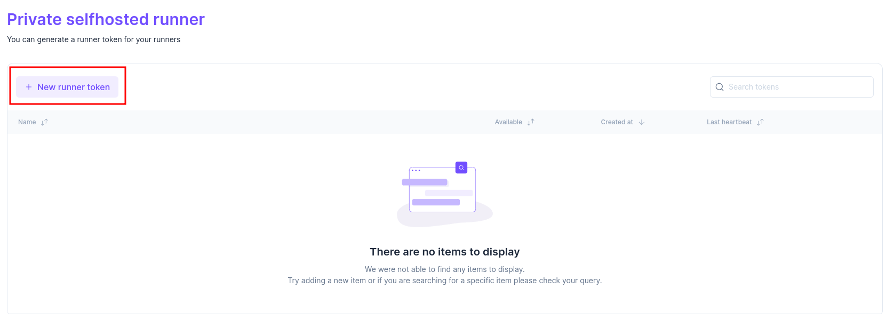
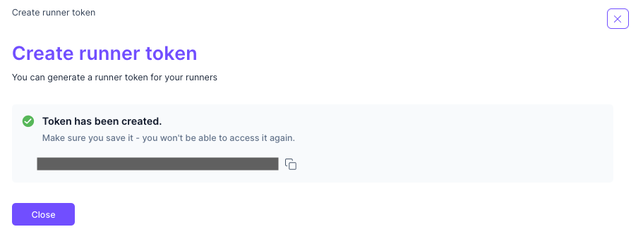

# Self-Hosted Runner


Feature Availability Self-Hosted Runner is available for Enterprise Plan only.


### Overview

Brainboard Runner is a service that runs all CI/CD jobs in your organization and sends the results back to Brainboard. Self-hosted runner allows you to run your pipeline jobs in your own infrastructure.

A self-hosted runner created is global to your organization and will therefore process all jobs created within your organization, regardless of which project's architecture the jobs belongs to, or which user created the job.

One organization can have multiple self-hosted runners, but these runners cannot be shared across multiple organizations.


Runner networking information You can use self-hosted runners to run jobs in a private network or to customize the hardware and software configuration of the machines that run your jobs.

Brainboard self-hosted runner will need to be able to communicate with Brainboard API to get jobs information and send the results, so your network needs to allow outbound traffic to Brainboard API in order for the runner to communicate with Brainboard.

However, you do not need any specific ingress rule, because Brainboard API does not communicate with the runner.&#x20;


### Generate runner token

To use the self-hosted runner, you first have to generate a runner token from Brainboard web application. To get the runner token, you have to be logged in with an account having Organization `Admin` or `Owner` permissions.

To generate the runner token:

1. Go to the [private self-hosted runner](https://app.brainboard.co/settings/runner-tokens) settings page.

On this page, you can create a new runner token or revoke an existing one.

2.  Click on the New runner token button&#x20;

    <figure><figcaption></figcaption></figure>
3. Click on Create on the next page
4. Copy the generated token and save it for the deployment step 

### Deploy self-hosted runner

You can deploy the self-hosted runner in your environment using two methods:

<table data-view="cards"><thead><tr><th></th><th></th><th></th><th data-hidden data-card-target data-type="content-ref"></th></tr></thead><tbody><tr><td>Deploy runner with docker-compose</td><td></td><td></td><td><a href="runner-docker-compose.md">runner-docker-compose.md</a></td></tr><tr><td>Deploy runner with Kubernetes</td><td></td><td></td><td><a href="runner-kubernetes.md">runner-kubernetes.md</a></td></tr></tbody></table>
