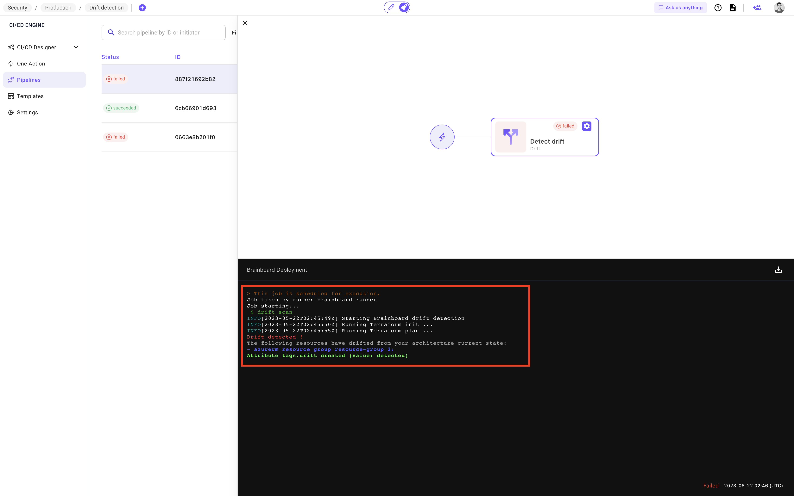

# Drift detection 🕵️

### Overview

Brainboard allows you to detect any drift happening to the cloud infrastructure, and in some cases it removes the root cause of the drift.

### Detecting the drift

To detect a drift happening to the cloud infrastructure, you have 2 options. Both options are based on a workflow.

Actually, Brainboard is the only tool in the market that allows you to create multiple CI/CD workflows for the same infrastructure. You can for e.g. create a workflow for security checks, another one for costs and a third one to detect a drift.

Refer to [this page](../../) if you want additional information about workflows.

#### Manual workflow

You can create a workflow to check if a drift has happened to the cloud infrastructure and run it manually as follows:

1. Go to the CI/CD page of the infrastructure by clicking on the rocket in the top bar
2.  Either create a new workflow by clicking on the button `New workflow` or use the public template called `[Public] Drift detection by Brainboard`:&#x20;

    <figure><figcaption></figcaption></figure>
3.  Once the workflow created, add a drift detection task and give it a name:&#x20;

    <figure><figcaption></figcaption></figure>
4. Run the pipeline by clicking on the button on the top right called `Run pipeline`.

#### Scheduled automatic detection

1. Go to the CI/CD page of the infrastructure by clicking on the rocket in the top bar
2.  Either create a new workflow by clicking on the button `New workflow` or use the public template called `[Public] Drift detection by Brainboard`:&#x20;

    <figure><figcaption></figcaption></figure>
3.  Open the settings of the workflow you just created:&#x20;

    <figure><figcaption></figcaption></figure>
4.  Activate the cron schedule and specify the frequency of the execution of the workflow&#x20;

    <figure><figcaption></figcaption></figure>
5. If you want to be notified when a drift is detected, enable `Notify on failure` and specify the email address(es) that will receive the notification.


You can use this [crontab generator](https://codebeautify.org/crontab-format) to generate a cron expression.


### Output

When the pipeline runs (either manually or automatically), Brainboard creates an execution environment, runs the detection and gives you the output:


When a drift is detected, the workflow will be marked as `failed`, because when a drift happens this is considered a failure by Brainboard as the infrastructure doesn't comply with the provisioned one.&#x20;


### Best practices

It's a good practice to use the automatic scheduled drift detection, for both critical workloads in case anything unwanted happens outside the source of truth, and for non-critical workloads to control costs and detect any modification that may increase them beyond the allowed budget.
