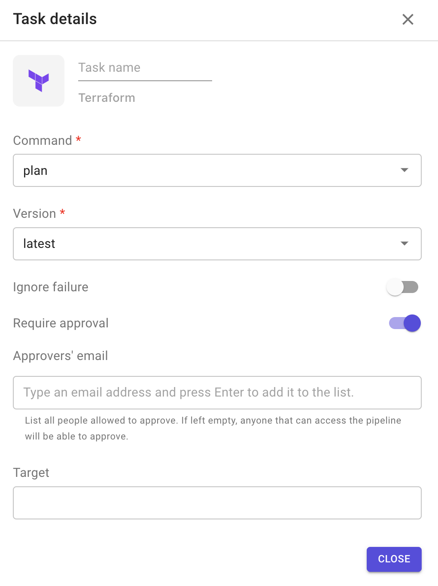
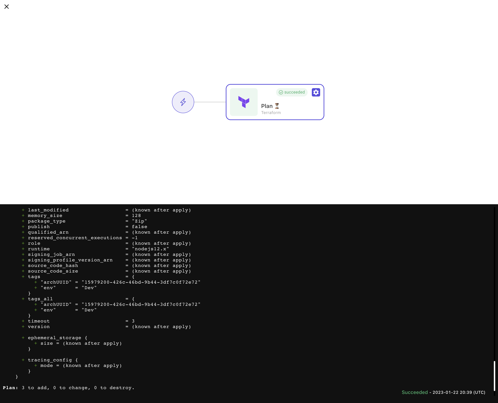
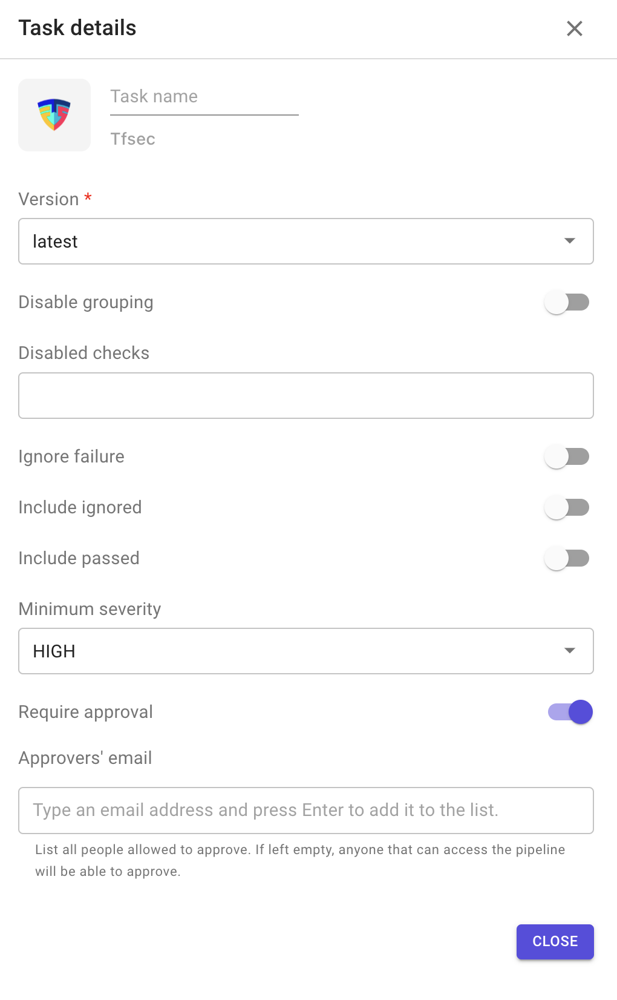
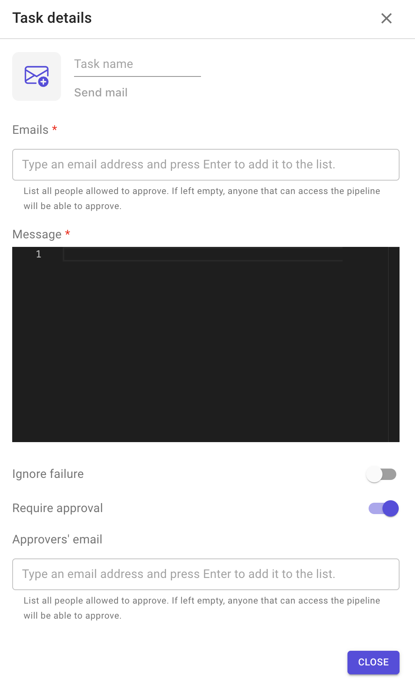
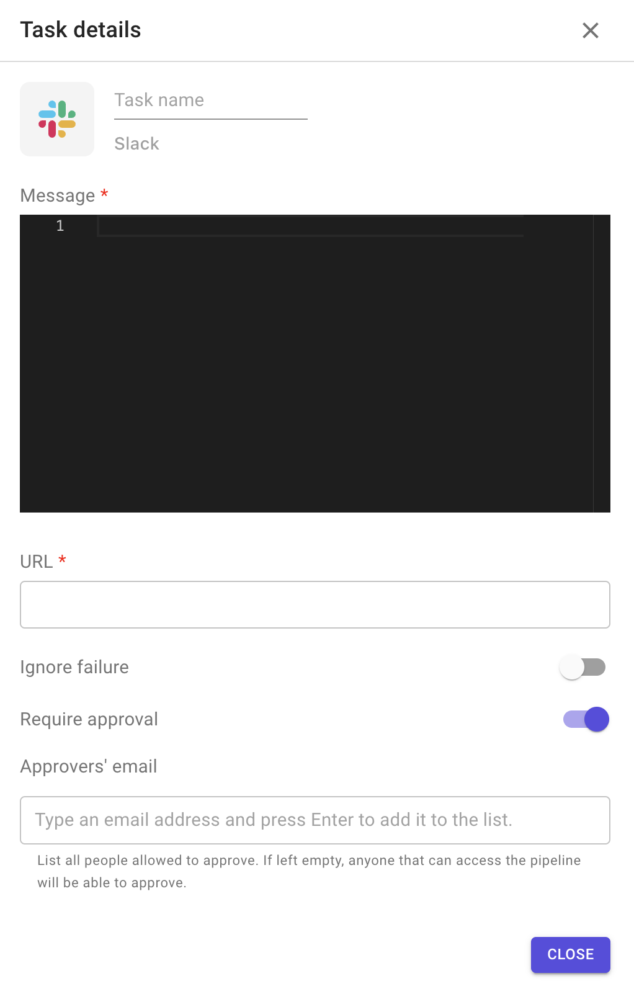

# Supported plugins 🧩

### Description

Plugins are open-source tools or software that are integrated in Brainboard and made available to use as part of your CI/CD pipelines.

These plugins are maintained and updated by Brainboard team, giving you always the latest releases available.

### Terraform

This plugin allows you to execute `Terraform` actions on your code.

**Configuration options**

1. Command: Terraform commands to execute. 4 options are available:
   * validate
   * plan
   * apply
   * destroy
2. Version: refers to the version of Terraform binary to use.
3. Ignore failure: if enabled, the execution of the following stage will be triggered even if the task fails.
4. Target: is a regex to specify which resource(s) will be the target of the execution.
5. Require approval: means that this task will not be executed until approved by people added in the approvers' list.
   * The task remains blocked until all approvers added in the list approve it.

:::info Refer to [this documentation page](https://developer.hashicorp.com/terraform/cli/commands/plan#resource-targeting) to understand how resource targeting works in Terraform. :::

**Sample output**

### Security

#### 1. TFSEC

This plugin allows you to scan the Terraform code with `tfsec` and provide output.

`tfsec` is a static analysis security scanner for your Terraform code.

* [Home page](https://aquasecurity.github.io/tfsec).
* [Source code on GitHub](https://github.com/aquasecurity/tfsec).

**Configuration options**

1. Version: always points to the latest version.
2. Disable grouping: disable grouping of similar results.
3. Disabled checks
4. Ignore failure: if enabled, the execution of the following stage will be triggered even if the task fails.
5. Include ignored: include ignored checks in the result output.
6. Include passed: include passed checks in the result output.
7. Minimum severity: you can specify the minimum severity of result that should be reported. By default, every severity is reported. You must use one of `CRITICAL`, `HIGH`, `MEDIUM`, `LOW`.
8. Require approval: means that this task will not be executed until approved by people added in the approvers' list.
   * The task remains blocked until all approvers added in the list approve it.

**Sample output**

#### 2. Terrascan

This plugin allows you to scan the Terraform code with `Terrascan` and provide output.

`Terrascan` is a static code analyzer for Infrastructure as Code.

It provides 500+ out-of-the-box policies so that you can scan IaC against common policy standards such as the CIS Benchmark.

* [Home page](https://runterrascan.io/).
* [Source code on Github](https://github.com/tenable/terrascan).

**Configuration options**

1. Version: always points to the latest version.
2. Ignore failure: if enabled, the execution of the following stage will be triggered even if the task fails.
3. Require approval: means that this task will not be executed until approved by people added in the approvers' list.
   * The task remains blocked until all approvers added in the list approve it.
4. Scan rules: specify rules to scan, example: –scan-rules=“ruleID1,ruleID2”.
5. Show passed: display passed rules, along with violations.
6. Skip rules: specify one or more rules to skip while scanning. Example: –skip-rules=“ruleID1,ruleID2”.

**Sample output**

### Cost estimation

#### 1. Infracost

This plugin allows you to have a cost estimation for your infrastructure from your Terraform code.

* [Home page](https://www.infracost.io/).
* [Source code on Github](https://github.com/infracost/infracost).

**Configuration options**

1. API key: you can generate it from your Infracost account.
2. Command: 2 commands supported
   * Breakdown: this command shows a breakdown of costs.
   * Diff: this command shows a diff of monthly costs between the deployed infrastructure and planned changes.
3. Version: always points to the latest version.
4. Ignore failure: if enabled, the execution of the following stage will be triggered even if the task fails.
5. Disable cache.
6. Project name.
7. Require approval: means that this task will not be executed until approved by people added in the approvers' list.
   * The task remains blocked until all approvers added in the list approve it.
8. Show skipped: list unsupported and free resources.

**Sample output**

### Policy as code

#### 1. OPA

This plugin allows you to check your Terraform code against security policies that you define.

`OPA` is a policy-based control for cloud native environments.

* [Home page](https://www.openpolicyagent.org/).
* [Source code on Github](https://github.com/open-policy-agent/opa).

**Configuration options**

1. Policy: the content of `rego` file that contains your policy.
2. Version: always points to the latest version.
3. Decision.
4. Ignore failure: if enabled, the execution of the following stage will be triggered even if the task fails.
5. Require approval: means that this task will not be executed until approved by people added in the approvers' list.
   * The task remains blocked until all approvers added in the list approve it.

**Sample output**

#### 2. Checkov

This plugin allows you to scan you Terraform code to find misconfigurations before they're deployed.

* [Home page](https://www.checkov.io/).
* [Source code on Github](https://github.com/bridgecrewio/checkov).

**Configuration options**

1. Version: always points to the latest version.
2. BC API key.
3. Checks.
4. Custom arguments.
5. Ignore failure: if enabled, the execution of the following stage will be triggered even if the task fails.
6. Skip checks.
7. Require approval: means that this task will not be executed until approved by people added in the approvers' list.
   * The task remains blocked until all approvers added in the list approve it.

**Sample output**

### Notifications

#### 1. Email

This plugin allows you to send an email to multiple emails.

This is Brainboard plugin.

**Configuration options**

1. Emails: list of email address that will receive a copy of the message.
2. Message: YAML content to be emailed.
3. Custom arguments.
4. Ignore failure: if enabled, the execution of the following stage will be triggered even if the task fails.

#### 2. Slack

This plugin allows you to send a notification to your Slack channel.

**Configuration options**

1. Message: YAML content to be sent.
2. URL of your Slack channel.
3. Custom arguments.
4. Ignore failure: if enabled, the execution of the following stage will be triggered even if the task fails.

#### 3. Microsoft Teams

This plugin allows you to send a notification to your MS Teams channel.

**Configuration options**

1. Message title: title of the message.
2. Message: text to be sent.
3. Incoming webhook URL of your MS Teams channel.
4. Hide pipeline URL: do not add button with link to the pipeline in the adaptive card.
5. Ignore failure: if enabled, the execution of the following stage will be triggered even if the task fails.

#### Setup instructions

If you want to configure Microsoft Teams to receive notifications from Brainboard pipelines, an _incoming hook_ needs to be set up in the channel of your choice. To do so, follow the steps from the Brainboard video tutorial:

.

### Webhooks

This plugin allows you to communicate with an external system that is accessible through an API.

This is Brainboard plugin.

**Configuration options**

1. URL of the external system.
2. Basic auth password.
3. Basic auth username.
4. Ignore failure: if enabled, the execution of the following stage will be triggered even if the task fails.
5. Message: payload to send with the API post request.
6. Require approval: means that this task will not be executed until approved by people added in the approvers' list.
   * The task remains blocked until all approvers added in the list approve it.

### Request a new integration

If you want to see your software integrated in Brainboard, you can request it or upvote for it in our [public roadmap](https://roadmap.brainboard.co).
