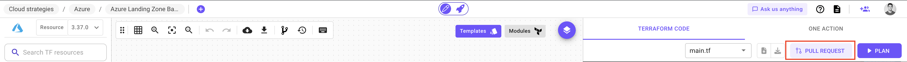
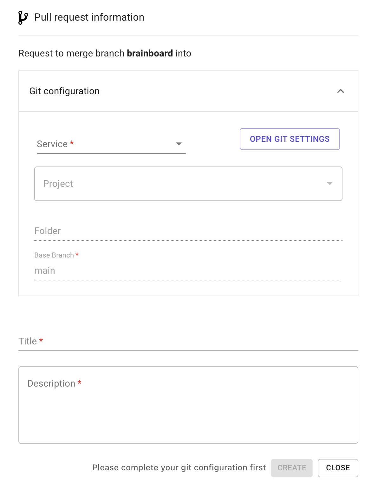

# Pull requests

### Description

A pull request is a way that allows you to push the generated Terraform code from Brainboard into your git repository.

It is similar to doing `git add .`, `git commit -m 'commit message'` and `git push` on your laptop.

### How it works

When you do a pull request, Brainboard packages all the generated files for your infrastructure, does the pull request into the git repository that you configure and gives you back the link to the PR.

Here are important information on how it works:

* You first have to setup the integration between Brainboard and your git repository. Refer to these pages do the integration with:
  * [Github](https://gitlab.com/brainboard/brainboard/-/blob/main/git-configuration/git-apps/README.md).
  * [Gitlab](https://gitlab.com/brainboard/brainboard/-/blob/main/git-configuration/personal-git-tokens/README.md#gitlab).
  * [Azure DevOps](https://gitlab.com/brainboard/brainboard/-/blob/main/git-configuration/personal-git-tokens/README.md#azure-devops).
  * [Bitbucket](https://gitlab.com/brainboard/brainboard/-/blob/main/git-configuration/personal-git-tokens/README.md#bitbucket).
* When Brainboard creates a pull request, it uses a branch called `brainboard` as the source branch and gives you the possibility to choose the base branch.
  * Every time you push your changes, they are pushed to the same branch `brainboard`. This may change in the future by giving you the possibility to specify even the source branch.
* By default, Brainboard uses as base branch either `main` or `master` from your project if it exists.
* Brainboard pushes only the difference between the branches, as it does git pull first before pushing.

### Create a pull request

To create a pull request from Brainboard:

1. Open the architecture that you want to do the PR for.
2.  In the right pane, on top of the code, click on `Create pull request` button:&#x20;

    <figure><figcaption></figcaption></figure>
3.  It opens the modal of the pull request:&#x20;

    <figure><figcaption></figcaption></figure>
4. You can now configure the following information for the PR:
   * Select the git provider you want to use in the `Service` field.
   * Brainboard will list all the project you have access to in this git provider using the git credentials you used.
   * You can specify a folder if you want to put the generated files in a specific folder.
   * Specify the target branch of the PR in the `Base branch` field.
   * Give a title for the PR. This will be visible as a title in your git project.
   * Provide a description for your PR.
5. Click on `Create` button.
6. Brainboard will create the pull request and gives you the link to access it.
   * If the pull request creation fails, Brainboard will show you the reason of the failure.

### Best practices

1.  It's a best practice to push a clean code, so before you do a pull request, make sure that your architecture and the generated code is:

    * Working properly. Try to have at least a `plan` succeeding before doing a PR.
    * Respect your budget. Use Brainboard CI/CD engine to integrate costs into your pipeline of tests and make sure it's under budget.
    * Secure. Add security checks like TFSEC, Checkov and even policy as code like OPA into your pipelines.

    Refer to the CI/CD engine to know how to build your pipelines.
2. Rotate your personal git tokens regularly.
