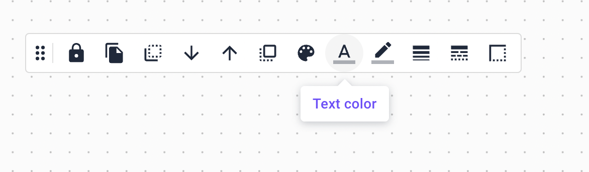

# Node 🟪

### Description

An architecture is built with nodes. A node is a terraform resource that can be used to visually indicate a resource from your infrastructure. A node can be a resource from any provider (Azure, AWS, OCI, GCP, Scaleway), an icon, a custom terraform resource or a file. In order to add a node to your architecture you find the desired resource in the leftbar and drag and drop it to the architecture. You can also search for a resource in the leftbar search input. After a resource has been added to your architecture, the terraform code will be automatically generated and will be visible in the right sidebar.

### Node options bar

You can select a resource by clicking on it. When a resource is selected, the node options bar will appear on top of the architecture, just under the architecture options bar. The node options bar allows you to visually configure the resource.

The node options bar contains the following elements:

* **Lock the node**: This button allows you to lock the node. When a node is locked, it cannot be moved around the architecture, changed or deleted. (CTRL + L)

* **Clone node**: This button allows you to clone the node. When a node is cloned, a copy of the node is created and it is placed near the original node. (CTRL + D)

* **Send node to back**: Brainboard allows and works based on layers and inheritance. This button allows you to send the node to the most back layer.

* **Send node backward**: This button allows you to send the node one layer backward.

* **Bring node forward**: This button allows you to send the node one layer forward.

* **Bring node to front**: This button allows you to send the node to the most front layer.

* **Fill color**: This button allows you to change the fill color of the node. When clicked, it opens the color picker, which allows you to choose a color.

.png>)

* **Text color**: This button allows you to change the text color of the node. For text nodes, it allows you to change the color of the text and for regular nodes, it allows you to change the color of the title.

* **Border color**: This button allows you to change the border color of the node.

* **Border weight**: This button allows you to change the border weight of the node. (measured in pixels)

* **Border dash**: This button allows you to change the border dash of the node.

.png>)

* **Border radius**: This button allows you to change the border radius of the node. (measured in pixels)

### Node action buttons

Besides the node options bar, when a resource is selected, the node action buttons will appear on the right side of the resource. These buttons allow you to perform the following actions:

* **(1) Edit text**: This button allows you to edit the text of the resource. It is useful when you want to change the name of the resource.
* **(2) Cloud configuration**: This button allows you to configure the cloud configuration of the resource. When clicked, it opens the Identity card of the resource with the proper configuration fields, which can be updated. After updating the fields and closing the Identity card, the terraform code will be automatically updated.
* **(3) Add connector**: This button allows you to add a connector to the resource. A connector is a line that connects two resources.
* **(4) Turn into icon only**: This button allows you to turn the resource into an icon. After a resource is turned into an icon only, it will no longer generate terraform code.
* **(5) Group resources in the same terraform file**: This button allows you to group resources a custom terraform group. After being grouped in a custom file, the corresponding terraform code will be generated in a file with the name of the group and it will be removed from the main terraform file.
* **(6) Delete resource**: This button allows you to delete the resource from the architecture.
