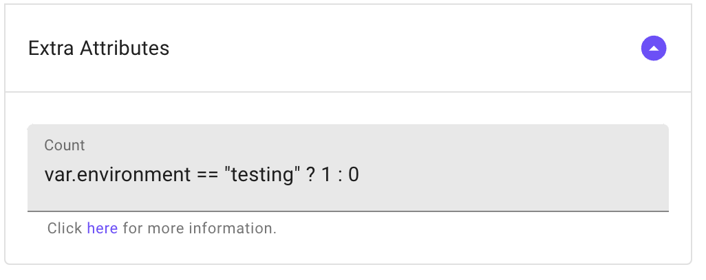

# Manage Environments

Managing environments in Brainboard involves creating and managing separate directories and sets of resources for different stages of your infrastructure, such as development, testing, staging, and production.

Here are the steps to manage environments in Brainboard:

### Create a new environment

Start by creating a directory structure that separates your infrastructure code by environment. For example, you could create a folder called "dev" for your development environment, "QA" for your testing environment, "DR" for your disaster recovery scenarios, and so on.

* To create a new environment, navigate to the projects selector and click on the `+` as below : 
* **Define variables**: Define variables in your Terraform code to customize the infrastructure for each environment. For example, you might define variables for the number of instances, the instance type, and the region for a particular environment. You can then use those variables in your module code to create the resources for that environment.

### Update environment

To update an existing environment:

* Click on the name of the environment in the top left corner
* Change any information you want:
  * Name
  * Description
  * Tags
* Click on the `update` button at the bottom.

### Delete environment

To delete an environment:

* Click on the name of the environment in the top left corner.
* Hove the 'Delete this environment\` button on the right side of the line of the environment. 
* Confirm the deletion.

:::warning Deleting an environment will delete all architectures inside it. This action cannot be undone. :::

### Synchronize multiple environments

Refer to the [Environment Sync](https://gitlab.com/brainboard/brainboard/-/blob/main/environments/environment-sync.md) to know more about it.

By following these steps, you can effectively manage multiple environments in Brainboard and ensure that your infrastructure is consistent and reliable across all stages. This is the best way to eliminate the drift between different environments.

### Tips

To create a test database only in the testing environment in Terraform using the count meta-argument, you can set the count expression of a resource to 1 when the environment is `testing`, and 0 otherwise. When the count expression is 0, the resource will not be created.

In this example, the count expression is set to `var.environment == "testing" ? 1 : 0`, which means that if the environment variable is set to "testing", one instance of the resource will be created; otherwise, no instances will be created.

This can be useful for conditional infrastructure provisioning based on different scenarios or stages of a deployment.
