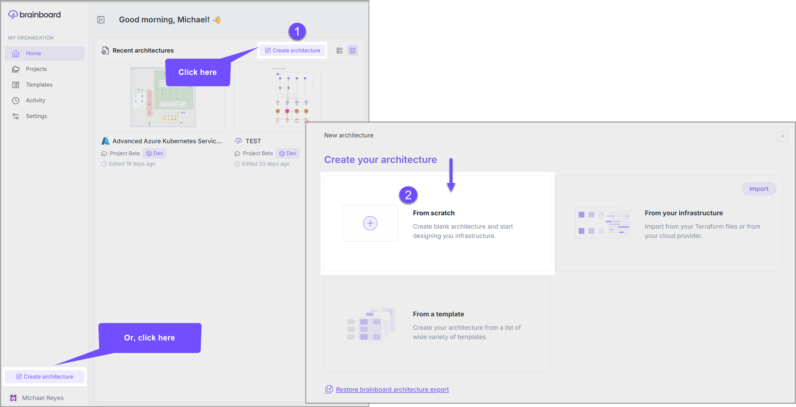
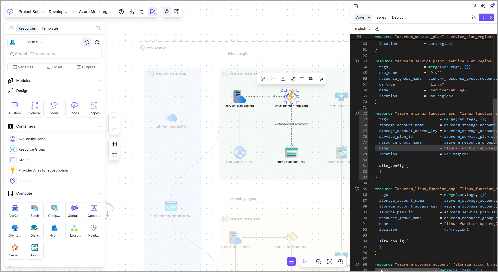
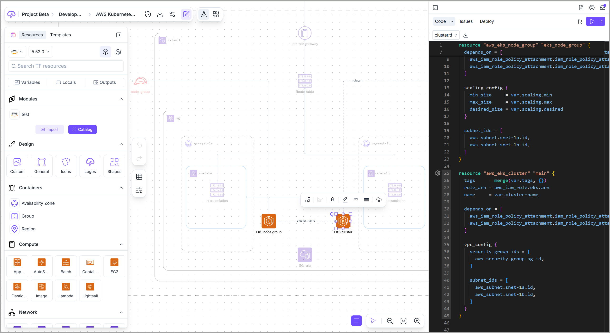
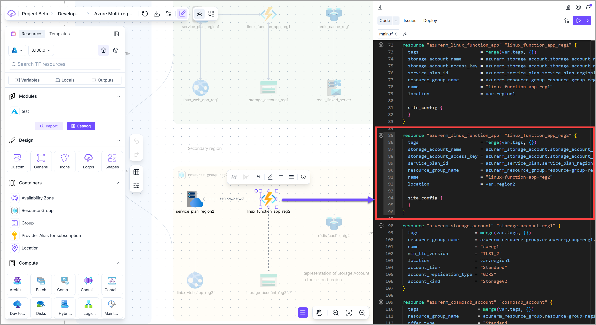
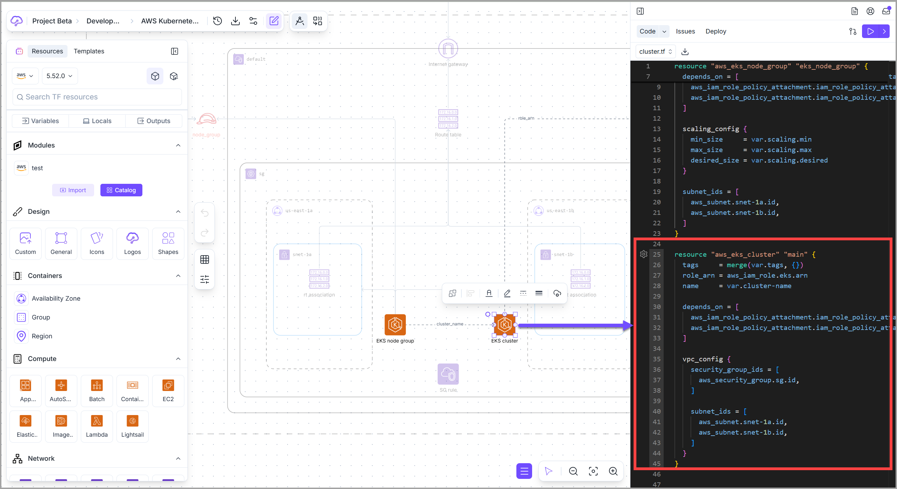
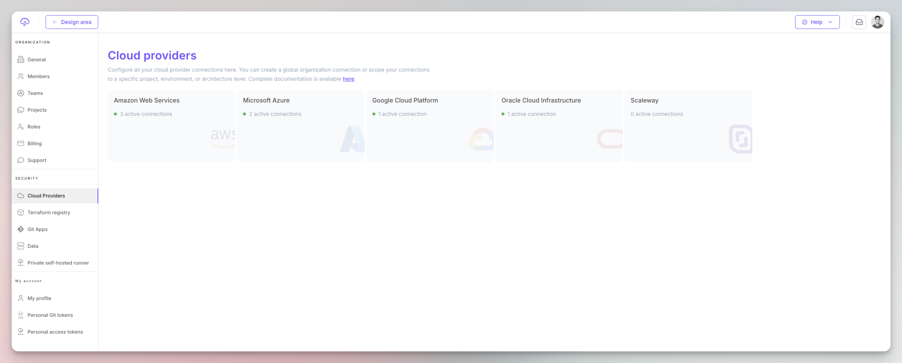
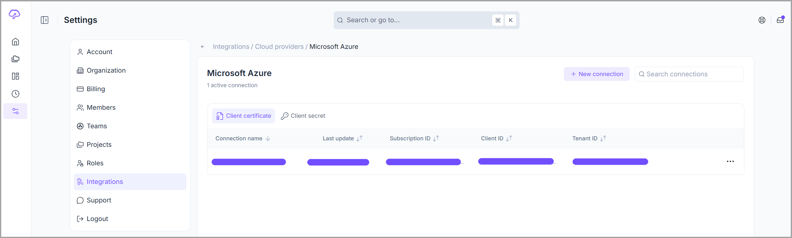
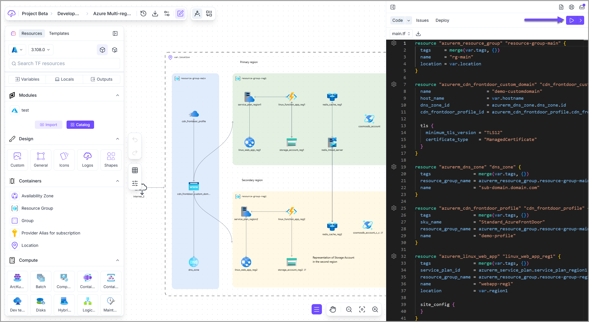

# Fast track

### 1. Create an account

Register [here](https://app.brainboard.co/register) to create your account. You can sign up with your Google or Microsoft login.

### 2. Create a new architecture

* Click on the <mark style="color:$primary;">**`New architecture`**</mark> button in the top left part.
* Select <mark style="color:$primary;">**`From scratch`**</mark> option.

<figure><figcaption></figcaption></figure>

### 3. Add cloud resources

Drag and drop cloud resources from the _**left bar**_ to the design area to build your architecture. Customize the cloud configuration of the resources

#### Azure

<figure><figcaption></figcaption></figure>

#### AWS

<figure><figcaption></figcaption></figure>

### 4. Inspect the auto-generated Terraform code

See the auto-generated **Terraform** code in the right pane.

Code for Azure & AWS resources:

<figure><figcaption></figcaption></figure> <figure><figcaption></figcaption></figure>

Please refer to the support providers page to have the complete list of all supported cloud providers.

### 5. Add your cloud credentials

If you want to deploy your architecture, add your preferred cloud provider credentials [here](https://app.brainboard.co/settings/integrations/cloud-providers).

<figure><figcaption>
Cloud credentials
</figcaption></figure>

Example for **Azure** credentials.

<figure><figcaption></figcaption></figure>

### 6. Trigger a plan

After adding your cloud credentials, you can trigger the **Terraform / OpenTofu** plan directly from the design area and get the output in real time.

<figure><figcaption></figcaption></figure>

#### Execution output

The output of the plan execution becomes available in the <mark style="color:$primary;">**`Deployment`**</mark> tab in the right panel.&#x20;

<figure><figcaption></figcaption></figure>
