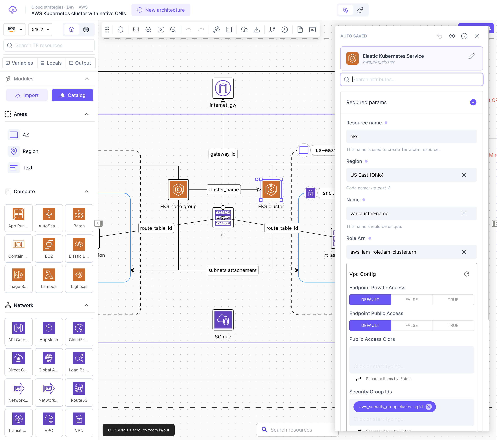
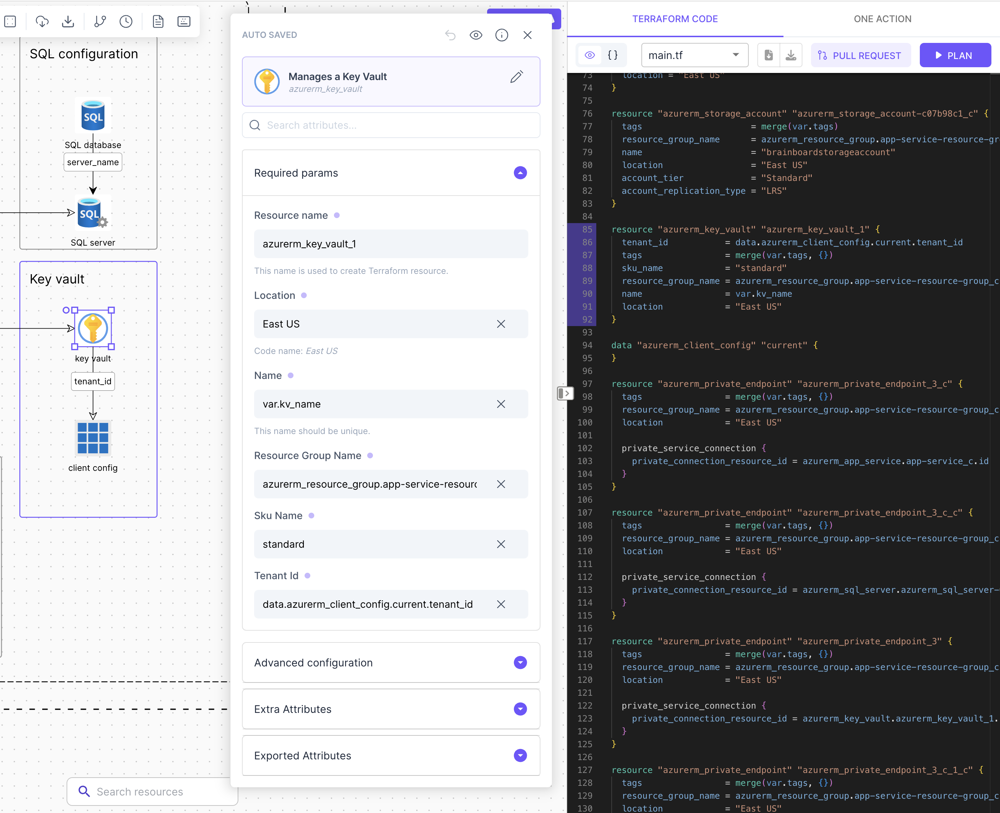
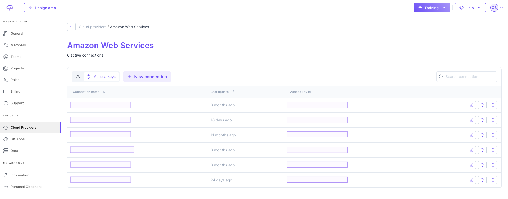

# Fast track

## 1. Create an account

Register [here](https://app.brainboard.co/register) to create your account. You can sign up with your Google or Microsoft login.

## 2. Create a new architecture

* Click on the `New architecture` button in the top left part.
* Select `From scratch` option.

## 3. Add cloud resources

Drag and drop cloud resources from the _Leftbar_ to the design area to build your architecture. Customize the cloud configuration of the resources

### Azure

### AWS

## 4. Inspect the auto-generate Terraform code

See the auto-generated Terraform code on the right pane.

### Code for Azure resource

### Code for AWS resource

Please refer to the support providers page to have the complete list of all supported cloud providers.

## 5. Add your cloud credentials

If you want to deploy your architecture, add your preferred cloud provider credentials [here](https://app.brainboard.co/settings/cloud-providers).

Examples for **AWS** and **Azure**.

 

## 6. Trigger a plan

After adding your cloud credentials, you can trigger the Terraform / OpenTofu plan directly from the design area and get the output in real time.

<figure><figcaption>
Terraform plan action
</figcaption></figure>

### Execution output

You see the output of the plan in the design area, in the tab next to the Terraform code:

<figure><figcaption>
Terraform / OpenTofu plan output
</figcaption></figure>
