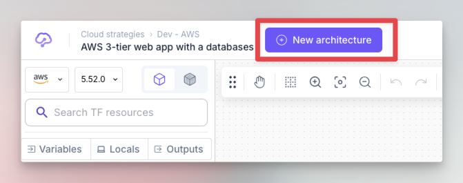
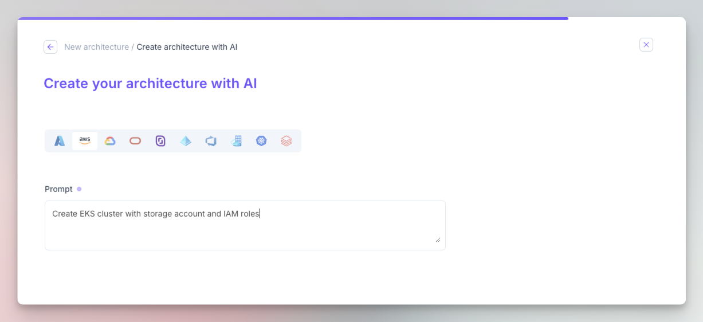

# Start with AI

You can also use Brainboard AI to get started quickly with a prompt.

## Create a new architecture

* Click on the `New architecture` button in the top left part.

<figure><figcaption>
Create new architecture
</figcaption></figure>

* Select `Create using AI` option.

<figure><figcaption>
Start with AI option
</figcaption></figure>

This will give you a text area where you can type your prompt text:

<figure><figcaption>
AI prompt
</figcaption></figure>

Brainboard processes your prompt and creates an architecture, you can give it a name as it is ready to be used:

<figure><figcaption>
Naming architecture
</figcaption></figure>

Once the architecture is generated, you'll have the design with the Terraform code generated

<figure><figcaption>
AI generated architecture
</figcaption></figure>
