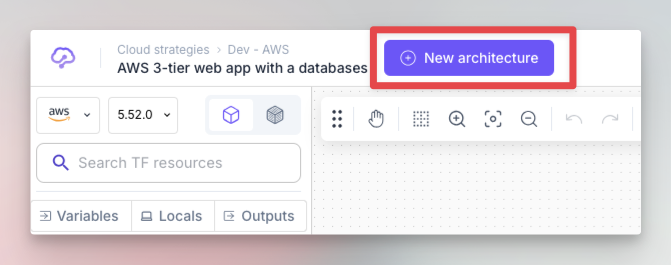
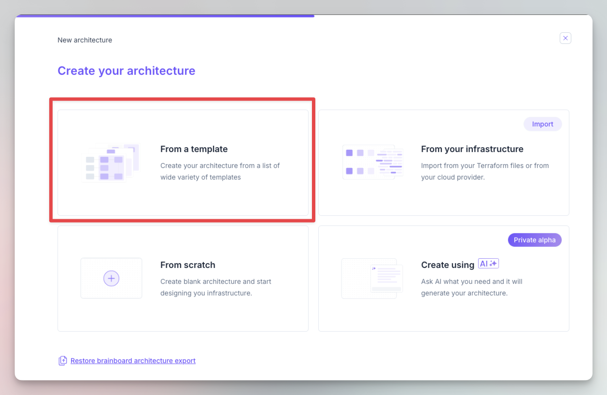

# Start with a template

One of the fastest ways to start with Brainboard, is to start with a template:

* Click on the `New architecture` button in the top left part.

<figure><figcaption>
Create new architecture
</figcaption></figure>

* Select `From a template` option.

<figure><figcaption>
Start from template option
</figcaption></figure>

It will open the template catalog where you can search for your use case, For e.g. `landing zone`, `kubernetes`, `security`... or select your preferred cloud provider to only see the templates  of this specific provider:

<figure><figcaption>
Templates catalog
</figcaption></figure>


There are 2 types of templates: **public** and **private.**\
You can convert any architecture created into a template. Which allows you to build your internal library of templates.

