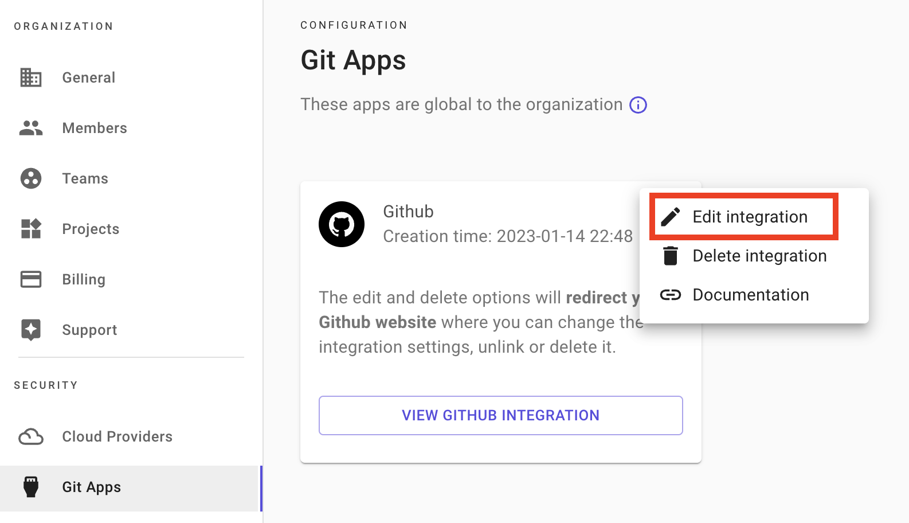
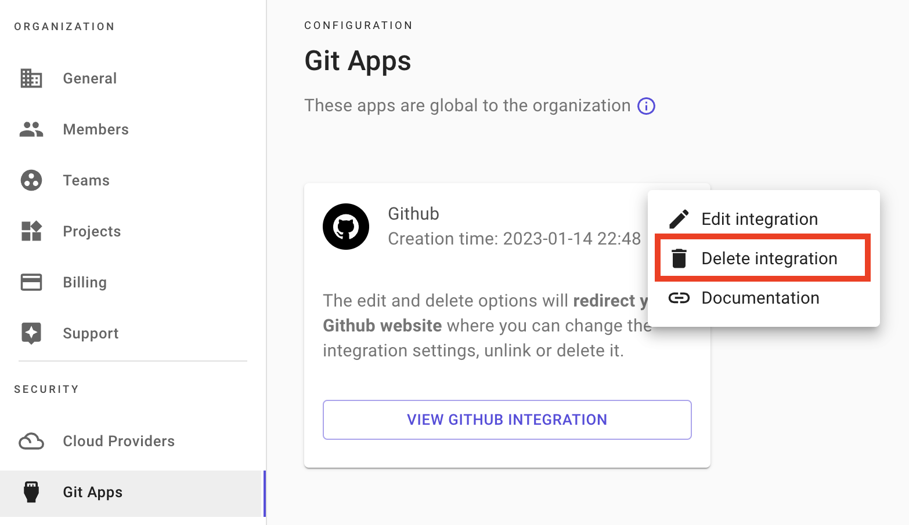

# Git apps 🔗

### Description

Git app integration is a mechanism that allows you to control access to repositories and users from your git provider and not inside Brainboard.

Which means that with this integration, users don't user their personal git tokens and have no configuration to do in Brainboard.

When doing Pull Requests, Brainboard sends the information of the user creating the PR to be able to track who does what. Refer to [Pull Requests](https://gitlab.com/brainboard/brainboard/-/blob/main/git-configuration/pull-requests/README.md) page for more information about how it works.

#### Supported git providers

Here are the supported git providers that provide git app integrations:

* GitHub.
* Azure DevOps (coming soon).

If you use another git provider (`Gitlab`, `Azure DevOps` and `Bitbucket`), please refer to [this page](https://gitlab.com/brainboard/brainboard/-/blob/main/git-configuration/personal-git-tokens/README.md) for integration.

### Configure GitHub integration

To create integration between Brainboard and GitHub:

1. Go to [Git apps](https://app.brainboard.co/settings/git-apps) settings page.
2. Click on `Add GitHub integration` button: 
3. You'll be redirected to GitHub website, where you can choose the organization for which you want to configure access: 
4.  After selecting the organization, you are prompted to specify the repositories: 

    :::info Brainboard requires `read-write` access to be able to do pull requests\` :::
5. After selecting the repositories, you'll be automatically redirected to Brainboard Git app settings page. Now the button changed to `View GitHub integration`.  :::warning Brainboard Enterprise SSO users If your organization uses Brainboard Enterprise SSO for authentication, the redirection to Brainboard app will fail after selecting the repositories. In that case, please contact our support to update your GitHub installation\_id. :::
6. Once your GitHub integration is configured, please [create a personal GitHub token](https://gitlab.com/brainboard/brainboard/-/blob/main/frontend/docs/docs/git-configuration/personal-git-tokens/README.md#github) in the [personal git tokens](https://app.brainboard.co/settings/personal-git-tokens) settings page in order to be able to use GitHub features in Brainboard.

### Edit GitHub integration

To edit the GitHub integration:

1. Go to [Git apps](https://app.brainboard.co/settings/git-apps) settings page.
2.  Either click on `View GitHub integration` button: 

    Or click on the three dots located in the top-right, then click on `Edit integration`: 
3. You'll be redirected to GitHub website, where you can edit the integration with Brainboard.

### Delete GitHub integration

To delete integration with GitHub:

1. Go to [Git apps](https://app.brainboard.co/settings/git-apps) settings page.
2. Click on the three dots located in the top-right, then click on `Delete integration`: 
3. You'll be redirected to GitHub website, where you can delete the integration with Brainboard.

The update will be immediate, and you no longer will be able to do pull requests.

:::info Important Only organization `owner` or `admin` can configure, edit or delete the GitHub integration. :::
