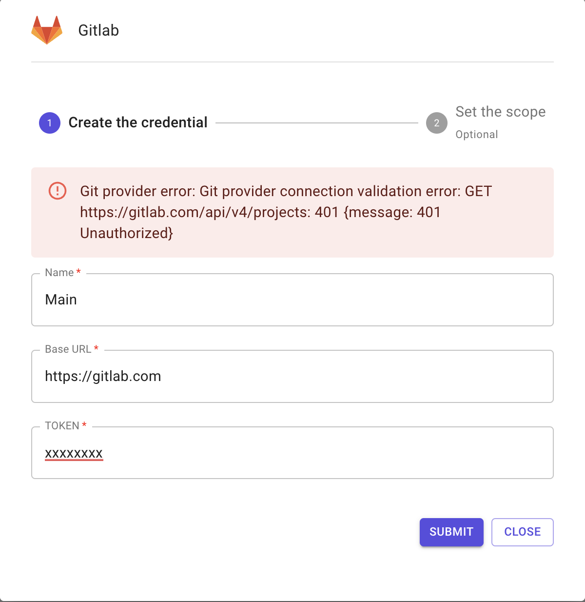

# Personal git tokens 🪪

### Description

Personal git tokens allow every user to add one or more git credentials in Brainboard to be able to do pull requests.

Pull requests initiated by the user will use the credential specified with its associated scope in a way that you can track who does which pull request.

If you use Github, refer to [this page](https://gitlab.com/brainboard/brainboard/-/blob/main/git-configuration/git-apps/README.md) to setup Github app integration.

### Supported git providers

#### Gitlab

To add Gitlab personal git tokens in Brainboard, you first need to generate Gitlab access token.

Steps to generate a personal token on your <strong>Gitlab</strong> account.

1. Go to your [Gitlab personal tokens page](https://gitlab.com/-/profile/personal\_access\_tokens).
2. Add a name and specify `API` rights, then click on `Create personal access token` button: 
3. The token is generated, you can copy it to add to Brainboard: 

To add the generated token in Brainboard:

1. Go to [personal git tokens](https://app.brainboard.co/settings/personal-git-tokens) settings page: 
2. Click on Gitlab row, then click on the `plus` button location on the right: 
3. Add your credentials in the displayed window:
   * Name of the token. This is only for Brainboard, it will not be used when you do a pull request.
   * The URL of your Gitlab server: by default Brainboard uses `https://gitlab.com` but if you have a private Gitlab instance accessible through internet or if you use a single-tenant Brainboard offering you can specify a different URL.
   * Token: the token (secret) generated from your Gitlab account. 
4. Then click on `Submit` button.
5. Brainboard will verify if the credentials are valid. If they are not, you'll receive this error: 
6. If the token is valid, you'll now configure the scope associated to it: 
7. Click on `Submit` button to save the configuration.

#### GitHub

In order to add GitHub personal git tokens in Brainboard, you will first need to [install the Brainboard github app](https://gitlab.com/brainboard/brainboard/-/blob/main/frontend/docs/docs/git-configuration/git-apps/README.md#configure-github-integration) in your organization.

To add a personal GitHub token:

1. Go to [personal git tokens](https://app.brainboard.co/settings/personal-git-tokens) settings page: 
2. Click on GitHub row, then click on the `plus` button location on the right: 
3.  Click on the `Connect with GitHub` button:

    
4.  GitHub website will open in a new tab, asking you to authorize Brainboard app to access your GitHub account. Click on the `Authorize Brainboard` button:

    
5.  You will then be redirected to Brainboard personal git tokens page, with a confirmation that the GitHub connection was successful:

    

#### Azure DevOps

To add Azure DevOps personal git tokens in Brainboard, you first need to generate Azure DO personal access token.

Steps to generate a personal access token on your <strong>Azure DO</strong> account.

1. Go to your [Azure DO page](https://dev.azure.com/).
2. Click on the top right icon and then select `Personal access tokens`: 
3. It will open the page of access tokens. Click on `New token` button. 
4. In the menu, add the following information:
   * Name of the token.
   * You can set an expiration date.
   * In the `code` section, select `Full` 
5. The token is generated, you can copy it to add to Brainboard: 

To add the generated token in Brainboard:

1. Go to [personal git tokens](https://app.brainboard.co/settings/personal-git-tokens) settings page: 
2. Click on Azure DevOps row, then click on the `plus` button location on the right: 
3. Add your credentials in the displayed window:
   * Name of the token. This is only for Brainboard, it will not be used when you do a pull request.
   * The URL of your Azure DevOps organization.
     * To get this URL, the simplest way is to click on `Azure DevOps` on the top-left button then copy the URL of the browser 
   * Token: the token (secret) generated from your Azure DO account. 
4. Then click on `Submit` button.
5. Brainboard will verify if the credentials are valid. If they are not, you'll receive this error: 
6. If the token is valid, you'll now configure the scope associated to it: 
7. Click on `Submit` button to save the configuration.

#### Bitbucket

To add Bitbucket personal app password in Brainboard, you first need to generate it in your Bitbucket account.

Steps to generate a personal app password on your <strong>Bitbucket</strong> account.

1. Go to your [Bitbucket app passwords page](https://bitbucket.org/account/settings/app-passwords/).
2. Click on the top right icon and then select `Personal settings`:
   * Got to `App passwords` accessible from the left bar options.
   * Click on `Create app password`. 
3. Add a name and grant `read-write` access for:
   * Projects.
   * Repositories.
   * Pull requests. 
4. The token is generated, you can copy it to add to Brainboard: 

To add the generated token in Brainboard:

1. Go to [personal git tokens](https://app.brainboard.co/settings/personal-git-tokens) settings page: 
2. Click on Bitbucket row, then click on the `plus` button location on the right: 
3. Add your credentials in the displayed window:
   * Name of the token. This is only for Brainboard, it will not be used when you do a pull request.
   * The URL of your Bitbucket server: by default Brainboard uses `https://api.bitbucket.org/2.0` but you can set your own URL.
   * Username: this is `not` your email. You get it from your personal Bitbucket [account settings](https://bitbucket.org/account/settings/). 
   * Password: the app password generated from your Bitbucket account. 
4. Then click on `Submit` button.
5. Brainboard will verify if the credentials are valid. If they are not, you'll receive this error: 
6. If the token is valid, you'll now configure the scope associated to it: 
7. Click on `Submit` button to save the configuration.

### Git token scope

Brainboard allows you to specify where a git token will be used by setting its scope. This provides you with fine grain flexibility when managing tokens and separating concerns.

So, when you add a personal git token, you can specify in which project, environment or architecture it will be used. This is what is called `setting the scope` of the credentials.

GitHub personal access tokens do not have any scope, as you can only create one token, which will be available for all your projects, environments, and architectures.

To change the scope of the token:

1. Go to [personal git tokens](https://app.brainboard.co/settings/personal-git-tokens) settings page: 
2. Hover the token row you want to change, and click on the `Change the scope of the credential` button: 
3. Choose from the list of the projects, environments and architectures displayed where you want this credential to be used 

### Edit token

To edit a personal git token:

1. Open the git provider row for the token you want to edit, and click on the `Edit the credential` button: 
2. Change the information of the credential, then click on `Submit` button to save the changes.

### Delete token

To delete a personal git token:

1. Open the git provider row for the token you want to delete, and click on the `Delete the credential` button: 
2. You'll be prompted to confirm your action. If you click on `Delete` button, the credential will be permanently deleted.

### Best practices

1. It is a best practice to define at least one default git credential.
   * To do it, click on the toggle `Default credentials for all your organization`: 
2. Always set an expiration date for your personal git tokens on your git provider.
3. When you rotate your personal git tokens, don't delete and add new ones in Brainboard but edit them to only change the token.

:::info Token's UUID Every token in Brainboard has a unique identifier, so updating any credential will not affect its scope. :::
