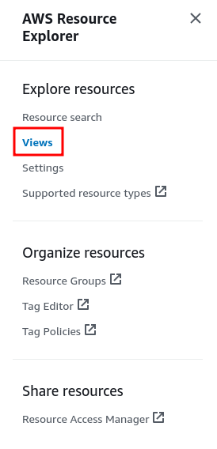

# Import from AWS

### Description

Brainboard allows you to import your cloud infrastructure from AWS, and will generate the architecture diagram, the Terraform code and the tfstate for you.


This is considered a migration to Brainboard and not intended to be used a remediation to the drift.

Please check [drift](../../../automation/drift/ "mention")section to understand how it works and how you can setup a remediation.


### Import from AWS provider prerequisites

When importing resources from AWS provider, Brainboard will scan your cloud account resources using the following AWS services:

* [AWS Resource Groups Tagging](https://docs.aws.amazon.com/resourcegroupstagging/latest/APIReference/overview.html): this service will list any resource which has been tagged at least once
* [AWS resource explorer](https://docs.aws.amazon.com/resource-explorer/latest/userguide/welcome.html): this service will list all resources matching Resource Explorer view index.

Brainboard will scan your cloud account using the best effort method: it will try to find as many resources as possible, using AWS resource explorer in priority if possible.

#### Create indexes

In order for AWS Resource Explorer to list your existing resources, AWS needs to frequently update its search index.

The index is based per region, so we recommend creating indexes for all your regions and then selecting your main region as an **aggregator index**. An aggregator index will aggregate results from all other regions indexes.

If you haven't already created indexes, here are the steps to take:

1. Open the [AWS Resource Explorer console](https://console.aws.amazon.com/resource-explorer/home)
2. Navigate to the `Settings` menu in the left panel:

3. Click on `Create Indexes`:

4. Select all regions and click on `Create Indexes`:

5. Go back to the `Settings` menu, select your aggregator region and click on `Change Index Type`:

6. In the modal window, select `Aggregator Index` and click on `Save changes`:

#### Create a default view

When using Resource Explorer service, Brainboard will look for a **default view** in one of the regions you select during the import steps.

Here are the steps to create a default view in AWS Resource Explorer:

1. Open the [AWS Resource Explorer console](https://console.aws.amazon.com/resource-explorer/home)
2. Navigate to the `Views` menu in the left panel:

3. Click on `Create View`:

4. In the view creation form, set a name for your view and **make sure you select the region containing the aggregator index** you created in the previous step:

5. Once the view has been created, select the view and click on Actions button to set this view as default view:

### Import cloud resources

Once your account is correctly configured to list cloud resources, you can import them into a new Brainboard architecture.

1. Click on new architecture button in the top left corner
2. Select the `import from your infrastructure` option:

.png>)

3. Select the `From you Cloud providers` option:

4. Select AWS

<figure><figcaption></figcaption></figure>

5. Select the credentials / the account that you want to import from

<figure><figcaption></figcaption></figure>

6. The next pages explain the mechanism to use to import your infrastructure. Please read them to know which way is best for you and click Next

<figure><figcaption></figcaption></figure>

<figure><figcaption></figcaption></figure>

7. Select the region(s) of your infrastructure

<figure><figcaption></figcaption></figure>

8. Brainboard scans your region(s) and list all the resources for you that you can filter exactly those you want to import

<figure><figcaption></figcaption></figure>

9. Give a name to your architecture and click on `Start import`&#x20;

<figure><figcaption></figcaption></figure>


Importing resources from your cloud account can take a long time, depending on the number of resources Brainboard will find in your account. You can either keep the import window open or wait for an email notification once the import is complete.&#x20;

You will also be notified in the app when the import is done.


This window will also display the remaining import credits in your Brainboard account.

Every time you select a resource to import, the number of credits that will be deducted from your account displayed at the bottom of the window is refreshed.

### Limitations

When you import your cloud infrastructure, here is what you need to know about what is imported and how:

* The import uses AWS resource explorer or the tagging, so all the resources available through through these mechanisms are supported
* Information that are not disclosed by AWS are not available, for e.g:
  * Virtual machine passwords
  * Database passwords
  * Sensitive information


So we replace these sensitive information in the code with a placeholder string "_ignored-as-imported_"


* The goal is to run the plan without having any errors, but sometimes you may have some:
  * When only one parameter is needed out of 2 possible. When we do the import, the default values are imported from AWS. So even if we are continuously improving the process to fix this mutually exclusive parameters, in some situations we keep it as it is for the user to decide what is correct.

### Exclusions and optimization

It is very important when you are importing resources to filter out those you will not maintain in Terraform (as it doesn't make sense) or ephemeral resources. You can use this list as a starting point:

| AWS resource type                | Comment                                            |
| -------------------------------- | -------------------------------------------------- |
| acm:certificate                  | We don't recommend importing sensitive information |
| appstream:image-builder          |                                                    |
| athena:datacatalog               |                                                    |
| athena:workgroup                 |                                                    |
| backup:recovery-point            |                                                    |
| cloudformation:stack             |                                                    |
| cloudformation:stackset          |                                                    |
| cloudtrail:trail                 |                                                    |
| cloudwatch:alarm                 |                                                    |
| codebuild:project                |                                                    |
| config:config-rule               |                                                    |
| ec2:default-security-group       |                                                    |
| ec2:image                        |                                                    |
| ec2:network-insights-path        |                                                    |
| ecs:task                         |                                                    |
| elasticloadbalancing:targetgroup |                                                    |
| iam:mfa                          |                                                    |
| iam:saml-provider                |                                                    |
| kms:key                          |                                                    |
| lambda:event-source-mapping      |                                                    |
| logs:log-group                   |                                                    |
| memorydb:acl                     |                                                    |
| memorydb:parametergroup          |                                                    |
| networkmanager:global-network    |                                                    |
| redshift:parametergroup          |                                                    |
| secretsmanager:secret            | We don't recommend importing sensitive information |
| ssm:session                      |                                                    |

### Best practices

* Do smaller imports: The golden rule is to import only resources that are supposed to be managed in the same lifecycle:
  * To reduce the blast radius
  * Have a light tfstate for future operations
  * Better diagram and code navigation
* If you have different environments like dev, staging and prod, don't import them all in one import. Separate the environments and do different imports for different purposes.
* Don't import sensitive information in clear text. Surprisingly, when you do the import, if the credentials are allowed to read the key vault secrets it will be able to list them for import. Better to not import them and just reference them using the `data objects` instead.
* After the first import, create a version in Brainboard called for e.g, `Initial import` . This is an immutable snapshot that you can revert to if needed later.
