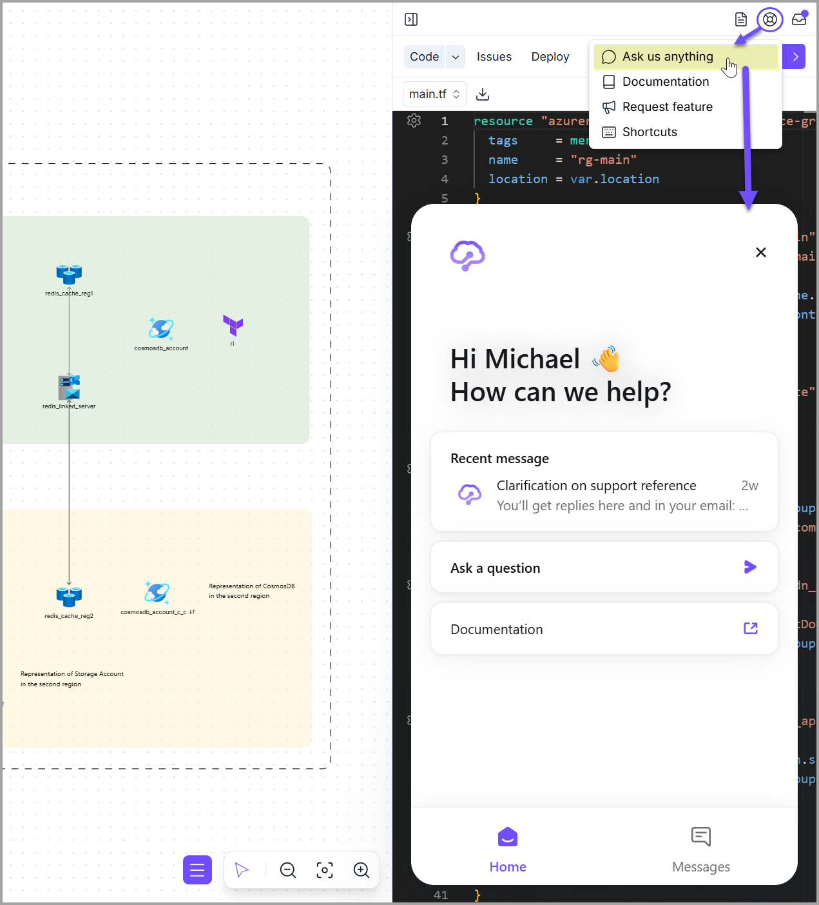

# Support

### In-app chat (preferred)

When you are using Brainboard, you can reach out to us in real time by clicking on the <mark style="color:$primary;">**`Help`**</mark> icon in the top right corner of the right pane, then clicking on <mark style="color:$primary;">**`Ask us anything`**</mark>. One of our team members will reply to answer your questions or help you with any technical topic.

<figure><figcaption></figcaption></figure>

### Email

If you prefer emails (asynchronous communication), you can reach out to our technical team at <mark style="color:$primary;">**`support@brainboard.co`**</mark>. The team will do its best to get back to you as soon as possible.

### Access our security reports

To request access to our security reports, like SOC 2 Type II, use this [portal](https://security.brainboard.co).


Your account manager or sales representative will approve your request. Otherwise, the team will reach out to you before approval.


### Report security issues

To report a security issue, reach out to our security team at <mark style="color:$primary;">**`security@brainboard.co`**</mark>.

### Request a feature

To request a new feature or see what the community have requested, check our [public roadmap](https://roadmap.brainboard.co/boards/feature-requests).

### Request a demo

To request a demo of Brainboard, reach out to our sales team at <mark style="color:$primary;">**`sales@brainboard.co`**</mark> .
