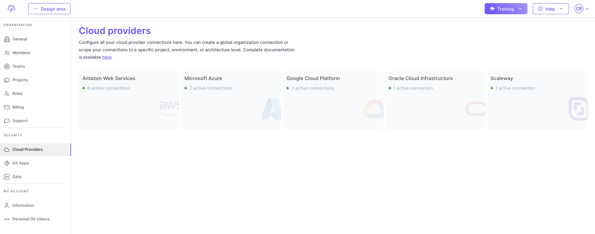

# Fast track ⏱️

## 1. Create an account

Register [here](https://app.brainboard.co/register) to create your account. You can sign up with your Google or Microsoft login.

## 2. Create a new architecture

* Click on the plus button in the top left part.
* Select `Blank` option.

## 3. Add cloud resources

Drag and drop cloud resources from the leftbar to the design area to build your architecture. Customize the cloud configuration of the resources

### Azure

### AWS

## 4. Auto-generate the Terraform code

See the auto-generated Terraform code on the right pane.

### Code for Azure resource

### Code for AWS resource

We support providers such as AWS, Azure, GCP and more.

## 5. Add you cloud credentials

Add your preferred cloud provider credentials into Brainboard [here](https://app.brainboard.co/settings/cloud-providers).

Here are examples for **AWS** and **Azure**.

 

## 6. Trigger a plan

After adding your cloud credentials, you can trigger the Terraform plan directly from the design area and get the output in real time.

### In place output

You see the output of the plan in the design area, in the tab next to the Terraform code: 

### Deploy view output

You can also go the deploy view to have a bigger output in the deploy view: 
