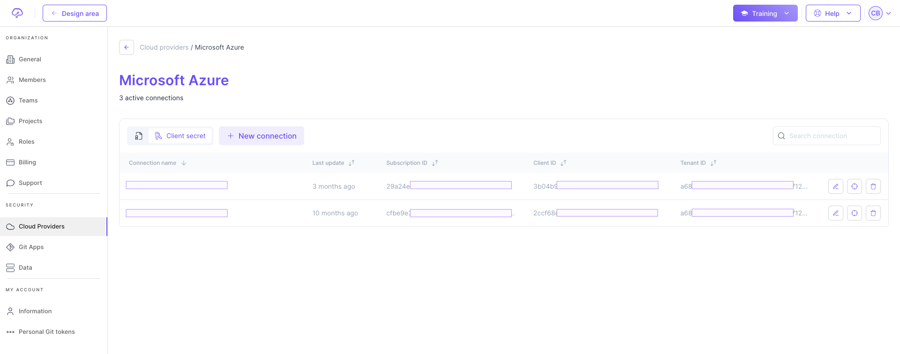

# Account Setup 🤝

Here below are setup actions that you need to do for your account to be able to:

* Do pull requests to your repo
* Organize how you work with your team collaboratively
* Do plan, apply and/or destroy

### How data is organized

Before you start, you need to understand how information are organized in Brainboard.

There are 3 levels of information:

1.  **Projects**: this is the topmost level of the hierarchy and it is equivalent to a folder.

    To better organize your work within Brainboard, you can consider the the project as your client or team's folder, so you can rename it in way that makes sens to you.
2.  **Environments**: inside any given project, you have multiple environments. By default Brainboard suggests to create 5 environments when you create a project.

    These environments are the stages of production systems, like test, development, QA, staging, production... and they are containers for architectures.
3.  **Architectures**: is the last element in the hierarchy and contains the diagram of your cloud infrastructure with the auto-generated code.

    The architecture is the one that accepts actions like: plan, apply and/or destroy, pull requests, versioning...


The architecture is associated to **one Terraform state** to better isolate and secure your infrastructure. This is a Terraform best practice and you can specify a different remote backend in the setting page.


Please refer to the right section of every level if you need detailed information.

### 1. Team organization

When you invite your colleagues to build cloud infrastructures within Brainboard, it's better to put them into teams to reflect your internal organization & processes. For e.g. DevOps team, Cloud Architect team, Security team, Project managers...

Here is the [link](https://app.brainboard.co/settings/teams) to access the team settings.

### 2. Add cloud credentials

Add your preferred cloud provider credentials to be able to do plan, apply or destroy and also to trigger the CI/CD pipelines.

Here is the [link](https://app.brainboard.co/settings/cloud-providers) to access the cloud credentials page.

Examples of configuration for AWS and Azure:

 

### 3. Git configuration

Brainboard supports 2 types of Git connections:

#### 3.1. Git apps

This type of connections is done through the app registration, and the user management is done at your provider level and not in Brainboard


The only provider supported is **Github**. Azure DevOps will be added in the near future


Here is the [link](https://app.brainboard.co/settings/git-apps) to access Git apps settings page.

#### 3.2. Add personal git tokens

Git personal tokens page allows you to store the tokens that you generate from your Git provider and set their scope (in which projects they will be used).

The Git providers supported are:

* Gitlab
* Azure DevOps
* Bitbucket

Here is the [link](https://app.brainboard.co/settings/personal-git-tokens) to access Git apps settings page.

### 4. Set remote backend

It's a best practice to store the Terraform state generated after you provision your cloud infrastructure into a remote backend.

Brainboard allows you to set and use your own remote backend.

Here is the [link](https://app.brainboard.co/settings/data) to configure it.

.png>)


Contact us If you need help to setup your account, please reach out to our support at `support (@) brainboard.co`\
One of our cloud architects will walk you through the configuration

