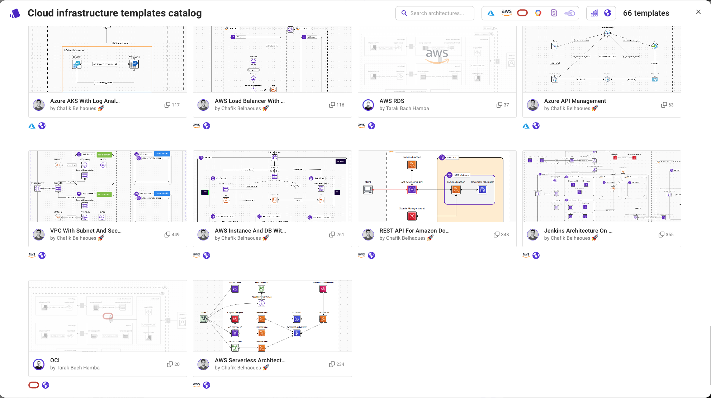

# Start with a template ⚜️

One of the fastest ways to start with Brainboard, is to start with a template.

You can access the template catalog from the design area with the button `Templates`:

.png>)

You can search by keyword any architecture, e.g. `landing zone`, `kubernetes`, `security`... or select your preferred cloud provider to only see the templates architectures for this specific provider:


There are 2 types of templates: **public** and **private.**\
You can convert any architecture created into a template. Which allows you to build your internal library of templates to use off the shelf.

