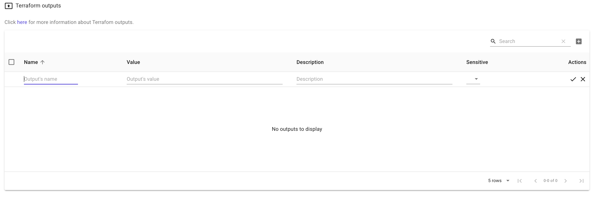

# Output 📺

### Definition

For situations where, for e.g. you deploy a large web application infrastructure using Terraform, you often need certain endpoints, IP addresses, database user credentials, and so forth. This information is most useful for passing the values to modules along with other scenarios.

`Output variables` in Terraform are used to display the required information in the console output after a successful application of configuration for the root module.

### Attributes

* **name**: the name of the output, which must be a valid identifier.
* **value**: an expression whose result is to be returned to the user.
* **description**: a description of the purpose of the output value.
* **sensitive**: a boolean value showing if terraform should hide the values in the messages from terraform plan and terraform apply.

### Scopes

Output values can be used for several purposes:

* To share data between Terraform modules: Output values can be used to pass data from one module to another, allowing you to share data between modules and keep your code organized.
* To export data for further usage: After creating a resource, you can output its ID, name, and other information that can be used to reference it later. This allows you to use the outputs in other parts of your infrastructure or in external systems.
* To debug your Terraform code: Output values can be used to debug your Terraform code. You can use it to output the values of certain variables or the status of certain resources, which can be helpful when troubleshooting issues.
* To make your Terraform code more reusable: By parameterizing your Terraform code with output values, you can make it more reusable and flexible. This allows you to use the same code in multiple environments or for different use cases.
* To access outputs after Terraform has been run: Output values can be stored in a state file, which allows you to access the outputs after Terraform has been run. This can be useful when you need to reference the resources created by Terraform later.
* To pass information to other parts of your infrastructure or to external systems: Output values can be used to pass information to other parts of your infrastructure or to external systems. This allows you to share data between different systems and automate the process of creating and managing infrastructure.

### Create output

To create an output click on the output button on the left bar.

After you add the information you click on the check icon at the end of the row.

### Edit output

In cases when you want to modify an output , you can click on the pen in the right side. 

### Delete output

To delete an output , you need to click on the bin icon in the right side as below:

