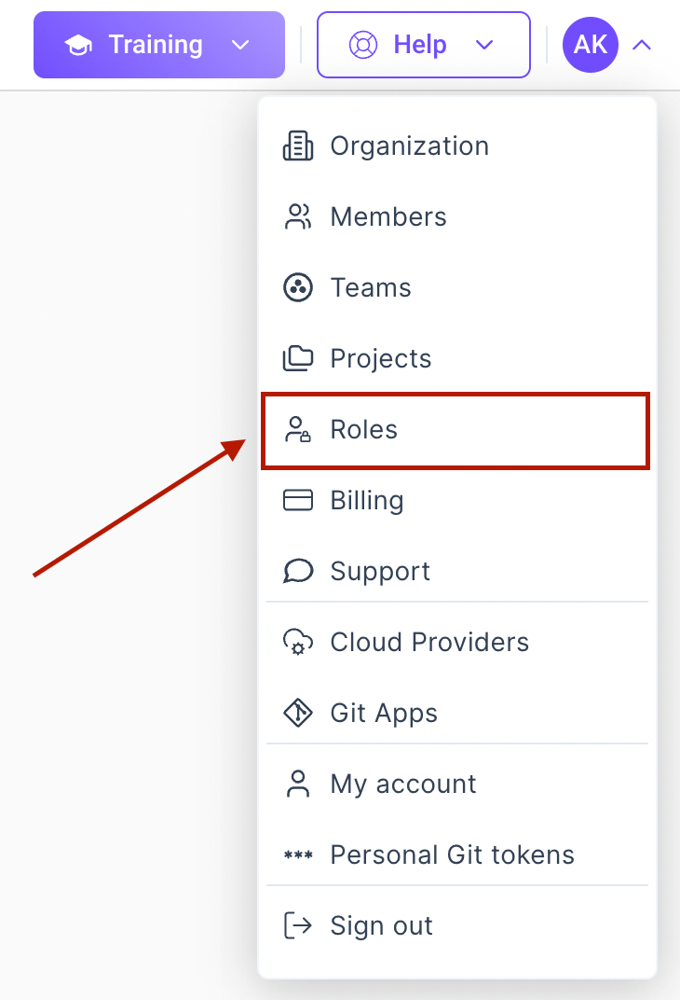
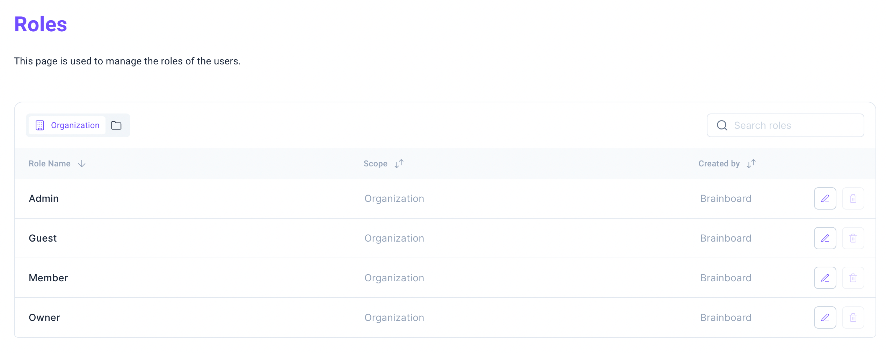
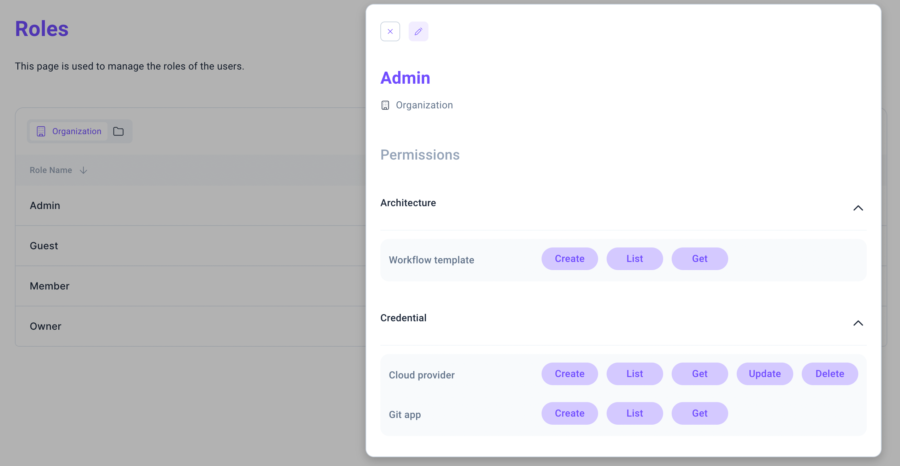
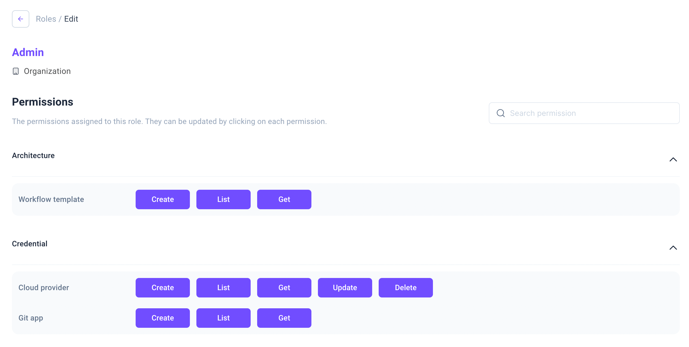
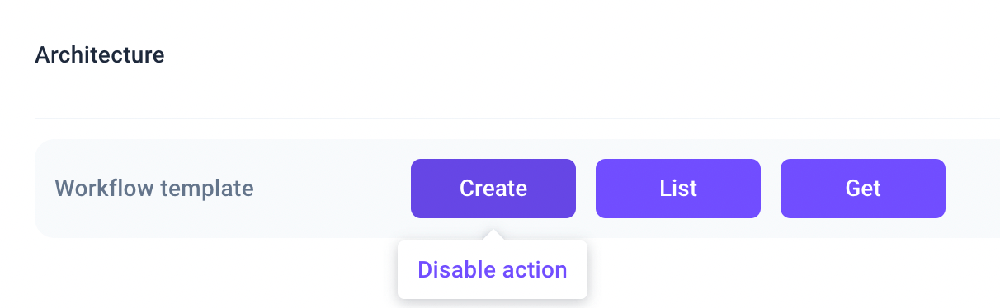
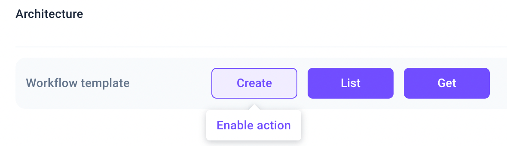

# Updating roles & permissions

To edit the permissions of a role, you need to go to the specific settings page, called `Roles`. You can find it in the user menu.

In the `Roles` page, you can see a list of all the roles in your application, grouped by levels: `Organization` or `Project`.

To see more information about the permissions of a role, you can click on each role. This will open a modal with the permissions of the role. Here you can view the permissions of the role, grouped by categories (e.g. `Architecture`). Each permission is described with a title (e.g. `Workflow template`) and a set of possible actions (e.g. `Create`, `List`, `Get`).

To edit the permissions of a role, you can click on the pencil icon from the top-left of the modal or from the end of the table row. This will open a new view, where you can visualize and edit the permissions of the role.

To enable or remove a permission, simply click on the button with the corresponding action name.

If the button is purple, it means that the action is enabled.

If the button is white, it means that the action is disabled.

