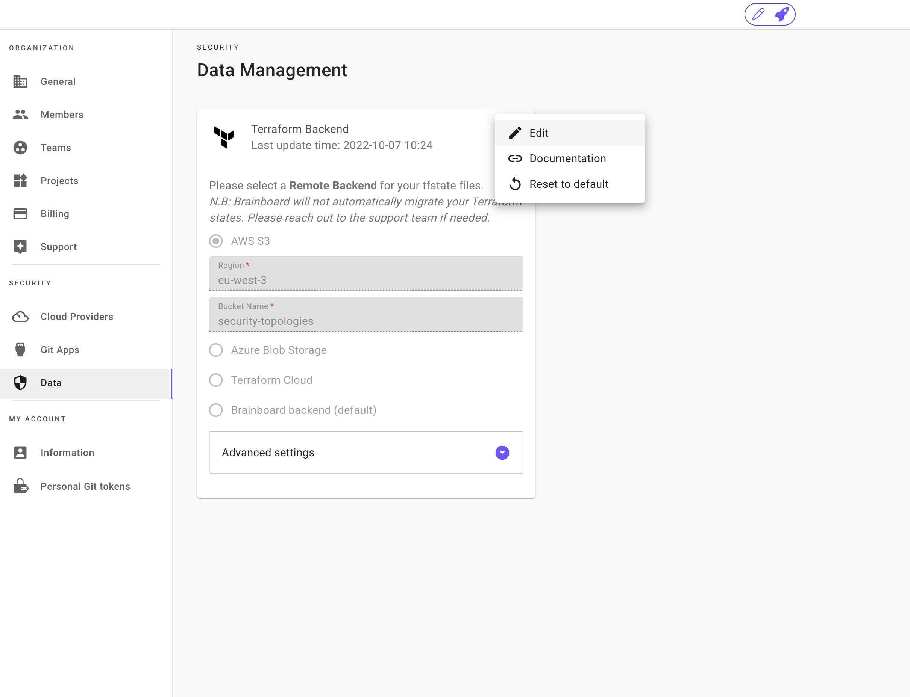

# Remote backend 🫙

### Definition

The remote backend is a storage that hosts the Terraform state of your cloud infrastructure after it is provisioned.

Brainboard uses Terraform as the provisioning engine, and so the concept of the remote backend comes from the configuration of Terraform that allows you to specify which storage system you want to use and how to access it.

### Global vs Architecture setting

There are 2 places where you can configure the remote backend, and both of them are complementary, which gives you greater flexibility and security options to separate where the Terraform states are stored based on your policies.

#### 1. Global

The [global setting](https://app.brainboard.co/settings/data) allows you to specify the default remote backend for any project, environment or architecture created in Brainboard.

If you use your own S3 or blob storage remote backend, it means that by default all the states will be stored in your own infrastructure.

#### 2. Architecture

You have the possibility to specify a different remote backend at the architecture level, which gives more control on where you want to store the state files for any given architecture.

To specify a remote backend for the architecture:

1. Go to the `deploy` tab for your architecture.
2.  Then click on the settings page:&#x20;

    <figure><figcaption></figcaption></figure>
3. Then follow the same steps as mentioned before for [AWS S3](remote-backend.md#2-aws-s3-bucket), [Azure blob storage](remote-backend.md#4-azure-blob-storage) or [Brainboard backend](remote-backend.md#1-brainboard).

### Supported backends

Here are the list of the supported remote backend in Brainboard.


If you use a different backend from the supported ones, please reach out to our support team.


#### 1. Brainboard

The default backend when you don't specify one is Brainboard.

Brainboard stores the Terraform state in its cloud storage, which helps you stay protected as we isolate by default the state of every architecture.

To configure Brainboard backend:

1. Go to the [remote backend settings page](https://app.brainboard.co/settings/data).
2.  Click on the 3 dots in the top-right corner of the configuration:&#x20;

    <figure><figcaption></figcaption></figure>
3. You can then select Brainboard backend and save.

#### 2. AWS S3 bucket

You have the possibility to specify AWS S3 bucket in Brainboard, which means the Terraform state of all your architectures will be stored in the bucket you specify.

You have the possibility to override the remote backend of a specific architecture in its settings page.

When you specify the S3 bucket, Brainboard stored the Terraform state of every architecture in a separate file that has the UUID of the architecture as a name.

If you want to find the UUID of your architecture, refer to [this page](../cloud-architectures/).

To configure S3 bucket as a remote backend:

1. Go to the [remote backend settings page](https://app.brainboard.co/settings/data).
2.  Click on the 3 dots in the top-right corner of the configuration:&#x20;

    <figure><figcaption></figcaption></figure>
3. Select `AWS S3` option.
4.  Add the `Region` and the `Bucket name`&#x20;

    <figure><figcaption></figcaption></figure>
5. Click on `Apply` to save your configuration.


New S3 bucket When you specify the bucket name, if the bucket doesn't exist, Brainboard will create a new one with the name you enter. To do so, it uses the default AWS credentials, so make sure these credentials have the rights to create a new bucket.


#### 4. Azure blob storage

You have the possibility to specify Azure block storage in Brainboard, which means that the Terraform state of all your architectures will be stored in the blob storage you specify.

You have the possibility to override the remote backend of a specific architecture in its settings page.

When you specify the Azure block storage, Brainboard stored the Terraform state of every architecture in a separate file that has the UUID of the architecture as a name.

If you want to find the UUID of your architecture, refer to [this page](../cloud-architectures/).

To configure Azure block storage as a remote backend:

1. Go to the [remote backend settings page](https://app.brainboard.co/settings/data).
2.  Click on the 3 dots in the top-right corner of the configuration:&#x20;

    <figure><figcaption></figcaption></figure>
3. Select `Azure Blob Storage` option.
4. Add the following information:
   * Storage account name
   * Storage account's access key: you can create a new access key following this [Azure documentation](https://learn.microsoft.com/en-us/azure/storage/common/storage-account-keys-manage?tabs=azure-portal)
   *   Storage container name&#x20;

       <figure><figcaption></figcaption></figure>
5. Click on `Apply` to save your configuration.


When you specify the storage container name, if the container doesn't exist, Brainboard will create a new one with the name you enter. To do so, it uses the default AzureRM credentials, so make sure these credentials have the rights to create a new storage container in the selected storage account.


#### 5. Terraform cloud backend

You can also have the possibility to specify Terraform cloud as a remote backend in Brainboard to host your Terraform states of all your architectures.

You have the possibility to override the remote backend of a specific architecture in its settings page.

To configure TFC as a remote backend:

1. Go to the [remote backend settings page](https://app.brainboard.co/settings/data).
2.  Click on the 3 dots in the top-right corner of the configuration:&#x20;

    <figure><figcaption></figcaption></figure>
3. Select `Terraform cloud` option.
4. Add the following information:
   * Terraform cloud hostname
   * Organization name
   * Workspace name
   *   The token to authenticate&#x20;

       <figure><figcaption></figcaption></figure>
5. Click on `Apply` to save your configuration.

### Access

To access the remote backend, Brainboard uses the default cloud provider credentials that you provide in the [credentials page](../cloud-providers/), so make sure that these credentials have the right to access the storage.

Refer to the [data management](data.md) page if you want to understand what information is manipulated and/or stored by Brainboard.

### State migration

To migrate your Terraform state into Brainboard, you have 2 options:

1. Use Brainboard backend: in this case you need to upload your state files when you import your Terraform files, Brainboard will automatically detect the state file and put it in our storage.
2. Use your remote backend (AWS S3 or Azure blob storage):
   * Configure the remote backend in Brainboard. Follow the steps for [AWS S3](remote-backend.md#2-aws-s3-bucket) or [Azure blob storage](remote-backend.md#4-azure-blob-storage)
   * In the remote backend storage that you configured, create a folder that has as a name the architecture UUID.
   * Put your state in the folder you just created.
   * Test in Brainboard by launching a _Terraform Plan_ from the design area of your architecture.
