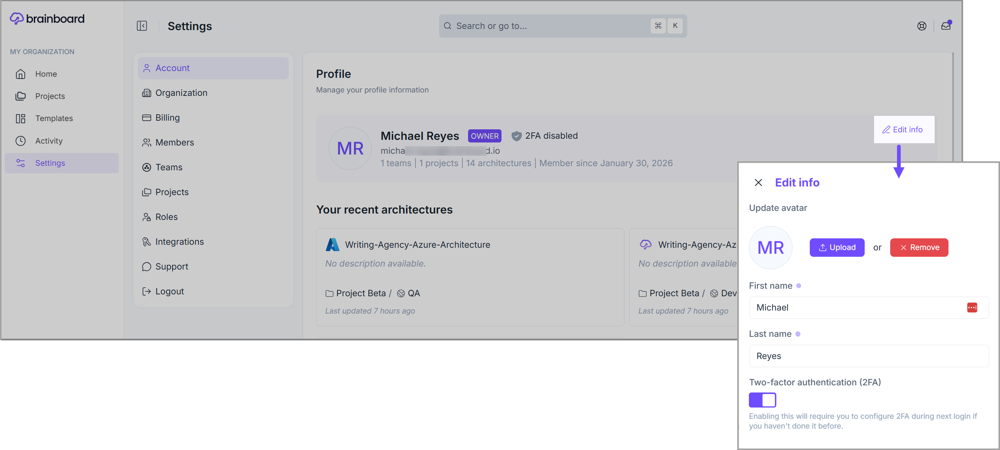
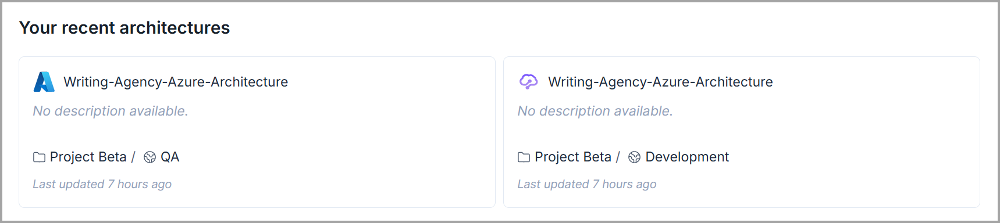
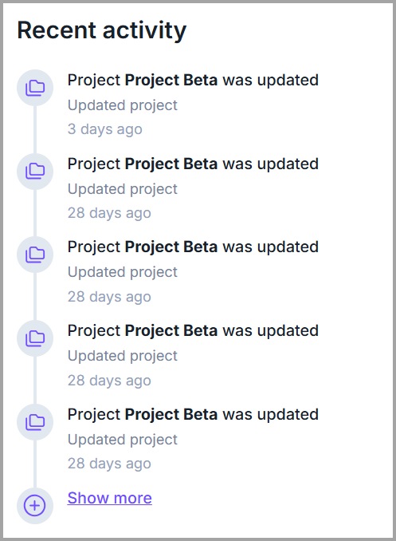

# Account management

### Create an account

To create a new <mark style="color:$primary;">**Brainboard**</mark> account:

1. Go to the [Sign up page](https://auth.brainboard.co/realms/brainboard/login-actions/registration?).
2. To register, either choose to sign up with **Google,** or, you can also use your email id.&#x20;
   * If you choose to register with your email, then fill the form with your **first name, last name** and **password.**
3. Click <mark style="color:$primary;">**`Register`**</mark> to create the account.

Once you create your account, <mark style="color:$primary;">**Brainboard**</mark> will automatically send you a confirmation email.

#### Organization owner

The first account created on <mark style="color:$primary;">**Brainboard**</mark> will be, by default, the owner of the organization and <mark style="color:$primary;">**Brainboard**</mark> automatically creates a **new team** and **new project** for this account as part of the onboarding process.

### Customize your account

After you create your <mark style="color:$primary;">**Brainboard**</mark> account, you can update the following information in your account [settings page](https://app.brainboard.co/settings/my-profile):

* First name
* Last name
* MFA settings


To change your email address associated with the Brainboard account, you need to submit a request at <mark style="color:$primary;">**support@brainboard.co.**</mark>&#x20;


To edit the information, click on the <mark style="color:$primary;">**Edit info**</mark> option available on the right.&#x20;

<figure><figcaption></figcaption></figure>

### Account information

This page gives information about your account but also an overview of:

* Your **recent architectures**
* Your **recent activities**
* **Teams** you belong to (marked 1)
* **Projects** you have access to (marked 2) and the associated **role** (marked 3). 

<figure><figcaption></figcaption></figure>

<figure><figcaption></figcaption></figure> <figure><figcaption></figcaption></figure>

